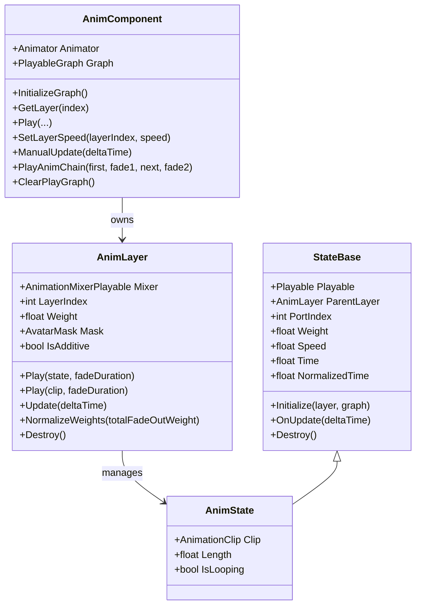
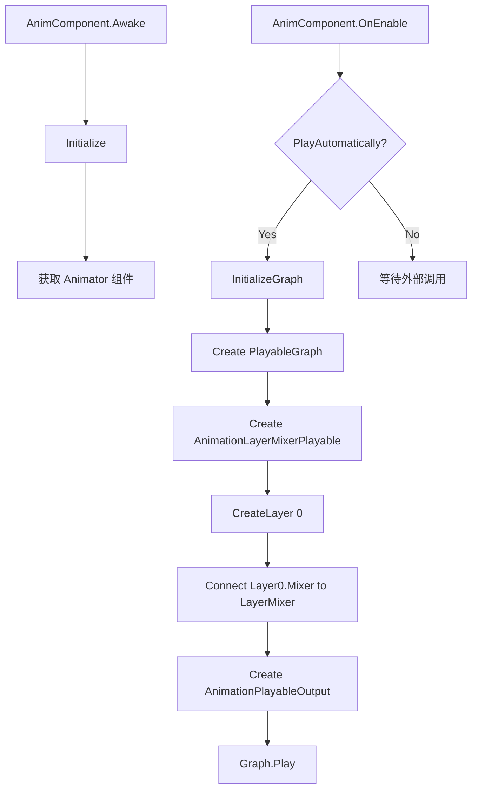
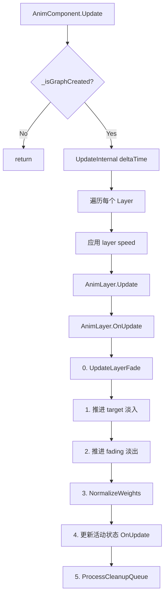
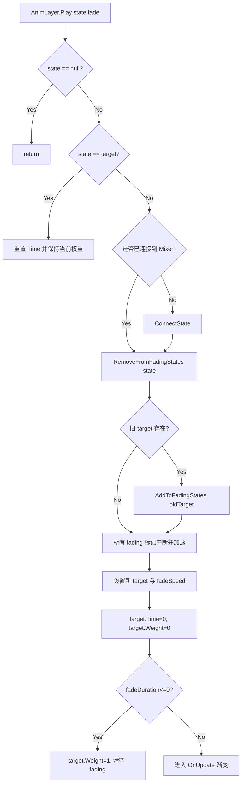
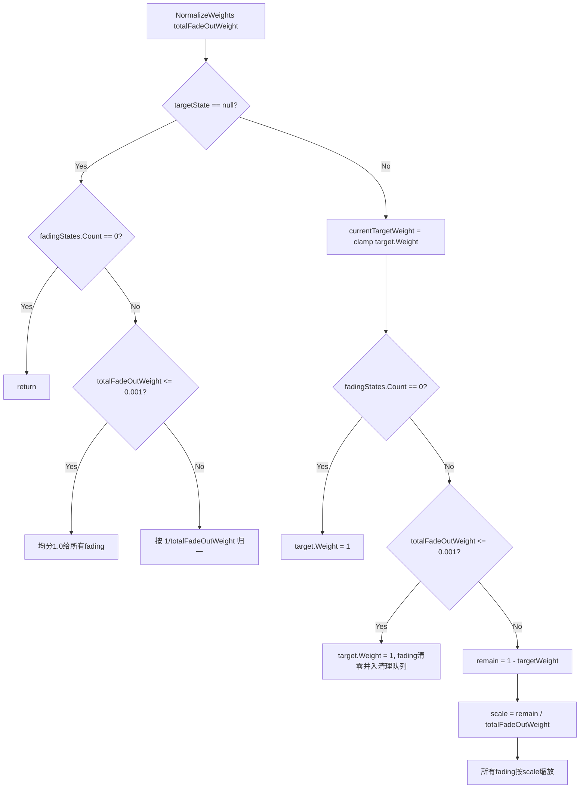

# MAnimSystem 设计架构与流程说明

- 文档版本: v1.1
- 生成日期: 2026-03-01
- 代码基线: `Assets/GameClient/MAnimSystem`（忽略 `Test*.cs`）

## 1. 文档目的与范围

本文用于后续接手开发时的统一认知，覆盖以下内容：

1. 系统分层架构与核心职责
2. 核心运行流程（初始化、播放切换、每帧更新、清理）
3. 关键方法逐项说明（含调用关系和设计意图）
4. `NormalizeWeights` 逻辑的完整解释（为什么这样做）
5. 当前尚未改动的 P1/P2 待修复项（列在文末）

当前分析文件（按目录现状）：

- `AnimComponent.cs`
- `AnimLayer.cs`
- `StateBase.cs`
- `AnimState.cs`

说明：

- 与上一版报告相比，当前目录下的状态体系为 `StateBase + AnimState`。
- 先前文档提及的 `ClipState/MixerState/LinearMixerState/BlendTreeState2D` 文件在当前目录中不存在。
- 本报告严格以当前代码基线为准。

## 2. 系统架构总览

### 2.1 三层抽象

1. `AnimComponent`（挂在角色对象上）
- 管理 `PlayableGraph` 生命周期
- 提供对外 API：`Play/CrossFade/SetLayerSpeed/查询接口`
- 管理多层 `AnimLayer`

2. `AnimLayer`（单层混合与过渡管理器）
- 管理本层 `AnimationMixerPlayable`
- 管理状态集合（目标状态、淡出状态、缓存状态、待清理状态）
- 负责 CrossFade 权重推进、归一化、延迟销毁

3. `StateBase/AnimState`（状态抽象与具体实现）
- `StateBase`：统一封装 Playable、时间、速度、权重、事件
- `AnimState`：当前基线中唯一具体状态，实现单个 `AnimationClip` 播放

### 2.2 类关系图

### 2.3 运行期数据结构（AnimLayer）

- `_targetState`: 当前淡入目标（最终应到 1.0 权重）
- `_fadingStates`: 当前淡出列表（每帧减重）
- `_states`: 本层所有已连接状态
- `_clipStateCache`: `AnimationClip -> AnimState` 缓存
- `_pendingCleanup`: 延迟销毁队列（避免切换时立即销毁导致抖动）
- `_freePorts`: 复用 Mixer 输入端口，避免端口无限增长

## 3. 核心流程

### 3.1 初始化流程

关键点：

- Layer 采用延迟创建，`GetLayer(index)` 会补齐缺失层。
- 每层创建时默认记录速度 `1.0`。

### 3.2 每帧更新流程

### 3.3 播放与切换（Play/CrossFade）流程

说明：

- 新目标在切换前先从 `_fadingStates` 移除，避免快速切换时“目标被自己继续淡出”。
- 被中断的淡出状态会提升速度（`INTERRUPT_SPEED_MULTIPLIER`），降低残留时间。

## 4. NormalizeWeights 逻辑专章

位置：`AnimLayer.NormalizeWeights(float totalFadeOutWeight)`。

目标：

1. 每帧尽量满足 `sum(weights) == 1`
2. 避免总权重短暂掉到接近 0（角色会闪到参考姿势，表现为“下沉/塌陷”）
3. 在快速切换时保持数值稳定，避免 fading 残留导致波动

### 4.1 决策流程图

### 4.2 为什么要这样做（对应 A/B 分支）

A 分支（无目标状态）是“兜底防失重”：

- 过渡边界帧可能出现 `target == null` 且 fading 尚有残留。
- 若不兜底，这一层会短暂“失重”，暴露参考姿态。
- 策略：
  - fading 总权重近 0 -> 均分 1.0；
  - fading 有效 -> 归一化到 1.0。

B 分支（有目标状态）是“目标优先 + 剩余填充”：

- 目标权重由淡入逻辑给出，淡出态只占剩余空间。
- fading 已空时直接把目标顶满，避免目标 < 1 的空窗。
- fading 近 0 时清残留并入清理队列，避免数值噪声与逻辑残留。
- 常规帧按比例缩放 fading，保持内部比例并满足总和守恒。

### 4.3 对“下沉”问题的直接关系

该方法核心价值是强制权重和守恒，避免 `target + fading < 1` 的帧间空洞。快速切换若出现短暂“无有效贡献”，就会显露参考姿态，视觉上即“下沉/塌陷”。

## 5. 关键方法说明（按类）

## 5.1 AnimComponent

`InitializeGraph()`

- 创建 Graph、LayerMixer、Layer0、Output，并启动 Graph。
- 是系统运行入口；Graph 未创建前，所有层操作都依赖该入口。

`GetLayer(int index)`

- 延迟扩层：访问高层索引时自动补齐中间层。
- 保证外部调用无需先手工创建层。

`UpdateInternal(float deltaTime)`

- 遍历层并调用 `layer.Update`。
- 同时处理 `_layerSpeeds`（当前实现会同时改 PlayableSpeed 与传入 deltaTime，见文末 P1）。

`SetLayerSpeed(int layerIndex, float speedScale)`

- 写入速度表并同步到对应 `AnimLayer`。
- 目标用途是帧同步/慢动作等时间缩放场景。

`PlayAnimChain(first, fade1, next, fade2)`

- 通过首段状态的 `AddScheduledEvent` 在指定时间点触发下一段播放。
- 依赖 `StateBase` 的事件调度机制。

`ClearPlayGraph()`

- 销毁层、清空速度字典、销毁 Graph。
- 最后 `Animator.Rebind + Update(0)` 清理残留姿态。

## 5.2 AnimLayer

`Play(AnimState state, float fadeDuration)`

- 处理连接、旧目标入淡出、新目标设定、瞬切逻辑。
- 通过 `RemoveFromFadingStates` 保证目标排他。

`AddToFadingStates(...)`

- 已存在则更新速度并标记中断；不存在才新增。
- 防止同一状态重复进入淡出列表。

`RemoveFromFadingStates(AnimState state)`

- 把即将成为新目标的状态从淡出列表移除。
- 解决 `A -> B -> A` 时 A 被二次淡出的竞态。

`OnUpdate(float deltaTime)`

- 统一调度 5 阶段：层淡入淡出、目标淡入、淡出更新、归一化、状态更新、清理。
- 是时序与数值稳定的核心循环。

`NormalizeWeights(...)`

- 对输入权重做强约束守恒。
- 通过边界兜底消除总权重下陷。

`ConnectState/DisconnectState`

- 封装 Graph Connect/Disconnect 与端口复用。
- `_freePorts` 避免 Mixer 输入端口持续增长。

`MarkForCleanup/ProcessCleanupQueue/DestroyState`

- 非缓存态采用延迟清理，降低切换瞬间抖动。

## 5.3 StateBase

`Initialize(AnimLayer layer, PlayableGraph graph)`

- 调用子类 `CreatePlayable` 建立具体节点。
- 绑定 `ParentLayer`，用于统一权重/时间接口。

`Weight/Speed/Time/NormalizedTime`

- 提供统一状态控制面。
- `Weight` 最终写入父层 Mixer 输入权重。

`OnUpdate(float deltaTime)`

- 负责非循环结束事件 `OnEnd`。
- 负责定时事件 `_scheduledEvents`（当前存在遍历中删除元素风险，见文末 P1）。

`Destroy()`

- 销毁底层 Playable 并清理回调。

## 5.4 AnimState

`CreatePlayable(...)`

- 创建 `AnimationClipPlayable`。

`Length/IsLooping`

- 通过缓存字段对 Clip 元数据做轻量封装。

`IsDone`

- 非循环且 `Time >= Length` 时为 true，便于快速判定片段完成。

## 6. 典型时序案例

### 6.1 普通切换 A -> B

1. A 作为旧 target 入 `_fadingStates`
2. B 成为新 target，权重从 0 向 1 递增
3. A 按 fadeSpeed 递减
4. `NormalizeWeights` 每帧约束总和=1
5. A 衰减到 0 后进入清理队列

### 6.2 快速切换 A -> B -> A

1. 第一段切换后：A 在 fading，B 为 target
2. 再次播放 A 时：先执行 `RemoveFromFadingStates(A)`
3. A 仅作为 target，不再被淡出循环误减
4. 归一化保证权重和稳定，不出现中间失重帧

### 6.3 动画链式切换（PlayAnimChain）

1. 播放 firstClip
2. 在 `firstClip.length - fadeDuration2` 处注册调度事件
3. 事件触发后调用 `Play(nextClip, fadeDuration2)`
4. 若调度事件安全触发，则链路可实现无额外状态机的串接

## 7. 当前状态结论

当前代码基线中，权重下陷相关的 P0 核心点已落地：

1. 新目标排他（target 不参与 fading）
2. 归一化强约束（总权重守恒 + 边界帧兜底）
3. 目标淡入保留 `SmoothStep/Linear` 分支，不再被重复赋值覆盖

以上三点共同降低了快速切换时“下沉姿态”出现概率。

## 8. 待修复项（未改动）

以下是当前仍未改动、建议后续排期处理的项。

### P1-1: StateBase 定时事件迭代删除问题

位置：`StateBase.OnUpdate` 中对 `_scheduledEvents` 的 `foreach`。

问题：

- 在遍历 `Dictionary` 时执行 `_scheduledEvents.Remove(kvp.Key)`，存在集合修改异常风险。

影响：

- 事件触发时可能抛异常，导致动画更新链路中断。

建议修复方向：

1. 先收集待删除 key，再循环后统一删除。
2. 或改用支持安全删除的结构。

### P1-2: AnimComponent 速度控制双重生效

位置：`AnimComponent.UpdateInternal` 与 `AnimLayer.SetSpeed` 组合。

问题：

- 当前既给 Layer/Mixer 设置 speed，又把 `deltaTime` 乘 speed 后传入 `layer.Update`。
- 这会导致过渡与事件时间窗出现双重缩放风险。

影响：

- 速度倍率较大或较小时，过渡/事件节奏可能偏离预期。

建议修复方向：

1. 二选一：
- 只改 Playable speed，`layer.Update` 使用原始 `deltaTime`；
- 或不改 Playable speed，仅缩放逻辑 `deltaTime`。
2. 推荐第一种，以保持与 Unity Playable 时间语义一致。

### P2-1: AnimLayer.Mask 的 null 语义不清晰

位置：`AnimLayer.Mask` 属性 getter/setter。

问题：

- getter 在 `_mask == null` 时返回 `new AvatarMask()`；
- setter 将 `null` 转换为新建 `AvatarMask`。

影响：

- 无法明确表达“无 Mask（不过滤）”语义；
- 可能引入行为歧义和不必要对象创建。

建议修复方向：

1. 保留 `null` 作为“不过滤”语义。
2. 仅在确实需要遮罩时设置具体 `AvatarMask` 实例。

## 9. 后续建议（落地顺序）

1. 先修 P1-1（稳定性风险，可能直接异常）。
2. 再修 P1-2（时间尺度一致性）。
3. 最后修 P2-1（语义与可维护性）。

---

如果后续继续扩展“状态机驱动战斗动作”，建议将该文档作为 MAnimSystem 基线规范：

1. 新状态类型优先继承 `StateBase`，避免绕开 Layer 的统一过渡/清理链路。
2. 引入复合状态（Mixer/BlendTree）时，先补齐其权重守恒与生命周期规范，再接入业务层。
