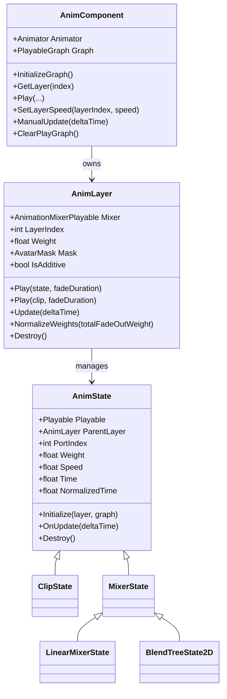
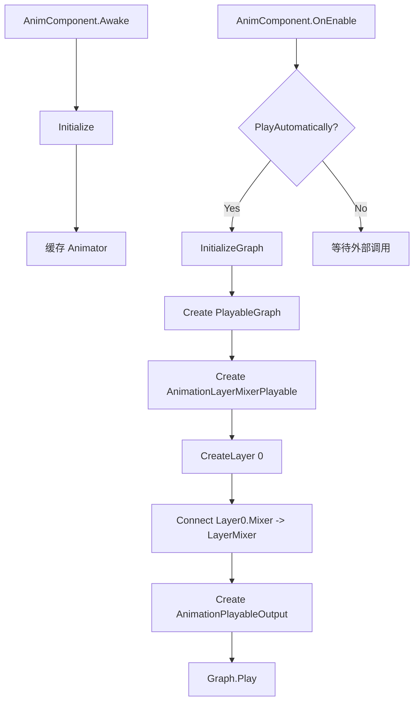
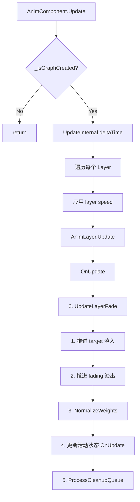
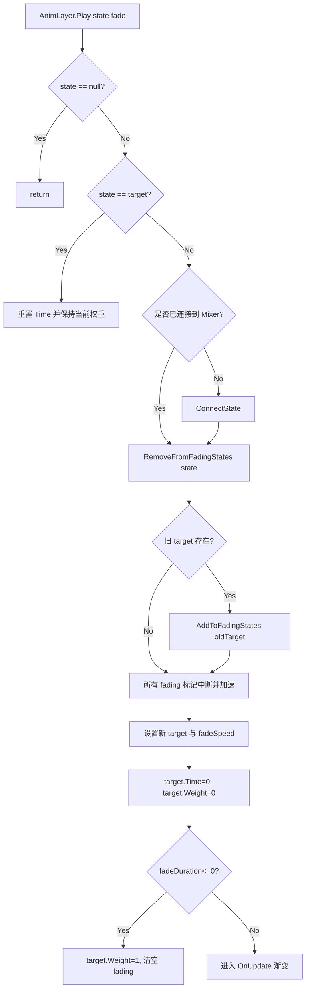
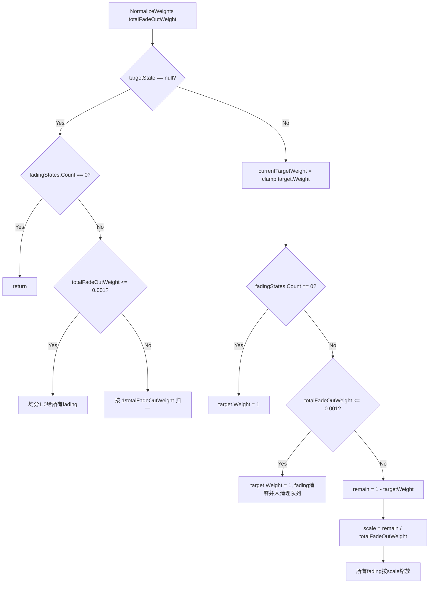

# MAnimSystem 设计架构与流程说明

- 文档版本: v1.0
- 生成日期: 2026-02-27
- 代码基线: `Assets/GameClient/MAnimSystem`（忽略 `Test*.cs`）

## 1. 文档目的与范围

本文用于后续接手开发时的统一认知，覆盖以下内容：

1. 系统分层架构与核心职责
2. 核心运行流程（初始化、播放切换、每帧更新、清理）
3. 关键方法逐项说明（含调用关系和设计意图）
4. `NormalizeWeights` 逻辑的完整解释（为什么这样做）
5. 当前尚未改动的 P1/P2 待修复项（列在文末）

当前分析文件：

- `AnimComponent.cs`
- `AnimLayer.cs`
- `AnimState.cs`
- `ClipState.cs`
- `MixerState.cs`
- `LinearMixerState.cs`
- `BlendTreeState2D.cs`

## 2. 系统架构总览

### 2.1 三层抽象

1. `AnimComponent`（挂在角色 GameObject 上）
- 负责 `PlayableGraph` 生命周期
- 提供对外 API：`Play/CrossFade/SetLayerSpeed/GetCurrentState...`
- 管理多层 `AnimLayer`

2. `AnimLayer`（一层动画混合与过渡管理器）
- 管理本层 `AnimationMixerPlayable`
- 管理状态集合（目标状态、淡出状态、缓存状态、待清理状态）
- 负责 CrossFade 权重推进、归一化、延迟销毁

3. `AnimState`（可播放节点抽象）
- 抽象 Clip/Mixer/BlendTree 的统一接口
- 封装 `Playable`、时间、速度、权重、事件
- 子类实现 `CreatePlayable`

### 2.2 类关系图

### 2.3 运行期数据结构（AnimLayer）

- `_targetState`: 当前淡入目标（最终要到 1.0 权重）
- `_fadingStates`: 当前淡出列表（每帧减重）
- `_states`: 本层所有已连接状态（包含 target/fading/缓存）
- `_clipStateCache`: `AnimationClip -> ClipState` 缓存
- `_pendingCleanup`: 延迟销毁队列（避免切换时立刻销毁造成抖动）
- `_freePorts`: 复用 Mixer 输入端口，避免端口无限增长

## 3. 核心流程

### 3.1 初始化流程

关键点：

- Layer 采用延迟创建，`GetLayer(index)` 会补齐缺失层。
- 每层创建时自动注册默认速度 `1.0`。

### 3.2 每帧更新流程

### 3.3 播放与切换（Play/CrossFade）流程

说明：

- 新目标状态会先从 `_fadingStates` 移除，避免快速切换时“目标被自己继续淡出”。
- 中断态会提高淡出速度（`INTERRUPT_SPEED_MULTIPLIER`），减少状态残留。

## 4. NormalizeWeights 逻辑专章

位置：`AnimLayer.NormalizeWeights(float totalFadeOutWeight)`。

目标：

1. 每帧尽量满足 `sum(weights) == 1`
2. 避免总权重短暂掉到接近 0（角色姿态会闪到参考姿势，表现为“下沉/塌陷”）
3. 在快速切换时保持数值稳定，避免 fading 残留导致的波动

### 4.1 决策流程图

### 4.2 为什么要这样做（对应代码注释 A/B 分支）

A 分支（无目标状态）是“兜底防失重”：

- 理论上过渡时应有目标，但边界帧可能出现 target 为空。
- 若此时 fading 也接近 0，层总权重会塌陷，出现参考姿态。
- 处理策略：
  - fading 总权重近 0 -> 均分 1.0；
  - fading 有效 -> 标准归一化到 1.0。

B 分支（有目标状态）是“目标优先 + 剩余填充”：

- 目标权重由淡入逻辑计算，淡出权重只占剩余空间。
- 若 fading 已空，则直接把目标拉满到 1。避免目标 < 1 的空窗。
- 若 fading 近 0，则清残留并清理队列，避免数值抖动。
- 常规帧用等比缩放保持 fading 内部比例，同时保证总和守恒。

### 4.3 对“下沉”问题的直接关系

该方法的核心价值是强制权重和守恒，避免 `target + fading < 1` 的帧间空洞。此前快速切换时若出现短暂“无有效贡献”，就会露出参考姿势，视觉上即“下沉/塌陷”。

## 5. 关键方法说明（按类）

## 5.1 AnimComponent

`InitializeGraph()`

- 创建 Graph、LayerMixer、Layer0、Output，并启动 Graph。
- 是系统运行入口，Graph 未创建前所有层操作都需先触发它。

`GetLayer(int index)`

- 延迟扩层：访问高层索引时自动补齐中间层。
- 保证外部调用无需关心层是否已创建。

`UpdateInternal(float deltaTime)`

- 遍历层并调用 `layer.Update`。
- 同时处理层速度表 `_layerSpeeds`（当前实现里会同时改 PlayableSpeed 与传入 deltaTime，见文末 P1）。

`SetLayerSpeed(int layerIndex, float speedScale)`

- 记录速度倍率并写入对应 `AnimLayer`。
- 供战斗慢速、暂停、局部时间缩放使用。

`ClearPlayGraph()`

- 销毁层、清空字典、销毁 Graph。
- 最后 `Animator.Rebind + Update(0)`，避免残留姿态。

## 5.2 AnimLayer

`Play(AnimState state, float fadeDuration)`

- 处理状态连接、旧目标入淡出、新目标设定、瞬切逻辑。
- 快速切换时通过 `RemoveFromFadingStates` 保证目标排他。

`AddToFadingStates(...)`

- 已存在则更新速度并标记中断；不存在才新增。
- 避免同一状态重复插入淡出列表。

`RemoveFromFadingStates(AnimState state)`

- 将即将成为新目标的状态从淡出列表移除。
- 解决 `A -> B -> A` 场景中 A 被“二次淡出”的问题。

`OnUpdate(float deltaTime)`

- 统一调度 5 阶段：层淡入淡出、目标淡入、淡出更新、归一化、状态更新、清理。
- 是本层时序与数值稳定的核心循环。

`NormalizeWeights(...)`

- 强约束权重守恒。
- 在边界帧进行兜底，消除“总权重下陷”。

`ConnectState/DisconnectState`

- 负责 Graph Connect/Disconnect 及端口复用。
- `_freePorts` 机制避免 Mixer 输入端口无上限增长。

`MarkForCleanup/ProcessCleanupQueue/DestroyState`

- 对非缓存态使用延迟销毁。
- 降低切换瞬间反复创建销毁带来的抖动和成本。

## 5.3 AnimState

`Initialize(AnimLayer layer, PlayableGraph graph)`

- 调用子类 `CreatePlayable`，建立具体节点。
- 绑定 `ParentLayer`，为统一权重/时间接口提供上下文。

`Weight/Speed/Time/NormalizedTime`

- 所有状态统一控制面。
- `Weight` 实际写入父层 Mixer 输入权重。

`OnUpdate(float deltaTime)`

- 处理非循环结束事件 `OnEnd`。
- 处理定时事件 `_scheduledEvents`（当前在迭代中删除元素，见文末 P1）。

`Destroy()`

- 销毁底层 Playable 并清回调。

## 5.4 ClipState

`CreatePlayable(...)`

- 创建 `AnimationClipPlayable`。
- 缓存 `Length` 与 `IsLooping` 避免运行期反复访问资源属性。

`IsDone`

- 非循环且 `Time >= Length` 时为 true，用于快速判断片段结束。

## 5.5 MixerState

`Add(AnimState state)`

- 初始化子状态、扩容端口、连接到本 Mixer、初始权重置 0。

`OnUpdate(deltaTime)`

- 递归更新所有子状态。
- 允许嵌套 Mixer/BlendTree 结构。

## 5.6 LinearMixerState

`Add(AnimationClip clip, float threshold)`

- 插入阈值并保持有序。
- 若插入中间，会重排 `_children` 并重连端口。

`UpdateWeights()`

- 典型 1D Blend Tree：只保留两个临近阈值状态参与线性插值。

## 5.7 BlendTreeState2D

`Add(AnimationClip clip, Vector2 position)`

- 为每个子状态注册二维坐标。

`UpdateWeights()`

- 反距离加权（IDW）计算权重并归一化。
- 参数与某点近乎重合时，直接该点权重=1，避免除零。

## 6. 典型时序案例

### 6.1 普通切换 A -> B

1. A 作为旧 target 入 `_fadingStates`
2. B 成为新 target，权重从 0 向 1 递增
3. A 按 fadeSpeed 递减
4. `NormalizeWeights` 每帧约束总和=1
5. A 衰减到 0 后进入清理队列

### 6.2 快速切换 A -> B -> A

1. 第一段切换后：A 在 fading，B 为 target
2. 再次播放 A 时：先执行 `RemoveFromFadingStates(A)`
3. A 仅作为 target，不再被淡出循环误减
4. 归一化保证权重和稳定，不出现中间失重帧

## 7. 当前状态结论

本次代码基线中，权重下陷相关的 P0 核心点已落地：

1. 新目标排他（target 不参与 fading）
2. 归一化强约束（总权重守恒 + 边界帧兜底）
3. 目标淡入权重计算中保留 `SmoothStep/Linear` 分支，不再被重复赋值覆盖

这三点共同降低了快速切换时出现“下沉姿态”的概率。

## 8. 待修复项（未改动）

以下是当前仍未改动、建议后续排期处理的项。

### P1-1: AnimState 定时事件迭代删除问题

位置：`AnimState.OnUpdate` 中对 `_scheduledEvents` 的 `foreach`。

问题：

- 在遍历 `Dictionary` 时执行 `_scheduledEvents.Remove(kvp.Key)`，存在运行时异常风险（集合修改）。

影响：

- 事件触发时可能抛异常，中断动画更新链路。

建议修复方向：

1. 先记录待删除 key，再在循环后统一删除。
2. 或改用可安全删除的数据结构。

### P1-2: AnimComponent 速度控制双重生效

位置：`AnimComponent.UpdateInternal` 与 `AnimLayer.SetSpeed` 组合。

问题：

- 当前既给 Layer/Mixer 设置 speed，又把 `deltaTime` 乘 speed 后传入 `layer.Update`。
- 这会导致部分逻辑（过渡、事件时间窗）与播放时间尺度出现双重缩放风险。

影响：

- 速度倍率较大或较小时，过渡/事件节奏可能偏离预期。

建议修复方向：

1. 二选一：
- 只改 Playable speed，`layer.Update` 使用原始 `deltaTime`；
- 或不改 Playable speed，仅缩放逻辑 `deltaTime`。
2. 推荐第一种，便于与 Unity Playable 时间语义保持一致。

### P2-1: AnimLayer.Mask 的 null 语义不清晰

位置：`AnimLayer.Mask` 属性的 getter/setter。

问题：

- getter 在 `_mask == null` 时返回 `new AvatarMask()`；
- setter 把 `null` 转成新建 `AvatarMask`。

影响：

- 无法明确表达“无 Mask（不过滤）”语义；
- 可能引入行为歧义和不必要对象创建。

建议修复方向：

1. 保留 `null` 作为“不过滤”语义。
2. 仅在确实需要掩码时设置具体 `AvatarMask` 实例。

## 9. 后续建议（落地顺序）

1. 先修 P1-1（稳定性风险，可能直接异常）。
2. 再修 P1-2（时间尺度一致性）。
3. 最后修 P2-1（语义与可维护性）。

---

如果后续要继续开发“状态机驱动战斗动作”，建议把该文档作为 MAnimSystem 的基线规范，所有新状态节点（例如 ComboState、HitReactState）都按 `AnimState` 接口约束接入，避免绕开 Layer 的统一过渡与清理通路。
