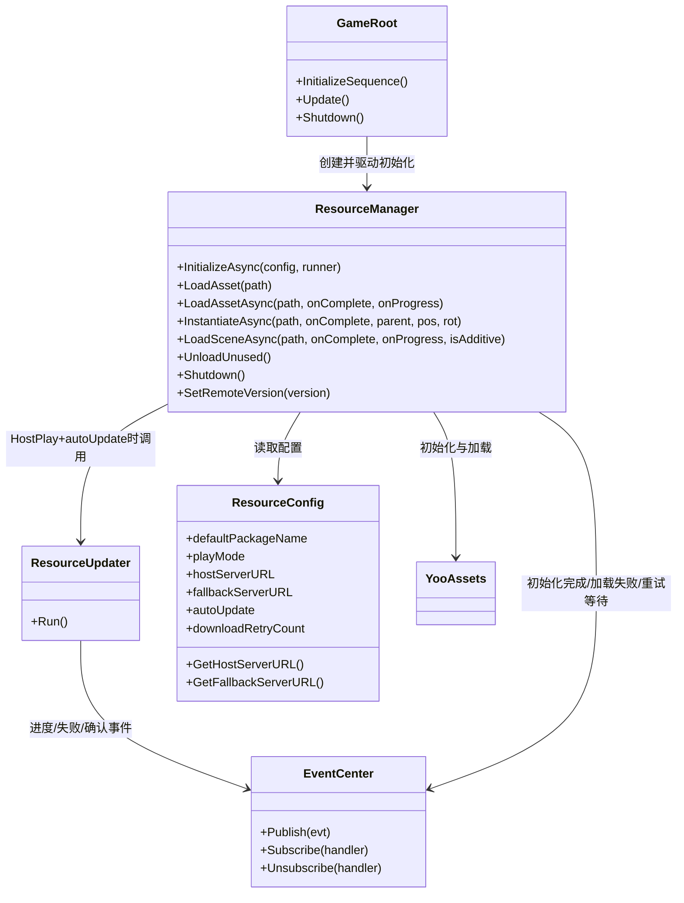
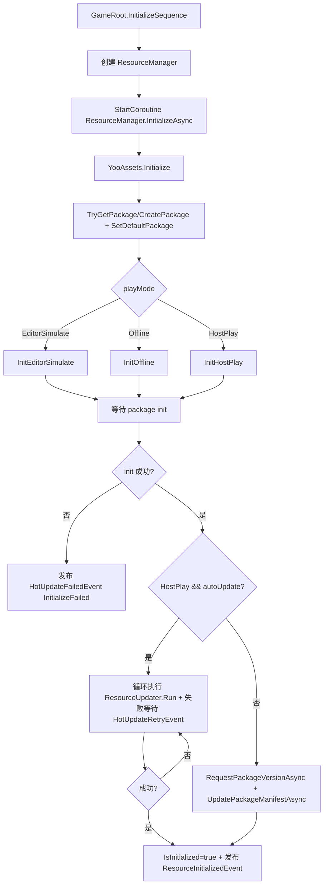
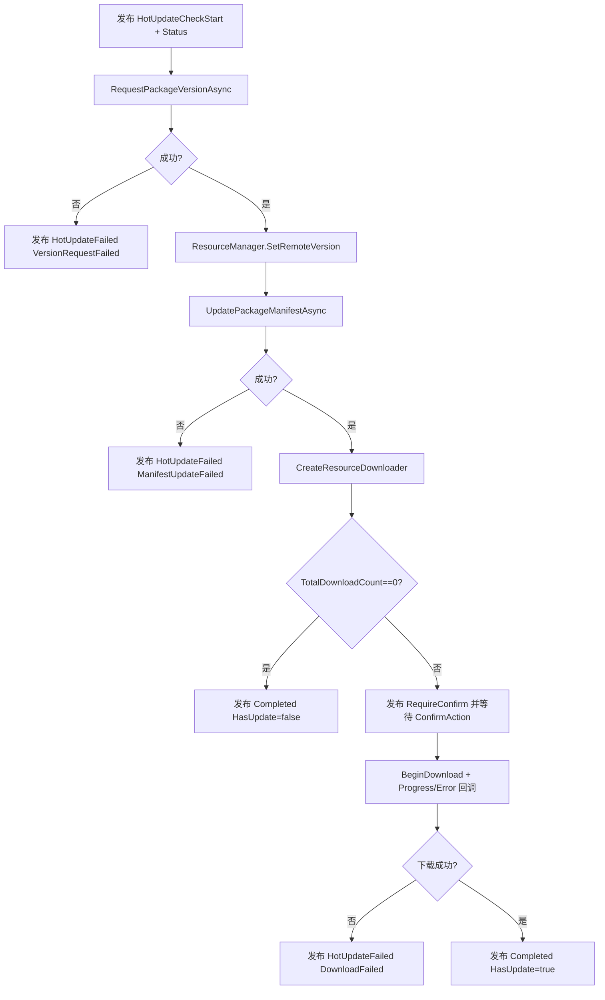
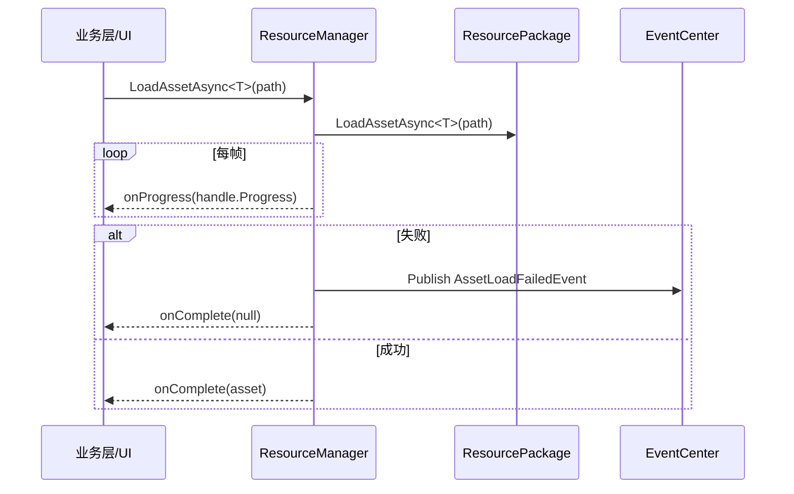

# Resource 封装层设计架构与流程说明

- 文档版本: v1.0
- 生成日期: 2026-02-27
- 分析范围: `Assets/GameClient/Resource`（含 `ResourceManager/ResourceUpdater/ResourceConfig/ResourceEvents` 及同目录测试与日志脚本）
- 关联调用核对: `GameRoot`、`SceneManager`、`UI HotUpdateModule`、`ConfigManager`

## 1. 目标与边界

本模块是 `YooAsset` 在项目内的统一封装层，目标是：

1. 屏蔽 YooAsset 三种运行模式初始化差异（EditorSimulate / Offline / HostPlay）
2. 对外提供统一资源加载 API（资产、实例化、场景）
3. 在 HostPlay 下驱动热更新流程（版本、清单、下载、重试）
4. 通过事件总线与 UI 解耦（进度、确认、失败、完成）

本说明聚焦“当前实现状态”，不假设尚未实现的能力。

## 2. 目录与模块拆分

`Assets/GameClient/Resource` 当前核心文件：

1. `ResourceManager.cs`
- 资源系统入口与生命周期管理
- 运行模式初始化
- 加载 API 与系统级释放/销毁

2. `ResourceUpdater.cs`
- HostPlay 热更新流程 orchestrator（版本 -> 清单 -> 下载）

3. `ResourceConfig.cs`
- ScriptableObject 配置（包名、模式、CDN、重试策略）

4. `ResourceEvents.cs`
- 热更与资源系统事件契约（EventCenter 消息）

5. `HotUpdateConsoleLogger.cs`
- 控制台观察热更流程的调试脚本

6. `ResourceTest.cs`
- 资源加载验证脚本（初始化后实例化测试资源）

## 3. 分层架构

### 3.1 角色职责

1. `ResourceManager`
- 资源系统唯一入口（运行时）
- 负责 Package 与 DefaultPackage 绑定
- 负责“初始化完成”的最终状态裁决（`IsInitialized`）

2. `ResourceUpdater`
- 只做热更新流程，不做通用加载
- 通过 `HotUpdateRequireConfirmEvent` 把“是否开始下载”的决策交给 UI

3. `ResourceConfig`
- 提供 URL 和模式策略，不直接发起网络/下载

4. `ResourceEvents`
- 将流程状态标准化，降低 UI 与资源层耦合

## 4. 核心流程

## 4.1 启动初始化总流程（GameRoot -> ResourceManager）

代码入口：`Assets/GameClient/Framework/GameRoot.cs:132-140`

说明：

1. 初始化分为“两层”：YooAssets 引擎层 + 清单激活层。
2. HostPlay + `autoUpdate=true` 时，清单和下载都交由 `ResourceUpdater`。
3. 非自动热更路径中，仍会做版本请求与清单更新，以保证清单可用。

## 4.2 HostPlay 热更新流程（ResourceUpdater.Run）

代码入口：`Assets/GameClient/Resource/ResourceUpdater.cs:35`

## 4.3 资源加载与场景加载流程

### A. 普通资源异步加载

### B. 场景加载

`LoadSceneAsync` 根据 `isAdditive` 选择 `Single/Additive`，内部轮询 handle 进度并在失败时发布 `AssetLoadFailedEvent`。

## 5. 事件契约（ResourceEvents）

核心事件分为四组：

1. 初始化组
- `ResourceInitializedEvent`

2. 热更阶段组
- `HotUpdateCheckStartEvent`
- `HotUpdateStatusEvent`
- `HotUpdateRequireConfirmEvent`
- `HotUpdateProgressEvent`
- `HotUpdateCompletedEvent`
- `HotUpdateFailedEvent`
- `HotUpdateRetryEvent`

3. 加载失败组
- `AssetLoadFailedEvent`

4. 失败枚举
- `HotUpdateFailReason`:
  - `InitializeFailed`
  - `VersionRequestFailed`
  - `ManifestUpdateFailed`
  - `DownloadFailed`

设计评价：

1. 事件命名和职责清晰，UI 可无侵入接入。
2. 失败原因分型明确，便于弹窗文案映射。
3. 事件字段覆盖了“进度条 + 下载体量 + 用户确认”三类 UI 需求。

## 6. 外部协作关系（关键调用点）

1. `GameRoot` 先打开 `HotUpdateModule`，再初始化 Resource。
- 作用：确保 `HotUpdateRequireConfirmEvent` 有 UI 监听者。

2. `SceneManager` 使用 `ResourceManager.LoadSceneAsync` 和 `LoadAssetAsync` 进行场景与前置资源加载。

3. `ConfigManager` 通过 `LoadAsset<TextAsset>` 同步加载配置。
- 当前依赖前提：Resource 初始化已完成（由 `GameRoot` 顺序保证）。

## 7. 当前实现的优点与已满足能力

1. 模式切换完整
- EditorSimulate / Offline / HostPlay 初始化路径分离明确。

2. 热更主链闭环
- 版本、清单、下载、失败重试事件完整。

3. UI 解耦良好
- `ResourceUpdater` 通过事件广播，不依赖具体 UI 实现。

4. 统一入口稳定
- 业务层基本只依赖 `ResourceManager` 和事件契约。

## 8. 客观问题分析（基于当前代码）

以下均为“已在代码中可观察到”的风险点，不是推测性问题。

### 8.1 资源句柄生命周期未托管（高风险）

涉及：
- `ResourceManager.LoadAsset`（`ResourceManager.cs:223-233`）
- `ResourceManager.LoadAssetAsync`（`241-264`）
- `ResourceManager.InstantiateAsync`（`269-295`）

现状：

1. API 仅返回 `AssetObject`，未返回/缓存 `AssetOperationHandle`。
2. 没有 `ReleaseAsset(handle)` 对外接口（注释里有示例，但代码不存在）。
3. 多处 handle 创建后没有显式释放路径。

结果：

1. 引用计数无法精准回收，只能依赖 `UnloadUnused` 粗粒度回收。
2. 场景切换、UI反复开关时更容易出现内存增长和资源滞留。

### 8.2 实例化路径未使用 YooAsset 实例句柄体系（高风险）

涉及：
- `ResourceManager.InstantiateAsync` 当前流程为“LoadAssetAsync + Unity Instantiate”。

现状：

1. 实例对象与资源引用关系未通过 YooAsset `InstantiateOperation` 管理。
2. 未暴露实例级释放 API（例如回收时归还句柄）。

结果：

1. 资源与实例生命周期可能脱节，后续精确释放难度高。

### 8.3 初始化失败事件覆盖不一致（中风险）

涉及：
- `ResourceManager.InitializeAsync`

现状：

1. Package 初始化失败会发布 `HotUpdateFailedEvent`（InitializeFailed）。
2. 但“本地版本请求失败/本地清单激活失败”仅打印日志并 `yield break`，未发布失败事件。

结果：

1. UI 侧可能收不到失败原因，表现为“初始化卡住但无错误弹窗”。

### 8.4 热更确认依赖强，缺省下会等待无上限（中风险）

涉及：
- `ResourceUpdater.Run`: `WaitUntil(() => userConfirmed)`
- `HotUpdateConsoleLogger.OnFoundUpdate`: 仅日志，不调用 `ConfirmAction`

现状：

1. 发现更新后流程完全依赖外部调用 `ConfirmAction`。
2. 若场景里只有 ConsoleLogger 或 UI 未正确监听，流程会长期挂起。

### 8.5 API 缺少初始化态保护（中风险）

涉及：
- 所有加载 API 默认假定 `_package` 可用。

现状：

1. `ResourceManager.Instance != null` 不等于 `IsInitialized == true`。
2. 在边界时序下可能被提前调用，产生空引用或失败噪音。

### 8.6 进度语义混合导致 UI 进度条可能“回退”（低风险）

涉及：
- `ResourceUpdater` 的 `HotUpdateStatusEvent.Progress`（阶段进度）
- `HotUpdateProgressEvent.Progress`（下载字节进度）

现状：

1. 检查清单阶段进度可接近 1.0。
2. 进入下载阶段后又按下载进度从低值开始，UI 若复用同一进度条会出现回退。

## 9. 设计改进建议（待补充 / 改进 / 修复）

以下按优先级排序，建议作为后续迭代 Backlog。

### P0（优先修复）

1. 建立“可释放句柄”资源加载 API
- 新增 `LoadAssetHandleAsync/LoadAssetHandleSync`，返回 `AssetOperationHandle`（或封装句柄）。
- 新增 `Release(handle)`、`ReleaseByPath(path)`（至少其一）。

2. 修复实例化生命周期管理
- 改为 `YooAsset` 原生实例化句柄流程（而不是裸 `UnityEngine.Object.Instantiate`）。
- 为实例对象提供对应释放接口，避免只销对象不减引用。

3. 对齐注释与实现
- 删除或实现注释中的 `ReleaseAsset(handle)` 示例，避免误导业务层。

### P1（高价值改进）

1. 初始化失败事件统一化
- 对“版本请求失败/清单激活失败”同样发布失败事件，保证 UI 可感知。

2. API 前置状态校验
- 所有加载入口统一检查 `IsInitialized` 与 `_package != null`，失败时标准化发布 `AssetLoadFailedEvent`。

3. 热更确认流程增加兜底策略
- 无 UI 时可配置“自动确认”或“超时退出/重试”。

4. 进度模型拆分
- 将“阶段进度”和“下载进度”在事件层分字段，或由 UI 分阶段显示，避免回退感。

### P2（工程化增强）

1. URL 拼接规范化
- 清理 `host/fallback` 末尾斜杠，避免双斜杠与路径歧义。

2. 扩展平台路径策略
- 对 StandaloneWindows/Mac/Linux 做显式映射，而不是统一 `PC`。

3. 增加诊断能力
- 提供加载中句柄统计、缓存命中率、失败聚合日志，便于线上排障。

4. 调试脚本职责明确化
- `HotUpdateConsoleLogger` 增加可选 `autoConfirm`，使“无 UI 场景测试”闭环。

## 10. 结论

当前 `GameClient/Resource` 封装已经具备“可运行”的资源初始化与热更主链，且事件化设计较清晰，能支撑现阶段启动、热更、场景加载需求。

但从“长期可维护”和“资源生命周期可控”角度看，最关键缺口是 **句柄释放体系未落地**。若不优先补齐，后续随着 UI/场景资源规模增长，内存和资源滞留问题会逐步放大。建议按文末 P0 -> P1 -> P2 顺序推进。

