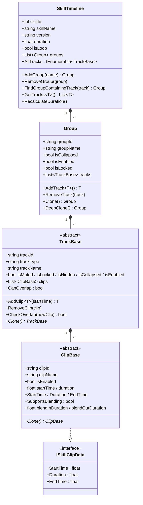
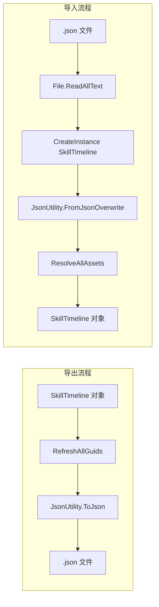
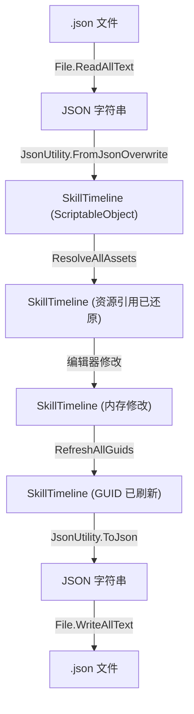
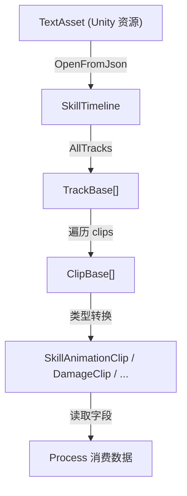

# SkillEditor 运行时 Data 层分析报告

> **分析范围**: `Runtime/Data/`、`Runtime/Enums/`、`Runtime/Attributes/`、`Runtime/Serialization/`、`Settings/`
> **分析日期**: 2026-02-22
> **分析维度**: 运行时 × Data

---

## 1. 总体数据架构

SkillEditor 的运行时数据采用 **四层树形结构**：

```
SkillTimeline (根节点, ScriptableObject)
 └─ Group[] (分组层, 普通类)
     └─ TrackBase[] (轨道层, 多态抽象类)
         └─ ClipBase[] (片段层, 多态抽象类)
```



### 1.1 设计要点

| 设计决策 | 说明 | 评价 |
|:---------|:-----|:-----|
| `SkillTimeline` 继承 `ScriptableObject` | 利用 Unity 资产系统进行持久化和引用管理 | ✅ 适合编辑器工作流 |
| `Group` 为普通 `[Serializable]` 类 | 不需要独立资产生命周期，作为 Timeline 的子数据存在 | ✅ 合理 |
| `TrackBase` / `ClipBase` 使用 `[SerializeReference]` | 支持多态序列化，不依赖 ScriptableObject | ✅ 正确使用 Unity 2019.3+ 特性 |
| ID 使用 `Guid.NewGuid().ToString()` | 保证唯一性，支持跨序列化的引用稳定性 | ✅ 合理，但 GUID 字符串较长 |
| `ClipBase` 实现 `ISkillClipData` 接口 | 通过接口暴露只读时间属性，便于运行时消费 | ✅ 符合 ISP |

---

## 2. 核心基类分析

### 2.1 ClipBase（片段基类）

**文件**: [ClipBase.cs](file:///D:/Unity/Server_Game/Assets/SkillEditor/Runtime/Data/ClipBase.cs)

```csharp
[Serializable]
public abstract class ClipBase : ISkillClipData
{
    [HideInInspector] public string clipId = Guid.NewGuid().ToString();
    [SkillProperty("片段名称")] public string clipName = "Clip";
    [SkillProperty("启用")] public bool isEnabled = true;
    [SkillProperty("开始时间")] public float startTime;
    [SkillProperty("持续时间")] public float duration = 1.0f;

    public float StartTime => startTime;
    public float Duration => duration;
    public float EndTime => startTime + duration;

    public virtual bool SupportsBlending => false;
    [SkillProperty("渐入时长")] public float blendInDuration;
    [SkillProperty("渐出时长")] public float blendOutDuration;

    public abstract ClipBase Clone();
}
```

**分析要点**:

1. **字段设计**: 所有字段标记为 `public`，由 `[SkillProperty]` 特性驱动 Inspector 绘制，不需要的字段用 `[HideInInspector]` 隐藏。
2. **接口实现**: 通过表达式主体属性（`=>`）暴露只读的 `StartTime`/`Duration`/`EndTime`，但底层 `startTime`/`duration` 字段仍为 public。

> [!WARNING]
> **数据安全隐患**: `startTime` 和 `duration` 作为 `public` 字段可被外部直接修改，而 `ISkillClipData` 接口仅提供只读属性。建议运行时消费方通过 `ISkillClipData` 接口访问，不要直接读写 `ClipBase` 字段。

3. **混合支持**: `SupportsBlending` 为 `virtual` 属性，默认 `false`。动画和音频等子类覆写为 `true`。`blendInDuration`/`blendOutDuration` 始终存在，即使子类不支持混合。
4. **Clone 模式**: 使用 **抽象方法 + 对象初始化器** 模式，每个子类负责完整的字段拷贝。

> [!NOTE]
> Clone 模式没有使用 `MemberwiseClone()` 或序列化拷贝，而是手动字段赋值。优点是每个子类完全控制深拷贝逻辑；缺点是新增字段后容易遗漏。

---

### 2.2 TrackBase（轨道基类）

**文件**: [TrackBase.cs](file:///D:/Unity/Server_Game/Assets/SkillEditor/Runtime/Data/TrackBase.cs)

**核心字段**:

| 字段 | 类型 | 用途 |
|:-----|:-----|:-----|
| `trackId` | `string` | GUID 唯一标识 |
| `trackType` | `string` | 类型名称字符串（冗余存储） |
| `trackName` | `string` | 显示名称 |
| `isMuted` | `bool` | 静音（编辑器预览跳过） |
| `isLocked` | `bool` | 锁定（禁止编辑） |
| `isHidden` | `bool` | 隐藏（视图不显示） |
| `isCollapsed` | `bool` | 折叠（视图折叠） |
| `isEnabled` | `bool` | 启用（运行时跳过） |
| `clips` | `List<ClipBase>` | 片段列表（`[SerializeReference]`） |

**核心方法**:

- `AddClip<T>(startTime)`: 泛型添加片段
- `RemoveClip(clip)`: 移除片段
- `CheckOverlap(newClip)`: 片段重叠检测
- `Clone()`: 抽象深拷贝 + `CloneBaseProperties()` 辅助方法

**分析要点**:

1. **`trackType` 冗余**: `trackType` 在构造函数中通过 `GetType().Name` 设置，反序列化后与 `[SerializeReference]` 的 `$type` 信息重复。可能用于 JSON 中快速类型判定而不依赖反射。
2. **重叠检测**: `CheckOverlap()` 使用 O(n) 线性扫描，对于少量片段是合理的。
3. **`CloneBaseProperties` 模板方法**: 良好的代码复用设计，所有 Track 子类的 `Clone()` 只需 `new + CloneBaseProperties(clone)`。

---

### 2.3 Group（分组数据）

**文件**: [Group.cs](file:///D:/Unity/Server_Game/Assets/SkillEditor/Runtime/Data/Group.cs)

- 非抽象、非密封的具体类
- 提供两级 Clone：`Clone()`（浅拷贝，不含 tracks）和 `DeepClone()`（含 tracks 深拷贝）
- 分组是纯组织结构，不影响运行时逻辑（运行时遍历所有 Track，不关心分组）

---

### 2.4 SkillTimeline（根节点）

**文件**: [SkillTimeline.cs](file:///D:/Unity/Server_Game/Assets/SkillEditor/Runtime/Data/SkillTimeline.cs)

**核心设计**:

1. **继承 `ScriptableObject`**: 利用 Unity 资产系统，但实际持久化通过 JSON 而非 `.asset` 文件。`CreateInstance<SkillTimeline>()` 用于反序列化时创建宿主对象。
2. **`AllTracks` 属性**: 使用 `yield return` 懒计算扁平化遍历，性能友好。
3. **`RecalculateDuration()`**: 遍历所有启用的 Track 和 Clip，取 `EndTime` 的最大值作为总时长。最小值钳位到 0.1 秒。

> [!NOTE]
> `SkillTimeline` 不直接持有 `TrackBase[]`，而是通过 `Group.tracks` 间接持有。这意味着运行时总需要二级遍历（groups → tracks），但通过 `AllTracks` 属性封装了这一复杂度。

---

## 3. ISkillClipData 接口

**文件**: [ISkillClipData.cs](file:///D:/Unity/Server_Game/Assets/SkillEditor/Runtime/Data/ISkillClipData.cs)

```csharp
public interface ISkillClipData
{
    float StartTime { get; }
    float Duration { get; }
    float EndTime { get; }
}
```

极简接口，仅暴露时间维度。

**评价**: 接口设计体现了 ISP（接口隔离原则），运行时处理器只需关注时间范围，不需要访问 `clipId`、`clipName` 等编辑器元数据。但当前仅有 `ClipBase` 实现此接口，接口的抽象价值有限——它更多是一种"意图声明"而非多态需求。

---

## 4. 自定义特性（Attributes）

**文件**: [SkillAttributes.cs](file:///D:/Unity/Server_Game/Assets/SkillEditor/Runtime/Attributes/SkillAttributes.cs)

### 4.1 SkillPropertyAttribute

```csharp
[AttributeUsage(AttributeTargets.Field)]
public class SkillPropertyAttribute : Attribute
{
    public string Name { get; private set; }
}
```

- **用途**: 标记字段在 SkillEditor Inspector 中的显示名称
- **消费方**: 编辑器侧 `SkillInspectorBase` 通过反射读取此特性，动态生成 Inspector UI
- **设计**: 放在 Runtime 而非 Editor 程序集中，因为特性标注在 Runtime 数据类的字段上

### 4.2 TrackDefinitionAttribute

```csharp
[AttributeUsage(AttributeTargets.Class, Inherited = false)]
public class TrackDefinitionAttribute : Attribute
{
    public string DisplayName { get; }
    public string Icon { get; }
    public int Order { get; }
    public Type ClipType { get; }
    public string ColorHex { get; }
}
```

- **用途**: 定义轨道的元数据（显示名、关联 Clip 类型、颜色、图标、排序）
- **消费方**: 编辑器侧 `TrackRegistry` 在启动时扫描所有带此特性的 `TrackBase` 子类，自动注册
- **设计优点**: 声明式、与类定义一体；新增轨道类型只需声明类 + 添加特性，符合 OCP

**使用示例**:

```csharp
[TrackDefinition("动画轨道", typeof(SkillAnimationClip), "#33B24C", "Animation.Record", 0)]
public class AnimationTrack : TrackBase { ... }
```

---

## 5. 枚举定义

### 5.1 SkillEnums.cs（数据层枚举）

**文件**: [SkillEnums.cs](file:///D:/Unity/Server_Game/Assets/SkillEditor/Runtime/Data/SkillEnums.cs)

| 枚举 | 成员 | 用途 |
|:-----|:-----|:-----|
| `HitBoxType` | Sphere, Box, Capsule, Sector, Ring | 碰撞体形状类型 |
| `HitFrequency` | Once, Always, Interval | 命中频率策略 |
| `TargetSortMode` | None, Closest, Random | 目标排序/选取策略 |

### 5.2 RuntimeEnums.cs（运行时枚举）

**文件**: [RuntimeEnums.cs](file:///D:/Unity/Server_Game/Assets/SkillEditor/Runtime/Enums/RuntimeEnums.cs)

| 枚举 | 成员 | 用途 |
|:-----|:-----|:-----|
| `SkillRunnerState` | Idle, Playing, Paused | SkillRunner 播放状态 |
| `PlayMode` | EditorPreview, Runtime | 区分编辑器预览和运行时环境 |
| `EAnimLayer` | Locomotion(0), Action(1), Expression(2) | 动画层枚举 |
| `AnimBlendMode` | Linear, SmoothStep | 动画混合模式 |
| `BindPoint` | Root, Body, Head, LeftHand, RightHand, WeaponLeft, WeaponRight, CustomBone | 挂载点 |

**分析**: `BindPoint` 枚举被 `VFXClip`、`DamageClip`、`SpawnClip` 三种 Clip 共用，用于指定特效/伤害/生成物的挂载位置，复用性良好。

---

## 6. 具体 Clip 实现分析

### 6.1 Clip 继承关系总览

```mermaid
classDiagram
    ClipBase <|-- SkillAnimationClip
    ClipBase <|-- AudioClip
    ClipBase <|-- VFXClip
    ClipBase <|-- DamageClip
    ClipBase <|-- SpawnClip
    ClipBase <|-- EventClip
    ClipBase <|-- CameraClip
    ClipBase <|-- MovementClip

    class SkillAnimationClip {
        +AnimationClip animationClip
        +float playbackSpeed
        +EAnimLayer layer
        +AvatarMask overrideMask
        +string clipGuid / maskGuid
        +SupportsBlending = true
    }

    class AudioClip {
        +UnityEngine.AudioClip audioClip
        +float volume / pitch / spatialBlend
        +bool loop
        +string clipGuid
        +SupportsBlending = true
    }

    class VFXClip {
        +GameObject effectPrefab
        +string prefabGuid
        +BindPoint bindPoint
        +string customBoneName
        +bool followTarget
        +Vector3 positionOffset / rotationOffset / scale
        +bool destroyOnEnd / stopEmissionOnEnd
    }

    class DamageClip {
        +string eventTag
        +string[] targetTags
        +HitFrequency hitFrequency
        +float checkInterval
        +int maxHitTargets
        +TargetSortMode targetSortMode
        +LayerMask hitLayerMask
        +HitBoxShape shape
        +BindPoint bindPoint
        +Vector3 positionOffset / rotationOffset
        +ISerializationCallbackReceiver
    }

    class SpawnClip {
        +GameObject prefab
        +bool destroyOnInterrupt
        +string eventTag
        +string[] targetTags
        +BindPoint bindPoint
        +Vector3 positionOffset / rotationOffset
        +bool detach
    }

    class EventClip {
        +string eventName
        +List~SkillEventParam~ parameters
    }

    class CameraClip {
        +Vector3 cameraOffset
        +float fieldOfView
    }

    class MovementClip {
        +Vector3 targetPosition
        +float speed
    }
```



### 6.2 各 Clip 逐一分析

#### SkillAnimationClip

**文件**: [SkillAnimationClip.cs](file:///D:/Unity/Server_Game/Assets/SkillEditor/Runtime/Data/Clips/SkillAnimationClip.cs)

| 字段 | 类型 | 说明 |
|:-----|:-----|:-----|
| `animationClip` | `AnimationClip` | Unity 动画资源引用 |
| `playbackSpeed` | `float` | 播放速度（默认 1.0） |
| `layer` | `EAnimLayer` | 目标动画层 |
| `overrideMask` | `AvatarMask` | 自定义遮罩 |
| `clipGuid` / `maskGuid` | `string` | 资源 GUID（序列化桥接） |

- **特点**: `SupportsBlending = true`，支持渐入渐出
- **GUID 桥接**: 资源引用序列化时保存 GUID 字符串，反序列化时通过 `AssetDatabase` 还原

#### AudioClip

**文件**: [AudioClip.cs](file:///D:/Unity/Server_Game/Assets/SkillEditor/Runtime/Data/Clips/AudioClip.cs)

| 字段 | 类型 | 说明 |
|:-----|:-----|:-----|
| `audioClip` | `UnityEngine.AudioClip` | 音频资源 |
| `volume` | `float [0,1]` | 音量 |
| `pitch` | `float [0.1,3]` | 音调 |
| `loop` | `bool` | 循环播放 |
| `spatialBlend` | `float [0,1]` | 空间混合（0=2D, 1=3D） |

> [!WARNING]
> **命名冲突**: 类名 `AudioClip` 与 `UnityEngine.AudioClip` 重名，虽然命名空间不同，但在引用时需全名限定 `UnityEngine.AudioClip`。建议重命名为 `SkillAudioClip`。

#### VFXClip

**文件**: [VFXClip.cs](file:///D:/Unity/Server_Game/Assets/SkillEditor/Runtime/Data/Clips/VFXClip.cs)

- 丰富的空间配置：`bindPoint`、`customBoneName`、`positionOffset`/`rotationOffset`/`scale`
- 生命周期控制：`destroyOnEnd`、`stopEmissionOnEnd`、`followTarget`
- 使用 `prefabGuid` 进行资源 GUID 桥接

#### DamageClip

**文件**: [DamageClip.cs](file:///D:/Unity/Server_Game/Assets/SkillEditor/Runtime/Data/Clips/DamageClip.cs)

**最复杂的 Clip**，包含：
- **检测策略**: `eventTag`、`targetTags`、`hitFrequency`、`checkInterval`、`maxHitTargets`、`targetSortMode`
- **物理配置**: `hitLayerMask`（通过 `ISerializationCallbackReceiver` 桥接 int 值）、`isSelfImpacted`
- **碰撞体**: `HitBoxShape shape`（组合模式，支持 Sphere/Box/Capsule/Sector/Ring）
- **空间变换**: `bindPoint`、`customBoneName`、`positionOffset`、`rotationOffset`

**LayerMask 序列化处理** (L86-94):
```csharp
public void OnBeforeSerialize()  { serializedHitLayerMask = hitLayerMask.value; }
public void OnAfterDeserialize() { hitLayerMask.value = serializedHitLayerMask; }
```

> [!NOTE]
> `LayerMask` 是 Unity 结构体，其 `value` 字段不能直接被 `JsonUtility` 正确序列化为 int。通过 `ISerializationCallbackReceiver` 桥接到 `serializedHitLayerMask` int 字段解决此问题——这是一个精巧的 workaround。

#### SpawnClip

**文件**: [SpawnClip.cs](file:///D:/Unity/Server_Game/Assets/SkillEditor/Runtime/Data/Clips/SpawnClip.cs)

- 与 `DamageClip` 共享 `eventTag`/`targetTags`/`bindPoint` 等概念
- `destroyOnInterrupt`: 被动打断时是否销毁已生成实体
- `detach`: 生成后是否脱离父节点
- 默认 `duration = 0.1f`（瞬时型片段）

#### EventClip

**文件**: [EventClip.cs](file:///D:/Unity/Server_Game/Assets/SkillEditor/Runtime/Data/Clips/EventClip.cs)

- **键值对参数**: 通过 `SkillEventParam`（key + string/float/int 三种值类型）
- 支持多个参数的事件，扩展性好
- 默认 `duration = 0.1f`（瞬时型片段）

#### CameraClip / MovementClip

**文件**: [CameraClip.cs](file:///D:/Unity/Server_Game/Assets/SkillEditor/Runtime/Data/Clips/CameraClip.cs) / [MovementClip.cs](file:///D:/Unity/Server_Game/Assets/SkillEditor/Runtime/Data/Clips/MovementClip.cs)

- 最简单的两种 Clip，字段极少
- 尚处于骨架阶段，各只有 2 个特有字段
- 没有 `[SkillProperty]` 标注（不经过自定义 Inspector 绘制）

---

## 7. 具体 Track 实现分析

### 7.1 Track 继承关系与元数据

所有 Track 子类为 **轻量包装器**，无额外字段，仅提供：
- 构造函数设置 `trackName`/`trackType`
- `CanOverlap` 覆写
- `Clone()` 实现（调用 `CloneBaseProperties`）

**`[TrackDefinition]` 元数据总览**:

| Track 类 | 显示名 | Clip 类型 | 颜色 | 图标 | 排序 | CanOverlap |
|:---------|:-------|:----------|:-----|:-----|:----:|:----------:|
| `AnimationTrack` | 动画轨道 | `SkillAnimationClip` | `#33B24C` | `Animation.Record` | 0 | ✅ |
| `VFXTrack` | 特效轨道 | `VFXClip` | `#CC4C4C` | `Particle Effect` | 1 | ❌ |
| `AudioTrack` | 音效轨道 | `AudioClip` | `#CCB233` | `AudioSource Icon` | 2 | ✅ |
| `DamageTrack` | 伤害判定轨道 | `DamageClip` | `#E57F33` | `Animation.EventMarker` | 3 | ❌ |
| `SpawnTrack` | 生成轨道 | `SpawnClip` | `#4CAF50` | `d_GameObject Icon` | 4 | ❌ |
| `EventTrack` | 事件轨道 | `EventClip` | `#9C27B0` | `d_EventSystem Icon` | 5 | ❌ |
| `CameraTrack` | 摄像机轨道 | `CameraClip` | `#994CB2` | `Camera Icon` | 5 | ❌ |
| `MovementTrack` | 移动轨道 | `MovementClip` | `#4C7FCC` | `MoveTool` | 4 | ❌ |

> [!NOTE]
> **排序冲突**: `CameraTrack` 和 `EventTrack` 的 Order 均为 5；`SpawnTrack` 和 `MovementTrack` 的 Order 均为 4。如果依赖 Order 排序，可能导致不确定的菜单顺序。

---

## 8. HitBoxShape（碰撞体形状）

**文件**: [HitBoxShape.cs](file:///D:/Unity/Server_Game/Assets/SkillEditor/Runtime/Data/Clips/HitBoxShape.cs)

```csharp
[Serializable]
public class HitBoxShape
{
    public HitBoxType shapeType = HitBoxType.Sphere;
    public Vector3 size = Vector3.one;      // Box 专用
    public float radius = 2f;               // Sphere/Capsule/Sector/Ring 共用
    public float height = 2f;               // Capsule/Ring/Sector 共用
    public float angle = 90f;               // Sector 专用
    public float innerRadius = 1f;          // Ring 专用
}
```

**设计分析**:

- 采用 **联合体（Union-like）** 设计：所有形状的参数放在同一个类中，通过 `shapeType` 枚举区分当前有效字段
- **优点**: 简单直接，序列化友好
- **缺点**: 不同类型共存多余字段，`size` 对 Sphere 无意义、`angle` 对 Box 无意义等

> [!TIP]
> 如果碰撞体类型在未来显著增多，可考虑使用继承或 `[SerializeReference]` 多态替换联合体模式。当前5种类型下，联合体设计是合理的。

---

## 9. 序列化机制

**文件**: [SerializationUtility.cs](file:///D:/Unity/Server_Game/Assets/SkillEditor/Runtime/Serialization/SerializationUtility.cs)

### 9.1 序列化架构



### 9.2 GUID 桥接机制

**核心问题**: Unity 的 `Object` 引用（AnimationClip、AudioClip、GameObject）基于 instanceID，不可跨会话持久化。

**解决方案**: 导出/导入时通过 `AssetDatabase` API 在 Object 引用与 GUID 字符串之间转换。

| 步骤 | 方法 | 方向 |
|:-----|:-----|:-----|
| 导出前 | `RefreshAllGuids()` | Object → GUID 字符串 |
| 导入后 | `ResolveAllAssets()` | GUID 字符串 → Object |

**需要 GUID 桥接的 Clip 类型**:

| Clip 类型 | GUID 字段 | 资源类型 |
|:----------|:----------|:---------|
| `SkillAnimationClip` | `clipGuid` | `AnimationClip` |
| `SkillAnimationClip` | `maskGuid` | `AvatarMask` |
| `VFXClip` | `prefabGuid` | `GameObject` |
| `AudioClip` | `clipGuid` | `UnityEngine.AudioClip` |

### 9.3 双入口导入

```csharp
// 1. 从文件路径导入（编辑器使用）
public static SkillTimeline ImportFromJsonPath(string path)

// 2. 从 TextAsset 导入（运行时使用）
public static SkillTimeline OpenFromJson(TextAsset textAsset)
```

> [!WARNING]
> **编辑器依赖问题**: `SerializationUtility` 使用了 `UnityEditor.AssetDatabase` API，但文件位于 `Runtime` 目录。虽然 `ResolveAllAssets` 和 `RefreshAllGuids` 使用了 `AssetDatabase`，但运行时构建会因缺少 `UnityEditor` 命名空间而编译失败。此文件应加入 `#if UNITY_EDITOR` 预处理指令或移至 `Editor` 目录。

> [!CAUTION]
> `OpenFromJson()` 调用了 `ResolveAllAssets()`，该方法内部使用 `AssetDatabase`。如果此方法在运行时（非编辑器）被调用，将抛出编译或运行时错误。需要为运行时提供不依赖 `AssetDatabase` 的资源解析路径（如 `Resources.Load` 或 Addressables）。

### 9.4 序列化格式选择

使用 **Unity `JsonUtility`** 而非 Newtonsoft.Json：
- ✅ 原生支持 `[SerializeReference]` 多态序列化
- ✅ 支持 `Vector3`、`Quaternion` 等 Unity 类型
- ❌ 不支持 Dictionary、接口字段等高级场景
- ❌ 多态类型信息以 Unity 内部格式存储，不够人类可读

---

## 10. 配置系统

### 10.1 SkillTagConfig

**文件**: [SkillTagConfig.cs](file:///D:/Unity/Server_Game/Assets/SkillEditor/Runtime/Data/SkillTagConfig.cs)

```csharp
[CreateAssetMenu(fileName = "SkillTagConfig", menuName = "SkillEditor/TagConfig")]
public class SkillTagConfig : ScriptableObject
{
    public List<string> availableTags = new List<string>()
    {
        "Enemy", "Ally", "Self", "Friendly", "NPC"
    };
}
```

- 基于 `ScriptableObject` 的全局配置
- 通过 Unity 菜单 `SkillEditor/TagConfig` 创建
- `availableTags` 供编辑器 Drawer 生成标签选择下拉菜单
- `DamageClip.targetTags` 和 `SpawnClip.targetTags` 从此配置中选取

---

## 11. 数据流总结

### 11.1 编辑时数据流



### 11.2 运行时数据流



---

## 12. 设计评估与发现

### 12.1 优势

1. **清晰的树形层次**: SkillTimeline → Group → Track → Clip 四层结构语义明确
2. **声明式元数据**: `[TrackDefinition]` + `[SkillProperty]` 特性驱动，新增轨道类型无需修改已有代码（OCP）
3. **深拷贝完备**: 每个数据类都实现了 `Clone()`，支持完整的复制粘贴操作
4. **GUID 桥接**: 解决了跨会话的资源引用持久化问题
5. **`[SerializeReference]`**: 正确使用 Unity 多态序列化特性，避免了 ScriptableObject 嵌套

### 12.2 需要关注的问题

| 是否解决 | 问题 | 严重程度 | 说明 |
|:----:|:--------:|:-----|:----:|
| ✔ | `SerializationUtility` 运行时编译 | 🔴 高 | 使用 `AssetDatabase` 但位于 Runtime 目录 |
| ✔ | `AudioClip` 命名冲突 | 🟡 中 | 与 `UnityEngine.AudioClip` 重名 |
| ❌ | Clone 的维护成本 | 🟡 中 | 手动字段赋值，新增字段易遗漏 |
| ❌ | Track Order 冲突 | 🟢 低 | 两组 Track 共享相同 Order 值 |
| ❌ | `ClipBase` 字段可见性 | 🟢 低 | public 字段缺乏运行时只读保护 |
| ❌ | `CameraClip`/`MovementClip` 骨架 | 🟢 低 | 功能尚未完善，字段缺少 `[SkillProperty]` |

---

## 附录：文件清单

| 文件路径 | 行数 | 大小 | 角色 |
|:---------|:----:|:----:|:-----|
| `Runtime/Data/ClipBase.cs` | 41 | 1.1KB | 片段抽象基类 |
| `Runtime/Data/TrackBase.cs` | 134 | 3.9KB | 轨道抽象基类 |
| `Runtime/Data/Group.cs` | 91 | 2.6KB | 分组数据类 |
| `Runtime/Data/SkillTimeline.cs` | 142 | 4.1KB | 根节点 ScriptableObject |
| `Runtime/Data/ISkillClipData.cs` | 10 | 179B | 时间接口 |
| `Runtime/Data/SkillEnums.cs` | 30 | 382B | 数据层枚举 |
| `Runtime/Data/Clips/SkillAnimationClip.cs` | 55 | 1.9KB | 动画片段 |
| `Runtime/Data/Clips/AudioClip.cs` | 63 | 1.7KB | 音频片段 |
| `Runtime/Data/Clips/VFXClip.cs` | 76 | 2.3KB | VFX 片段 |
| `Runtime/Data/Clips/DamageClip.cs` | 97 | 3.1KB | 伤害片段 |
| `Runtime/Data/Clips/SpawnClip.cs` | 68 | 2.1KB | 生成片段 |
| `Runtime/Data/Clips/EventClip.cs` | 72 | 2.0KB | 事件片段 |
| `Runtime/Data/Clips/CameraClip.cs` | 34 | 838B | 相机片段（骨架） |
| `Runtime/Data/Clips/MovementClip.cs` | 34 | 835B | 移动片段（骨架） |
| `Runtime/Data/Clips/HitBoxShape.cs` | 42 | 1.1KB | 碰撞体形状 |
| `Runtime/Data/Tracks/AnimationTrack.cs` | 25 | 618B | 动画轨道 |
| `Runtime/Data/Tracks/AudioTrack.cs` | 25 | 581B | 音频轨道 |
| `Runtime/Data/Tracks/VFXTrack.cs` | 23 | 517B | VFX 轨道 |
| `Runtime/Data/Tracks/DamageTrack.cs` | 23 | 553B | 伤害轨道 |
| `Runtime/Data/Tracks/SpawnTrack.cs` | 23 | 537B | 生成轨道 |
| `Runtime/Data/Tracks/EventTrack.cs` | 23 | 538B | 事件轨道 |
| `Runtime/Data/Tracks/CameraTrack.cs` | 23 | 535B | 相机轨道 |
| `Runtime/Data/Tracks/MovementTrack.cs` | 23 | 540B | 移动轨道 |
| `Runtime/Enums/RuntimeEnums.cs` | 58 | 1.3KB | 运行时枚举 |
| `Runtime/Attributes/SkillAttributes.cs` | 50 | 1.7KB | 自定义特性 |
| `Runtime/Serialization/SerializationUtility.cs` | 126 | 5.3KB | 序列化工具 |
| `Runtime/Data/SkillTagConfig.cs` | 20 | 513B | 标签配置 |
