# SkillEditor 编辑器 View 层分析报告

> **分析范围**: `Editor/SkillEditorWindow.cs` + `Editor/Views/` 全部6个文件
> **分析日期**: 2026-02-22
> **分析维度**: 编辑器 × View

---

## 1. 视图层整体架构

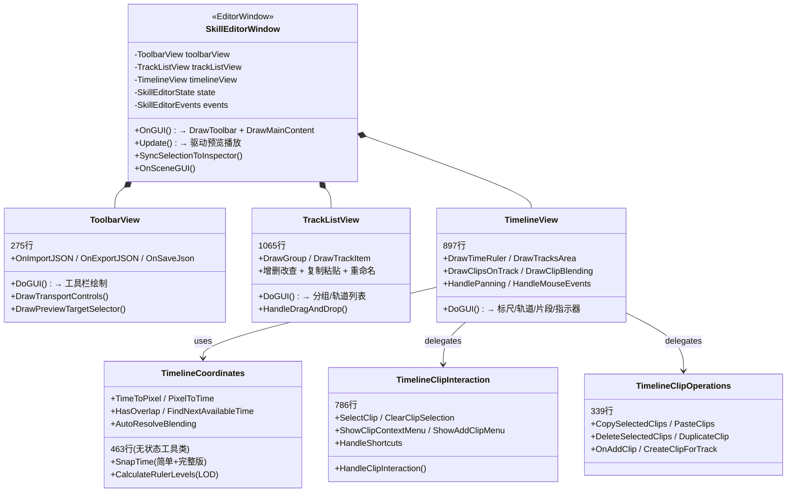

---

## 2. 窗口布局

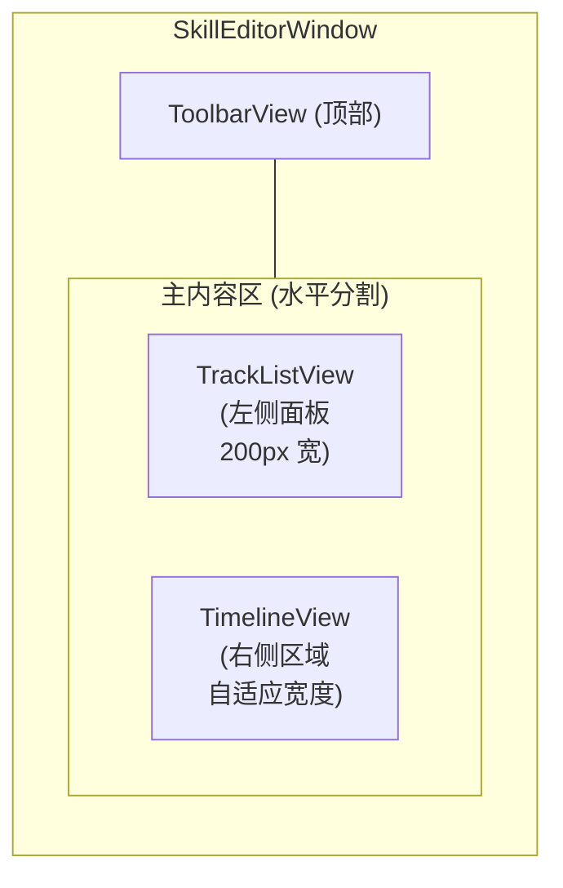

| 区域 | 文件 | 行数 | 职责 |
|:-----|:-----|:----:|:-----|
| **工具栏** | `ToolbarView.cs` | 275 | 播放控制、导入/导出/保存、设置、预览角色 |
| **轨道列表** | `TrackListView.cs` | 1065 | 分组/轨道的树形列表、拖拽排序、右键菜单、重命名 |
| **时间轴** | `TimelineView.cs` | 897 | 标尺、轨道区域、片段绘制、时间指示器 |
| **交互** | `TimelineClipInteraction.cs` | 786 | 片段选择、拖拽（移动/缩放/跨轨道/融合手柄） |
| **操作** | `TimelineClipOperations.cs` | 339 | 复制/粘贴/删除/克隆/添加 |
| **坐标** | `TimelineCoordinates.cs` | 463 | 时间↔像素转换、吸附、标尺 LOD、重叠检测 |
| **主窗口** | `SkillEditorWindow.cs` | 542 | 组装视图、Update 驱动、Undo、Inspector 同步 |

---

## 3. SkillEditorWindow（主窗口）

**文件**: [SkillEditorWindow.cs](file:///D:/Unity/Server_Game/Assets/SkillEditor/Editor/SkillEditorWindow.cs) (542行)

### 3.1 生命周期

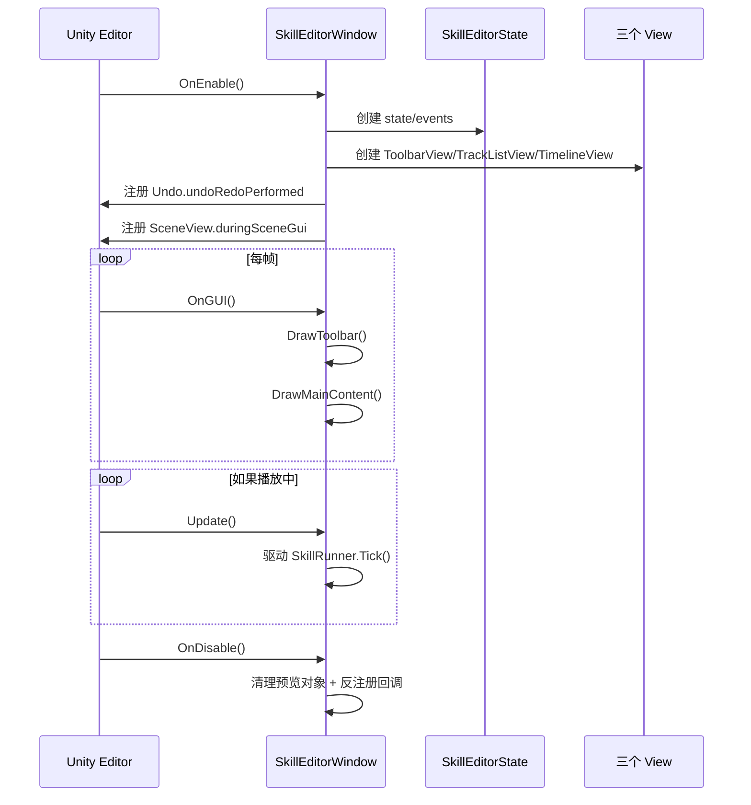

### 3.2 核心方法

| 方法 | 行范围 | 职责 |
|:-----|:------:|:-----|
| `OnEnable` | 51-92 | 初始化 State/Events/Views，加载语言，注册回调 |
| `OnDisable` | 94-121 | 清理预览 Runner，反注册 Undo/SceneView 回调 |
| `OnUndoRedo` | 123-186 | Undo 后重建 trackCache + 同步 Inspector |
| `OnGUI` | 201-214 | 布局调用 DrawToolbar + DrawMainContent |
| `Update` | 218-258 | 驱动 SkillRunner.Tick + 同步 timeIndicator |
| `DrawMainContent` | 311-358 | 水平分割轨道列表和时间轴，处理焦点互斥 |
| `SyncSelectionToInspector` | 453-522 | 将选中状态同步为 SO Wrapper 并设为 Inspector target |
| `OnSceneGUI` | 524-537 | 遍历选中 Clip 的 Drawer 调用 DrawSceneGUI |

### 3.3 焦点管理

```csharp
// DrawMainContent 中
if (trackListRect.Contains(e.mousePosition) && e.type == EventType.MouseDown)
{
    timelineView.OnLostFocus();  // 清除 Clip 选中
}
if (timelineRect.Contains(e.mousePosition) && e.type == EventType.MouseDown)
{
    trackListView.OnLostFocus(); // 清除 Track 选中 + 退出重命名
}
```

- 左右面板点击互斥：点击轨道列表时清除时间轴选中，反之亦然

---

## 4. ToolbarView（工具栏）

**文件**: [ToolbarView.cs](file:///D:/Unity/Server_Game/Assets/SkillEditor/Editor/Views/ToolbarView.cs) (275行)

### 4.1 布局结构

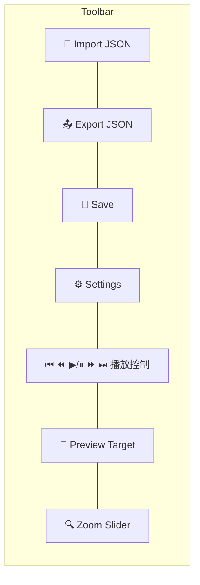

### 4.2 播放控制

| 按钮 | 方法 | 行为 |
|:-----|:-----|:-----|
| ⏮ Jump to Start | `OnJumpToStart` | `timeIndicator = 0` |
| ⏪ Prev Frame | `OnPrevFrame` | `timeIndicator -= 1/frameRate` |
| ▶/⏸ Play/Pause | `OnTogglePlay` | 委托给 Window 处理播放状态 |
| ⏩ Next Frame | `OnNextFrame` | `timeIndicator += 1/frameRate` |
| ⏭ Jump to End | `OnJumpToEnd` | `timeIndicator = timeline.duration` |
| ⏹ Stop | `OnStop` | 委托给 Window 停止 + 重置 |

### 4.3 JSON 操作

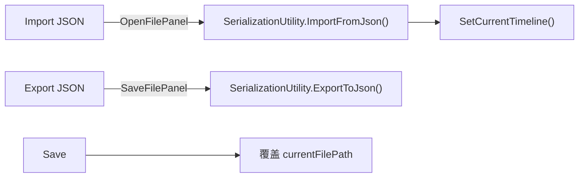

---

## 5. TrackListView（轨道列表）

**文件**: [TrackListView.cs](file:///D:/Unity/Server_Game/Assets/SkillEditor/Editor/Views/TrackListView.cs) (1065行)

### 5.1 核心渲染

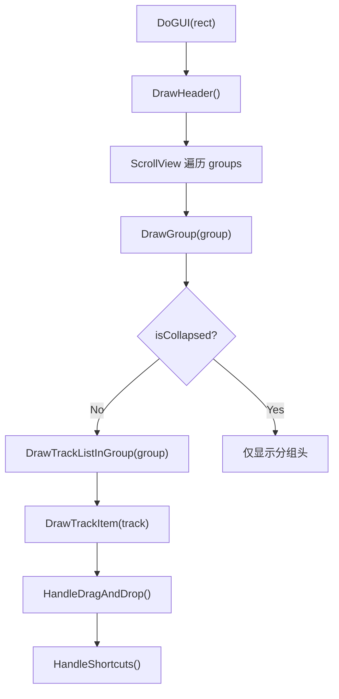

### 5.2 功能分区

| 功能 | 方法 | 行范围 |
|:-----|:-----|:------:|
| **绘制** | `DrawHeader`/`DrawGroup`/`DrawTrackItem` | 160-358 |
| **增删** | `CreateNewGroup`/`OnAddTrackToGroup`/`DeleteTrack`/`DeleteGroup` | 362-557 |
| **拖拽排序** | `HandleDragAndDrop`/`UpdateDropTarget`/`ExecuteDrop` | 569-728 |
| **复制粘贴** | `CopyTrack`/`PasteTrack`/`CopyGroup`/`PasteGroup` | 798-881 |
| **选中** | `SelectTrack`/`SelectGroup`/`ClearTrackSelection` | 901-945 |
| **克隆** | `DuplicateGroup`/`DuplicateTrack` | 981-1049 |
| **右键菜单** | `ShowGroupContextMenu`/`ShowTrackContextMenu`/`ShowGlobalContextMenu` | 378-794 |
| **重命名** | `OnLostFocus`/`EndRenaming` | 41-85 |

### 5.3 拖拽排序

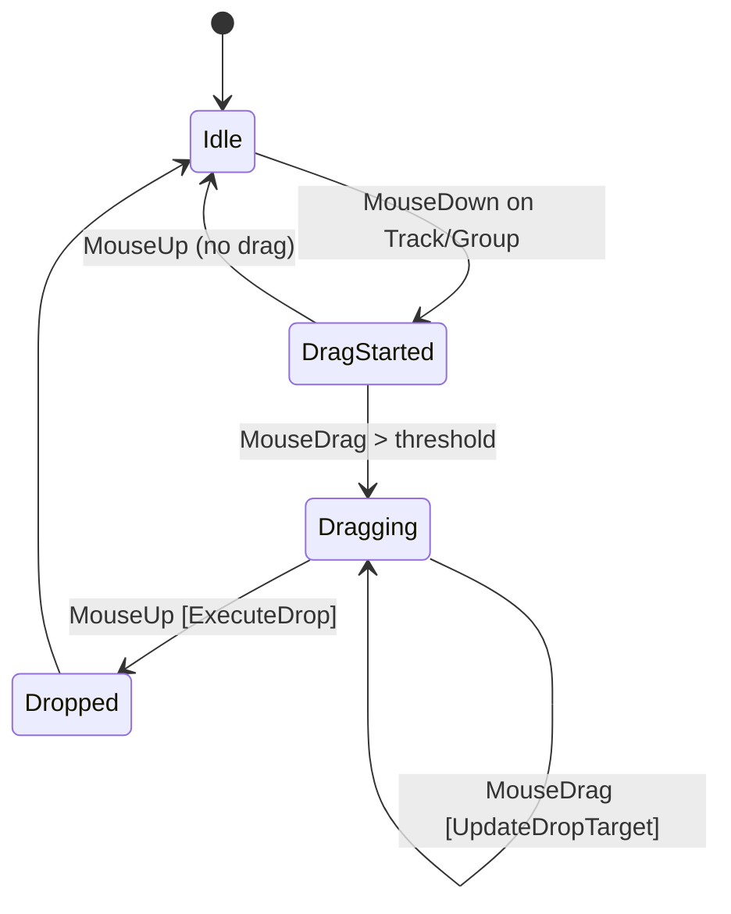

- 支持 **Track 跨 Group 拖放** 和 **Group 重排序**
- `UpdateDropTarget()` 实时计算拖放位置
- `ExecuteDrop()` 执行实际的列表重组

---

## 6. TimelineView（时间轴视图）

**文件**: [TimelineView.cs](file:///D:/Unity/Server_Game/Assets/SkillEditor/Editor/Views/TimelineView.cs) (897行)

### 6.1 渲染流程

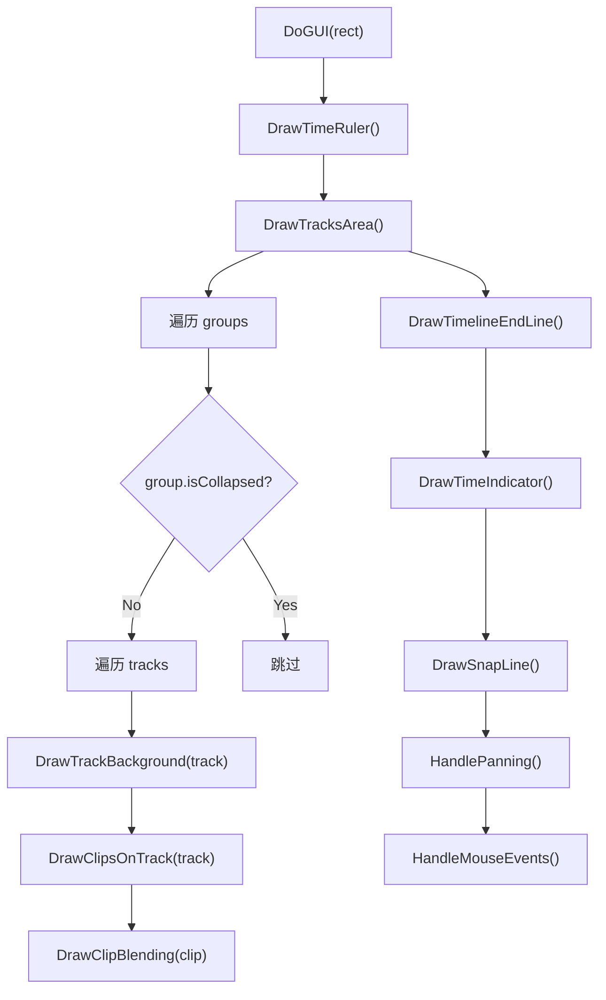

### 6.2 渲染方法分析

| 方法 | 行范围 | 职责 |
|:-----|:------:|:-----|
| `DrawTimeRuler` | 102-165 | 标尺刻度（使用 LOD 分级）+ 时间文本 |
| `DrawTracksArea` | 167-250 | 遍历 Group/Track，计算 Y 偏移，绘制轨道行 |
| `DrawTrackBackground` | 268-288 | 交替背景色 + 选中高亮 |
| `DrawClipsOnTrack` | 290-372 | 为每个 Clip 计算矩形 → 绘制填充/边框/名称/时间标签 |
| `DrawClipBlending` | 374-430 | 绘制 BlendIn/BlendOut 三角形区域 |
| `DrawTimeIndicator` | 450-464 | 红色竖线 + 时间文本 |
| `DrawSnapLine` | 432-448 | 吸附时显示的绿色辅助线 |
| `DrawTimelineEndLine` | 252-266 | 白色竖线标记 Timeline 末端 |

### 6.3 事件处理

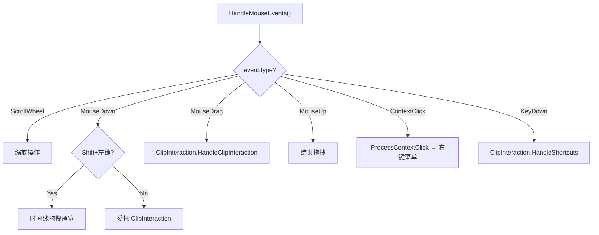

- **Shift+左键**: 时间指针拖拽定位
- **滚轮**: 以鼠标位置为锚点的缩放（保持鼠标下的时间点不动）
- **鼠标事件**: 委托给 `TimelineClipInteraction` 处理

---

## 7. TimelineCoordinates（坐标工具）

**文件**: [TimelineCoordinates.cs](file:///D:/Unity/Server_Game/Assets/SkillEditor/Editor/Views/TimelineCoordinates.cs) (463行)

### 7.1 坐标转换

```
时间 (秒) ←→ 逻辑像素 ←→ 物理像素

TimeToPixel(time) = time × zoom
PixelToTime(pixel) = pixel / zoom
TimeToPhysX(time) = time × zoom - scrollOffset + startMargin
PhysXToTime(physX) = (physX + scrollOffset - startMargin) / zoom
```

### 7.2 吸附系统

**两版 SnapTime**:

| 版本 | 用途 | 特性 |
|:-----|:-----|:-----|
| 简化版 | 通用吸附 | 仅返回吸附后时间值 |
| 完整版 | 拖拽实时 | 返回 `(snappedTime, isSnapped, minPixelDist)`，支持排除当前拖拽的 Clip |

**吸附优先级**: 片段边缘 > 帧网格 > 标尺刻度

### 7.3 标尺 LOD（Level of Detail）

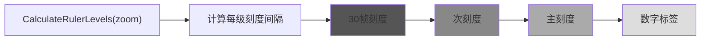

- 根据 `zoom` 动态调整刻度密度
- 支持固定帧率（Fixed 模式）和动态刻度（Variable 模式）

### 7.4 重叠与融合

| 方法 | 职责 |
|:-----|:-----|
| `HasOverlap` | 检测 Clip 在给定位置是否与同轨道其他 Clip 重叠 |
| `FindNextAvailableTime` | 查找下一个不重叠的时间位置 |
| `AllowsOverlap` | 查询轨道类型是否允许重叠（`track.CanOverlap`） |
| `AutoResolveBlending` | 自动计算重叠部分的 BlendIn/BlendOut 时长 |

---

## 8. TimelineClipInteraction（片段交互）

**文件**: [TimelineClipInteraction.cs](file:///D:/Unity/Server_Game/Assets/SkillEditor/Editor/Views/TimelineClipInteraction.cs) (786行)

### 8.1 交互模式

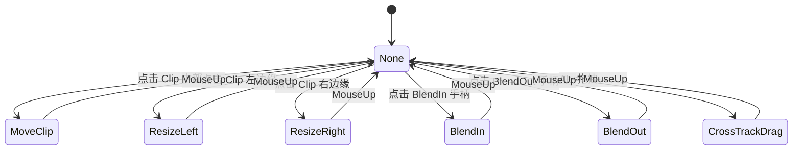

### 8.2 HandleClipInteraction 详解

**核心方法** (L188-592)，最大的方法之一：

```
1. MouseDown:
   - 检测点击位置 → 确定 ClipDragMode
   - 记录初始状态 (SelectedClipInitialState)
   - 调用 SelectClip() 处理 Ctrl 多选

2. MouseDrag:
   - MoveClip: 计算新 startTime + 吸附 + 范围限制
   - ResizeLeft/Right: 修改 startTime/duration + 最小宽度保护
   - CrossTrackDrag: 跨轨道移动（改变 Clip 所属 Track）
   - BlendIn/Out: 调整 blendInDuration/blendOutDuration
   - 多选拖拽：维持相对位置关系

3. MouseUp:
   - 提交修改（Undo.Record）
   - 重叠检测 → AutoResolveBlending
   - ResetDragState()
```

### 8.3 选中机制

```csharp
// Ctrl 多选
if (ctrlPressed)
{
    if (state.selectedClips.Contains(clip))
        state.selectedClips.Remove(clip);  // 取消选中
    else
        state.selectedClips.Add(clip);     // 追加选中
}
else
{
    state.selectedClips.Clear();
    state.selectedClips.Add(clip);         // 单选
}
```

### 8.4 快捷键

| 快捷键 | 行为 |
|:-------|:-----|
| `Delete` | 删除选中 Clip |
| `Ctrl+C` | 复制选中 Clip |
| `Ctrl+V` | 粘贴 Clip |
| `Ctrl+D` | 克隆选中 Clip |
| `Ctrl+A` | 全选当前轨道 |

---

## 9. TimelineClipOperations（片段操作）

**文件**: [TimelineClipOperations.cs](file:///D:/Unity/Server_Game/Assets/SkillEditor/Editor/Views/TimelineClipOperations.cs) (339行)

### 9.1 操作流程

```mermaid
flowchart TD
    subgraph 复制
        A["CopySelectedClips()"] --> B["遍历 selectedClips"]
        B --> C["clip.Clone() + 记录 sourceTrackId"]
        C --> D["存入 copiedClipsData"]
    end

    subgraph 粘贴
        E["PasteClips()"] --> F["遍历 copiedClipsData"]
        F --> G{同轨道可用?}
        G -->|Yes| H["粘贴到原轨道"]
        G -->|No| I["粘贴到当前选中轨道"]
        H & I --> J["再次 Clone + 偏移时间"]
        J --> K["重叠检测 + AutoResolve"]
    end

    subgraph 删除
        L["DeleteSelectedClips()"] --> M["Undo.Record"]
        M --> N["遍历 tracks → Remove(clip)"]
        N --> O["清除选中"]
    end

    subgraph 克隆
        P["DuplicateClip()"] --> Q["clip.Clone()"]
        Q --> R["FindNextAvailableTime()"]
        R --> S["添加到同一 Track"]
    end
```

### 9.2 类型兼容性

| 方法 | 职责 |
|:-----|:-----|
| `CreateClipForTrack(trackType)` | 通过 TrackRegistry 查找关联 ClipType，反射实例化 |
| `GetTrackTypeForClip(clipType)` | 反向查找 Clip 对应的 Track 类型名 |
| `IsClipCompatibleWithTrack(clip, track)` | 检查 Clip 类型是否匹配 Track 类型 |

---

## 10. 视图间通信

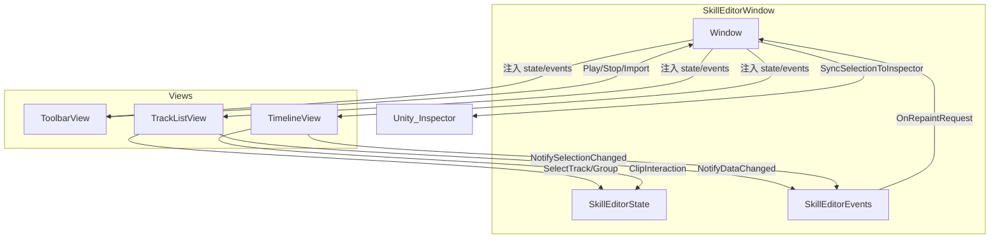

**通信模式**: 所有视图共享 `state` + `events` 引用，通过事件通知变更

---

## 11. 设计评估

### 11.1 优势

| 方面 | 评价 |
|:-----|:-----|
| 职责分离 | ✅ 6 个文件各司其职（渲染/交互/操作/坐标/工具栏/列表） |
| 坐标工具独立 | ✅ `TimelineCoordinates` 无状态，纯函数式设计 |
| 交互与渲染分离 | ✅ `TimelineView` 只绘制，交互委托给 `ClipInteraction` |
| 吸附系统完整 | ✅ 片段边缘/帧网格/标尺都支持吸附 |
| 多选支持 | ✅ Ctrl 多选 + 批量移动/复制/删除 |
| 拖拽排序 | ✅ Track/Group 都支持拖拽重排 |
| Undo 集成 | ✅ 所有数据修改操作都记录 Undo |
| LOD 标尺 | ✅ 根据缩放级别自适应刻度密度 |

### 11.2 需要关注的问题

| 是否解决 | 问题 | 严重程度 | 说明 |
|:----:|:--------:|:-----|:----:|
| ❌ | HandleClipInteraction 方法过长 | 🟡 中 | 404 行的超大方法（L188-592），包含所有拖拽模式的处理逻辑 |
| ❌ | HandleMouseEvents 方法过长 | 🟡 中 | 270 行（L585-855），包含滚轮/点击/拖拽/框选的所有事件 |
| ❌ | TrackListView 体量大 | 🟡 中 | 1065 行包含绘制+操作+菜单+拖拽，可考虑进一步拆分 |
| ❌ | 硬编码 Magic Numbers | 🟢 低 | 如 `TRACK_HEIGHT=40`, `GROUP_HEIGHT=30` 等分散在多个文件中 |
| ❌ | OnSceneGUI Drawer 调用 | 🟢 低 | 遍历所有选中 Clip 调用 DrawSceneGUI，大量 Clip 选中时可能影响性能 |

---

## 附录：文件清单

| 文件路径 | 行数 | 大小 | 角色 |
|:---------|:----:|:----:|:-----|
| `Editor/SkillEditorWindow.cs` | 542 | 18.1KB | 主窗口 EditorWindow |
| `Editor/Views/ToolbarView.cs` | 275 | 9.5KB | 工具栏视图 |
| `Editor/Views/TrackListView.cs` | 1065 | 40.1KB | 轨道列表视图 |
| `Editor/Views/TimelineView.cs` | 897 | 37.7KB | 时间轴视图 |
| `Editor/Views/TimelineCoordinates.cs` | 463 | 15.7KB | 坐标工具类 |
| `Editor/Views/TimelineClipInteraction.cs` | 786 | 31.7KB | 片段交互处理 |
| `Editor/Views/TimelineClipOperations.cs` | 339 | 11.3KB | 片段数据操作 |
| **合计** | **4367** | **164KB** | - |
