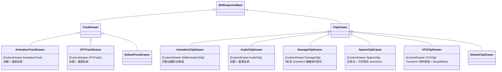
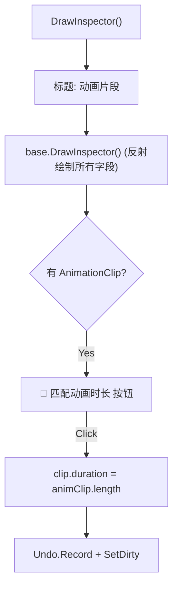
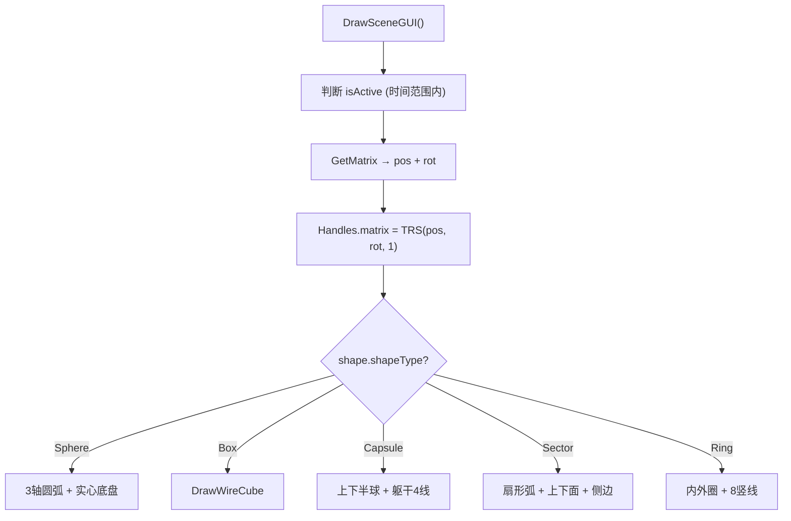
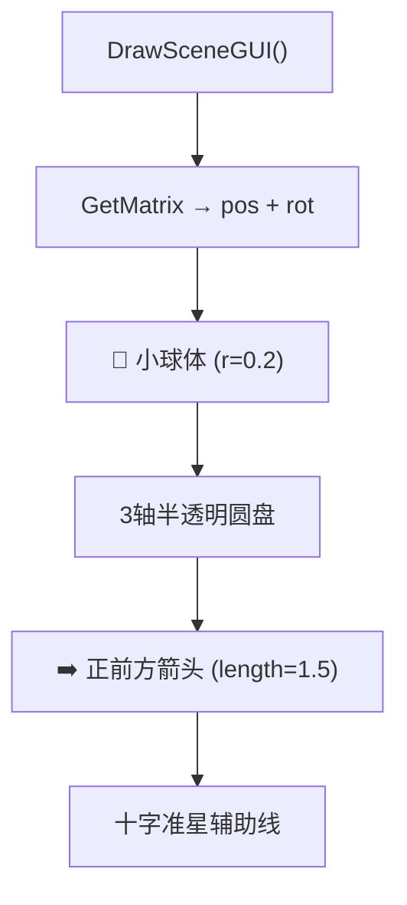
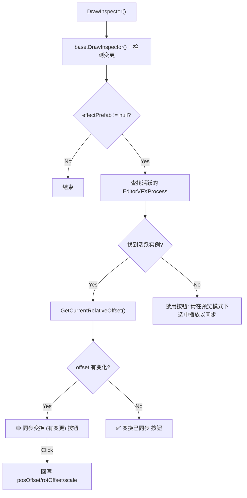

# SkillEditor 各轨道/片段 Drawer 实现分析报告

> **分析范围**: `Editor/Drawers/Impl/` 全部7个 Drawer 实现文件
> **分析日期**: 2026-02-22
> **分析维度**: 编辑器 × Drawer 具体实现

---

## 1. Drawer 注册总览



### 注册映射表

| 数据类型 | Drawer | 行数 | Inspector 扩展 | SceneGUI |
|:---------|:-------|:----:|:--------------:|:--------:|
| `AnimationTrack` | `AnimationTrackDrawer` | 19 | 标题 | ❌ |
| `VFXTrack` | `VFXTrackDrawer` | 19 | 标题 | ❌ |
| `SkillAnimationClip` | `AnimationClipDrawer` | 45 | ✅ 匹配动画时长 | ❌ |
| `AudioClip` | `AudioClipDrawer` | 24 | 标题 | ❌ |
| `DamageClip` | `DamageClipDrawer` | 161 | 基类反射 | ✅ 5种碰撞体 |
| `SpawnClip` | `SpawnClipDrawer` | 90 | 基类反射 | ✅ 生成点+箭头 |
| `VFXClip` | `VFXClipDrawer` | 128 | ✅ Transform 同步 | ❌ |
| 其他 Track | `DefaultTrackDrawer` | - | 基类反射 | ❌ |
| 其他 Clip | `DefaultClipDrawer` | - | 基类反射 | ❌ |

> [!NOTE]
> **无自定义 Drawer 的类型**：`DamageTrack`、`AudioTrack`、`SpawnTrack`、`EventTrack`、`CameraTrack`、`MovementTrack`、`EventClip`、`CameraClip`、`MovementClip` — 这些类型全部使用 `DefaultDrawer` 的基类反射绘制。

---

## 2. AnimationClipDrawer

**文件**: [AnimationClipDrawer.cs](file:///D:/Unity/Server_Game/Assets/SkillEditor/Editor/Drawers/Impl/AnimationClipDrawer.cs) (45行)

### 功能



- **匹配按钮**: 一键将 Clip 的 `duration` 设置为实际 AnimationClip 的时长
- 使用 `d_Refresh` 内置图标提升视觉效果

---

## 3. AudioClipDrawer

**文件**: [AudioClipDrawer.cs](file:///D:/Unity/Server_Game/Assets/SkillEditor/Editor/Drawers/Impl/AudioClipDrawer.cs) (24行)

- 最简单的自定义 Drawer
- 仅添加 "音频片段设置" 标题标签
- 所有字段由基类反射自动绘制

---

## 4. DamageClipDrawer（最复杂）

**文件**: [DamageClipDrawer.cs](file:///D:/Unity/Server_Game/Assets/SkillEditor/Editor/Drawers/Impl/DamageClipDrawer.cs) (161行)

### 4.1 SceneGUI 碰撞体可视化



### 4.2 五种碰撞体绘制

| 形状 | 渲染元素 | 参数 |
|:-----|:---------|:-----|
| **Sphere** | 三轴线框圆弧 + 底部实心盘 | `radius` |
| **Box** | 线框立方体 | `size (Vector3)` |
| **Capsule** | 上下半球(各2个半圆弧) + 上下水平圆 + 4根垂直线 | `radius`, `height` |
| **Sector** | 上下扇形弧 + 侧边线 + 垂直连线 + 实心扇面 | `radius`, `angle`, `height` |
| **Ring** | 内外上下共4圆弧 + 8垂直辅助线 | `radius`, `innerRadius`, `height` |

### 4.3 颜色编码

| 状态 | 线框色 | 填充色 |
|:-----|:-------|:-------|
| **激活中**（时间范围内） | 🟢 `(0,1,0,0.8)` | 🟢 `(0,1,0,0.2)` |
| **非激活** | ⚪ `(0.5,0.5,0.5,0.5)` | ⚪ `(0.5,0.5,0.5,0.1)` |

---

## 5. SpawnClipDrawer

**文件**: [SpawnClipDrawer.cs](file:///D:/Unity/Server_Game/Assets/SkillEditor/Editor/Drawers/Impl/SpawnClipDrawer.cs) (90行)

### SceneGUI 生成点可视化



| 元素 | 颜色 | 说明 |
|:-----|:-----|:-----|
| 顶点球 | 🔵 Cyan `(0,1,1,0.8)` | 生成原点位置 |
| 圆盘 | 半透明 Cyan | 上/右/前三个方向 |
| 箭头 | 🔵 Cyan | 1.5 单位长的方向指示 |
| 十字线 | 白色半透明 | 辅助对齐 |

---

## 6. VFXClipDrawer

**文件**: [VFXClipDrawer.cs](file:///D:/Unity/Server_Game/Assets/SkillEditor/Editor/Drawers/Impl/VFXClipDrawer.cs) (128行)

### 6.1 Inspector 扩展



### 6.2 实时 Transform 同步

| 功能 | 说明 |
|:-----|:-----|
| **属性变更检测** | `EditorGUI.BeginChangeCheck` 检测反射字段修改 |
| **ForceUpdateTransform** | 属性变更时立即更新 VFX 实例位置 |
| **逆向偏移计算** | 从世界坐标反算 `posOffset`/`rotOffset`（通过 `InverseTransformPoint`） |
| **黄色高亮** | 有变更时按钮背景变黄，视觉提示 |

### 6.3 自定义 ShouldShow

```csharp
protected override bool ShouldShow(FieldInfo field, object obj)
{
    if (!base.ShouldShow(field, obj)) return false;
    if (field.Name == "customBoneName" && vfx.bindPoint != BindPoint.CustomBone)
        return false;
    return true;
}
```

- 覆写基类的 `ShouldShow`，增加 VFX 专属的字段显示逻辑

---

## 7. Track Drawer 实现

### AnimationTrackDrawer / VFXTrackDrawer

**文件**: [AnimationTrackDrawer.cs](file:///D:/Unity/Server_Game/Assets/SkillEditor/Editor/Drawers/Impl/AnimationTrackDrawer.cs) (19行) / [VFXTrackDrawer.cs](file:///D:/Unity/Server_Game/Assets/SkillEditor/Editor/Drawers/Impl/VFXTrackDrawer.cs) (19行)

- 两者结构完全相同：标题标签 + `base.DrawInspector(track)`
- 未添加自定义 Inspector 控件
- 主要目的：确保选中轨道时显示类型特定的中文标题

---

## 8. GetMatrix 模式（通用 Gizmo 定位）

`DamageClipDrawer` 和 `SpawnClipDrawer` 共享相同的 `GetMatrix` 逻辑模式：

```csharp
private void GetMatrix(XxxClip clip, SkillEditorState state, out Vector3 pos, out Quaternion rot)
{
    Transform parent = null;
    // 1. 通过 PreviewContext 获取 ISkillActor
    var actor = state.PreviewContext.GetService<ISkillActor>();
    if (actor != null)
        parent = actor.GetBone(clip.bindPoint, clip.customBoneName);

    // 2. 计算世界坐标
    if (parent != null)
    {
        pos = parent.position + parent.rotation * clip.positionOffset;
        rot = parent.rotation * Quaternion.Euler(clip.rotationOffset);
    }
    else  // 降级：直接使用偏移值
    {
        pos = clip.positionOffset;
        rot = Quaternion.Euler(clip.rotationOffset);
    }
}
```

> [!TIP]
> 此模式在 `EditorVFXProcess`、`EditorSpawnProcess`、`DamageClipDrawer`、`SpawnClipDrawer` 中重复出现4次。可考虑提取为工具方法以遵守 DRY 原则。

---

## 9. 设计评估

### 9.1 优势

| 方面 | 评价 |
|:-----|:-----|
| 声明式注册 | ✅ `[CustomDrawer]` 特性 + 反射工厂，新增 Drawer 零修改工厂 |
| SceneGUI 可视化 | ✅ Damage 和 Spawn 提供直观的 Scene 窗口辅助图形 |
| VFX Transform 同步 | ✅ 编辑器拖拽 VFX 实例后可逆向回写偏移值到数据 |
| 渐进式覆写 | ✅ 简单类型仅加标题 + 基类反射，复杂类型深度定制 |
| 激活状态着色 | ✅ Damage Gizmo 区分激活/非激活状态 |

### 9.2 需要关注的问题

| 是否解决 | 问题 | 严重程度 | 说明 |
|:----:|:--------:|:-----|:----:|
| ❌ | GetMatrix 代码重复 | 🟡 中 | 4个文件中重复相同的骨骼查询+偏移计算逻辑 |
| ❌ | VFXClipDrawer ShouldShow 重复 | 🟢 低 | 与 `SkillInspectorBase.ShouldShow` 中的 blendDuration 逻辑重复 |
| ❌ | 缺少 SceneGUI 的几种类型 | 🟢 低 | Camera/Movement Clip 未实现 SceneGUI 可视化 |
| ❌ | Track Drawer 过简 | 🟢 低 | AnimationTrack/VFXTrack 的 Drawer 仅加标题，效益较低 |
| ❌ | 大量类型无自定义 Drawer | 🟢 低 | 6种数据类型使用 DefaultDrawer，反射绘制已足够但扩展空间有限 |

---

## 附录：文件清单

| 文件路径 | 行数 | 大小 | 角色 |
|:---------|:----:|:----:|:-----|
| `Editor/Drawers/Impl/AnimationClipDrawer.cs` | 45 | 1.5KB | 动画片段 Drawer |
| `Editor/Drawers/Impl/AnimationTrackDrawer.cs` | 19 | 493B | 动画轨道 Drawer |
| `Editor/Drawers/Impl/AudioClipDrawer.cs` | 24 | 709B | 音频片段 Drawer |
| `Editor/Drawers/Impl/DamageClipDrawer.cs` | 161 | 8.8KB | 伤害片段 Drawer |
| `Editor/Drawers/Impl/SpawnClipDrawer.cs` | 90 | 3.7KB | 生成片段 Drawer |
| `Editor/Drawers/Impl/VFXClipDrawer.cs` | 128 | 5.3KB | 特效片段 Drawer |
| `Editor/Drawers/Impl/VFXTrackDrawer.cs` | 19 | 473B | 特效轨道 Drawer |
| **合计** | **486** | **21KB** | - |
