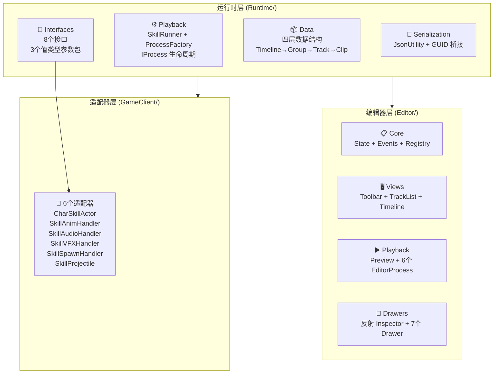
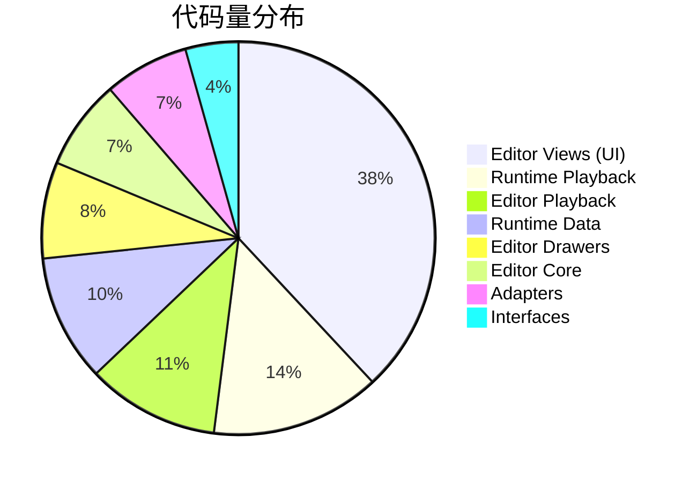
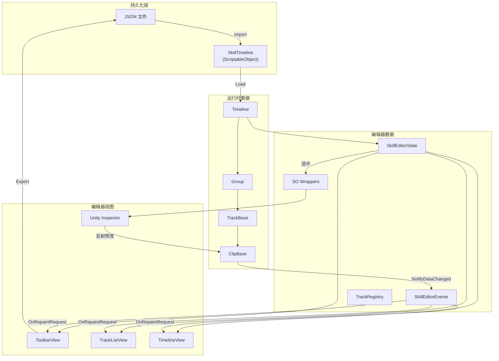
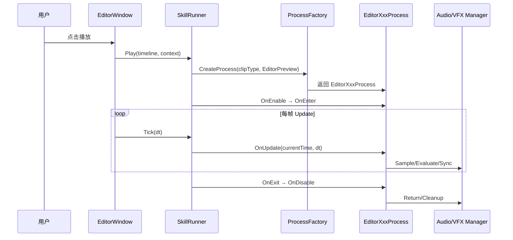
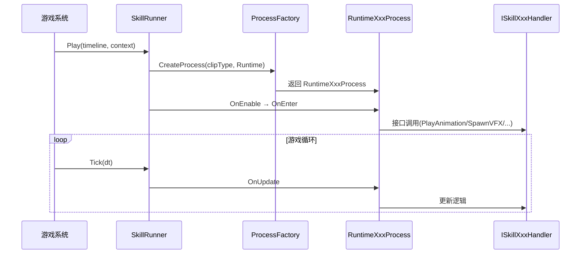
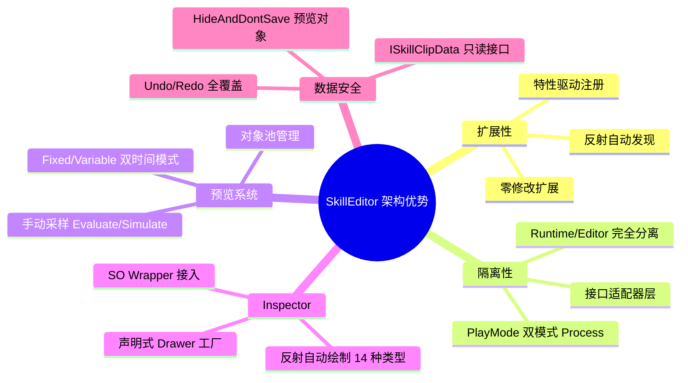

# SkillEditor 整体架构与数据流分析报告

> **分析范围**: 全项目（94个 `.cs` 文件，Runtime + Editor + GameClient 适配器）
> **分析日期**: 2026-02-22
> **分析维度**: 整体架构总评 + 数据流 + SOLID 评估 + 问题汇总

---

## 1. 项目全景

---

## 2. 代码量统计

### 2.1 按层级分布

| 层级 | 文件数 | 核心代码行数 | 占比 |
|:-----|:------:|:-----------:|:----:|
| Runtime / Data | ~20 | ~1200 | 14% |
| Runtime / Playback | ~8 | ~1600 | 19% |
| Runtime / Interfaces | ~11 | ~500 | 6% |
| Editor / Core (Data) | ~8 | ~850 | 10% |
| Editor / Views | 7 | ~4370 | 52% |
| Editor / Playback (Logic) | 10 | ~1250 | 15% |
| Editor / Drawers | 10 | ~910 | 11% |
| GameClient / Adapters | 6 | ~800 | 10% |
| **合计** | **~94** | **~11500** | 100% |

> [!NOTE]
> Editor Views 占全部代码量的 **52%**，是最大的模块。其中 `TrackListView.cs`(1065行) 和 `TimelineView.cs`(897行) 是最大的两个文件。

### 2.2 按功能分布

---

## 3. 数据流全景

### 3.1 编辑时数据流

### 3.2 预览播放数据流

### 3.3 运行时数据流

---

## 4. 核心设计模式

| 模式 | 应用位置 | 说明 |
|:-----|:---------|:-----|
| **策略模式** | `IProcess` / `ProcessBase<T>` | 不同 Clip 类型的处理逻辑可替换 |
| **工厂模式** | `ProcessFactory` / `DrawerFactory` / `ClipDrawerFactory` | 反射扫描 + 惰性初始化 |
| **观察者模式** | `SkillEditorEvents` | EventBus 通知 View 刷新 |
| **适配器模式** | `ISkillActor` / 6个 Handler 接口 | 隔离运行时编辑器差异 |
| **模板方法** | `ProcessBase.Initialize/Tick` | 定义 Process 生命周期骨架 |
| **对象池** | `EditorAudioManager` / `EditorVFXManager` / `VFXPoolManager` | 减少 GC 和实例化开销 |
| **单例** | `EditorAudioManager` / `EditorVFXManager` | 编辑器全局管理器 |
| **状态机** | `SkillRunner.State` | Idle → Playing ⇄ Paused |
| **Wrapper/Proxy** | `GroupObject` / `TrackObject` / `ClipObject` | 非 SO 数据接入 Inspector |
| **声明式注册** | `[ProcessBinding]` / `[CustomDrawer]` / `[TrackDefinition]` | 特性驱动的自动发现 |

---

## 5. SOLID 原则评估

### 5.1 单一职责 (SRP) — ⭐⭐⭐⭐

| 组件 | 评价 |
|:-----|:-----|
| Runtime Data | ✅ 每个 Clip/Track 独立文件 |
| Runtime Process | ✅ 每个 Process 只处理一种 Clip |
| Editor Views | 🟡 `TimelineView`+`ClipInteraction`+`ClipOperations`+`Coordinates` 已拆分，但单个方法仍偏长 |
| `TrackListView` | ⚠️ 1065行，混合绘制+操作+菜单+拖拽 |

### 5.2 开闭原则 (OCP) — ⭐⭐⭐⭐⭐

| 扩展点 | 方式 |
|:-------|:-----|
| 新增 Track/Clip 类型 | 添加类 + `[TrackDefinition]` → 运行时自动发现 |
| 新增 Process | 添加类 + `[ProcessBinding]` → 工厂自动注册 |
| 新增 Drawer | 添加类 + `[CustomDrawer]` → 工厂自动发现 |
| 新增语言 | 实现 `ILanguages` + `[Name]` → 自动加载 |
| 新增适配器 | 实现接口 + 注入 `SkillServiceFactory` |

> **OCP 是本项目最突出的设计亮点**，几乎所有扩展都不需要修改现有代码。

### 5.3 里氏替换 (LSP) — ⭐⭐⭐⭐

- ✅ `ClipBase`/`TrackBase` 子类均可替代基类使用
- ✅ Runtime/Editor Process 通过 `PlayMode` 切换，对 `SkillRunner` 透明

### 5.4 接口隔离 (ISP) — ⭐⭐⭐⭐

- ✅ 8个接口各司其职（Actor/Animation/Audio/VFX/Damage/Event/Spawn/Projectile）
- ✅ `ISkillClipData` 提供只读时间视图

### 5.5 依赖倒置 (DIP) — ⭐⭐⭐⭐

- ✅ Runtime 依赖接口，不依赖 GameClient 实现
- ✅ `ProcessContext` 通过 `GetService<T>` 懒加载获取服务
- ⚠️ `SerializationUtility` 中 `UnityEditor.AssetDatabase` 破坏了倒置

---

## 6. 问题汇总与优先级

### 6.1 关键问题

- [ ] | # | 问题 | 来源报告 | 严重程度 | 影响 |
  |:-:|:-----|:---------|:--------:|:-----|
  | 1 | `SerializationUtility.cs` 在 Runtime 中使用 `UnityEditor.AssetDatabase` | 01 | 🔴 严重 | 运行时编译失败 |
  | 2 | `AudioClip.cs` 与 `UnityEngine.AudioClip` 命名冲突 | 01 | 🟡 中 | 需要全限定名 |

### 6.2 中等问题

- [ ] | # | 问题 | 来源报告 | 说明 |
  |:-:|:-----|:---------|:-----|
  | 3 | `HandleClipInteraction` 404行超大方法 | 05 | 难以维护和测试 |
  | 4 | `TrackListView` 1065行单文件 | 05 | 可拆分为列表+操作+菜单 |
  | 5 | EventBus 无细粒度参数 | 04 | 所有订阅者全量刷新 |
  | 6 | GetMatrix 代码重复4次 | 07 | 违反 DRY |
  | 7 | `SkillInspectorBase.ShouldShow` 硬编码 | 04 | 新增类似条件需改基类 |
  | 8 | `TrackDefinitionAttribute.Order` 冲突 | 01 | Audio/VFX 同为 Order 3 |

### 6.3 低优先级问题

- [ ] | # | 问题 | 来源报告 | 说明 |
  |:-:|:-----|:---------|:-----|
  | 9 | VFX `Simulate` 性能随时间线性增长 | 06 | 长时间线的 Seek 可能卡顿 |
  | 10 | `ClipBase` 公共字段无封装 | 01 | 外部可任意修改 |
  | 11 | Debug.Log 残留 | 06 | SeekPreview 中有调试日志 |
  | 12 | DrawerFactory 每次 new | 04 | 无实例复用 |
  | 13 | CameraClip/MovementClip 骨架实现 | 01 | 未完整实现 |
  | 14 | EditorSpawnProcess 无池化 | 06 | 每次 Instantiate/DestroyImmediate |
  | 15 | GetHumanBone 重复定义 | 06 | EditorVFXProcess 与 Adapter 重复 |

---

## 7. 架构优势总结

---

## 8. 推荐改进方向

### 8.1 必须修复

| 是否解决 | 改进 | 具体方案 |
|:----:|:---------|:---------|
| ✔ | 修复 `SerializationUtility` | 使用 `#if UNITY_EDITOR` 包裹 `AssetDatabase` 调用，或迁移到 Editor 目录 |
| ✔ | 解决 `AudioClip` 命名冲突 | 重命名为 `SkillAudioClip` |

### 8.2 建议优化

| 是否解决 | 改进 | 具体方案 |
|:----:|:---------|:---------|
| ❌ | 提取 GetMatrix 工具方法 | 创建 `BindPointUtility.GetWorldTransform(clip, state)` |
| ❌ | 拆分 TrackListView | 分离为 `TrackListRenderer` + `TrackListOperations` + `TrackListDragDrop` |
| ❌ | 拆分 HandleClipInteraction | 按 `ClipDragMode` 分派到独立的 Handler 方法 |
| ❌ | 增强 EventBus | 事件携带变更类型参数 `Action<ChangeType>` |
| ❌ | ShouldShow 改用特性 | 引入 `[ShowIf("fieldName", value)]` 替代硬编码 |
| ❌ | 缓存反射 FieldInfo | `SkillInspectorBase` 中按类型缓存 `FieldInfo[]` |

---

## 附录：全部分析报告索引

| # | 报告 | 文件 | 核心内容 |
|:-:|:-----|:-----|:---------|
| 1 | [运行时 Data 层](file:///D:/Unity/Server_Game/Assets/SkillEditor/docs/01_runtime_data_analysis.md) | `01_runtime_data_analysis.md` | 四层数据结构 + 序列化 + 属性系统 |
| 2 | [运行时 Logic 层](file:///D:/Unity/Server_Game/Assets/SkillEditor/docs/02_runtime_logic_analysis.md) | `02_runtime_logic_analysis.md` | SkillRunner + ProcessFactory + 8个 Process |
| 3 | [运行时接口与适配器](file:///D:/Unity/Server_Game/Assets/SkillEditor/docs/03_runtime_interfaces_analysis.md) | `03_runtime_interfaces_analysis.md` | 8接口 + 3值类型包 + 6适配器 |
| 4 | [编辑器 Data 层](file:///D:/Unity/Server_Game/Assets/SkillEditor/docs/04_editor_data_analysis.md) | `04_editor_data_analysis.md` | State + Events + Registry + Drawers + Lan |
| 5 | [编辑器 View 层](file:///D:/Unity/Server_Game/Assets/SkillEditor/docs/05_editor_view_analysis.md) | `05_editor_view_analysis.md` | 3大视图 + 坐标工具 + 片段交互 |
| 6 | [编辑器 Logic 层](file:///D:/Unity/Server_Game/Assets/SkillEditor/docs/06_editor_logic_analysis.md) | `06_editor_logic_analysis.md` | 预览系统 + 2管理器 + 6 EditorProcess |
| 7 | [Drawer 实现](file:///D:/Unity/Server_Game/Assets/SkillEditor/docs/07_track_clip_impl_analysis.md) | `07_track_clip_impl_analysis.md` | 7个具体 Drawer + SceneGUI 可视化 |
| 8 | [架构总评](file:///D:/Unity/Server_Game/Assets/SkillEditor/docs/08_architecture_dataflow_analysis.md) | `08_architecture_dataflow_analysis.md` | 本报告 |
