# SkillEditor 运行时 Logic 层分析报告

> **分析范围**: `Runtime/Playback/` 全部子目录（Core、Interfaces、Lifecycle、Processes）及 `Runtime/Sample/`
> **分析日期**: 2026-02-22
> **分析维度**: 运行时 × Logic

---

## 1. 播放系统整体架构

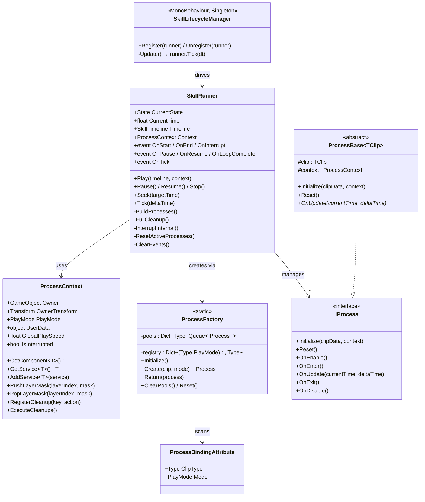

---

## 2. IProcess 生命周期接口

**文件**: [IProcess.cs](file:///D:/Unity/Server_Game/Assets/SkillEditor/Runtime/Playback/Core/IProcess.cs)

### 2.1 五阶段生命周期

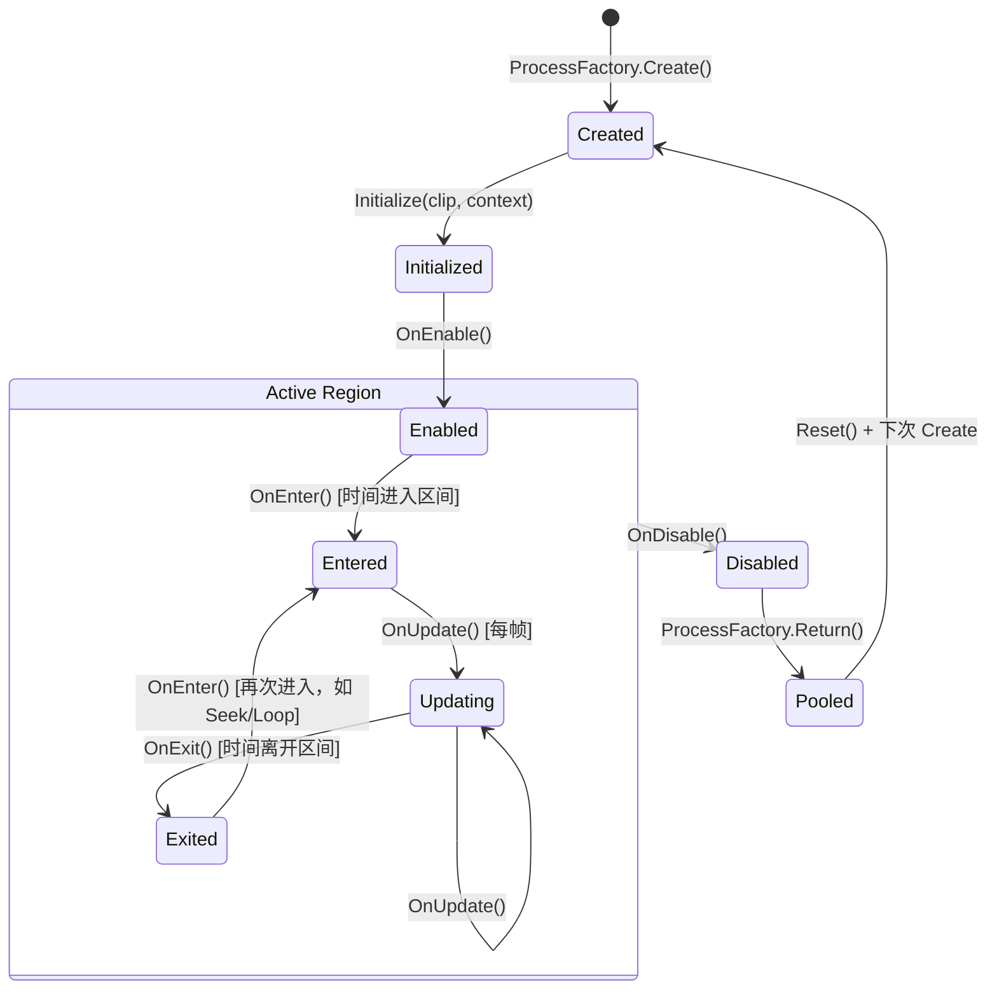

| 阶段 | 方法 | 调用时机 | 典型用途 |
|:-----|:-----|:---------|:---------|
| 初始化 | `Initialize` | `BuildProcesses` 时 | 注入 clip 数据和 context |
| 启用 | `OnEnable` | `Play()` 后立即 | 缓存组件引用、注册系统清理 |
| 进入 | `OnEnter` | 时间指针进入片段区间 | 开始播放动画/音频、实例化特效 |
| 更新 | `OnUpdate` | 每帧（在区间内） | 同步速度、检测伤害 |
| 退出 | `OnExit` | 时间指针离开片段区间 | 回收实例、重置临时状态 |
| 禁用 | `OnDisable` | `Stop()`/打断时 | 释放进程级资源 |
| 重置 | `Reset` | 对象池复用前 | 清空所有字段到默认值 |

### 2.2 设计评价

- ✅ **粒度合理**: Enter/Update/Exit 覆盖了片段持续时间内的完整生命周期；Enable/Disable 覆盖了整个播放会话
- ✅ **对象池友好**: `Reset()` 方法确保实例可安全复用
- ⚠️ **OnEnable 与 OnEnter 职责边界**: 部分 Process（如 RuntimeAnimationProcess）在 `OnEnable` 中调用 `animHandler.Initialize()`，如果多个动画 Clip 共享同一 AnimationHandler，可能多次初始化

---

## 3. ProcessBase 泛型基类

**文件**: [ProcessBase.cs](file:///D:/Unity/Server_Game/Assets/SkillEditor/Runtime/Playback/Core/ProcessBase.cs)

```csharp
public abstract class ProcessBase<TClip> : IProcess where TClip : ClipBase
{
    protected TClip clip;
    protected ProcessContext context;

    public void Initialize(ClipBase clipData, ProcessContext context)
    {
        this.clip = (TClip)clipData;  // 强制转换，由 ProcessBinding 保证类型安全
        this.context = context;
    }

    public virtual void Reset()
    {
        clip = default;
        context = null;
    }

    // 默认空实现，子类按需覆写
    public virtual void OnEnable() { }
    public virtual void OnEnter() { }
    public abstract void OnUpdate(float currentTime, float deltaTime);
    public virtual void OnExit() { }
    public virtual void OnDisable() { }
}
```

**设计要点**:

1. **泛型约束**: `TClip : ClipBase` 保证 `clip` 字段具备强类型访问，避免频繁转型
2. **Initialize 强转**: `(TClip)clipData` 依赖 `ProcessFactory` 的正确绑定，无运行时类型检查
3. **OnUpdate 抽象**: 唯一强制子类实现的方法，其余均为 `virtual` 空实现
4. **Reset 可覆写**: 子类需 `override + base.Reset()` 清理额外字段

---

## 4. ProcessBindingAttribute（绑定特性）

**文件**: [ProcessBindingAttribute.cs](file:///D:/Unity/Server_Game/Assets/SkillEditor/Runtime/Playback/Core/ProcessBindingAttribute.cs)

```csharp
[AttributeUsage(AttributeTargets.Class, AllowMultiple = true, Inherited = false)]
public class ProcessBindingAttribute : Attribute
{
    public Type ClipType { get; }
    public PlayMode Mode { get; }
}
```

- **AllowMultiple = true**: 同一 Process 类可绑定多种模式（如 CameraProcess 同时绑定 EditorPreview 和 Runtime）
- **Inherited = false**: 防止子类继承父类的绑定关系

### 当前绑定注册表

| Clip 类型 | EditorPreview Process | Runtime Process |
|:----------|:---------------------|:----------------|
| `SkillAnimationClip` | `EditorAnimationProcess` | `RuntimeAnimationProcess` |
| `AudioClip` | `EditorAudioProcess` | `RuntimeAudioProcess` |
| `VFXClip` | `EditorVFXProcess` | `RuntimeVFXProcess` |
| `DamageClip` | `EditorDamageProcess` | `RuntimeDamageProcess` |
| `SpawnClip` | `EditorSpawnProcess` | `RuntimeSpawnProcess` |
| `EventClip` | `EditorEventProcess` | `RuntimeEventProcess` |
| `CameraClip` | `CameraProcess` *(共用)* | `CameraProcess` *(共用)* |
| `MovementClip` | `MovementProcess` *(共用)* | `MovementProcess` *(共用)* |

---

## 5. ProcessFactory（工厂 + 对象池）

**文件**: [ProcessFactory.cs](file:///D:/Unity/Server_Game/Assets/SkillEditor/Runtime/Playback/Core/ProcessFactory.cs)

### 5.1 初始化流程

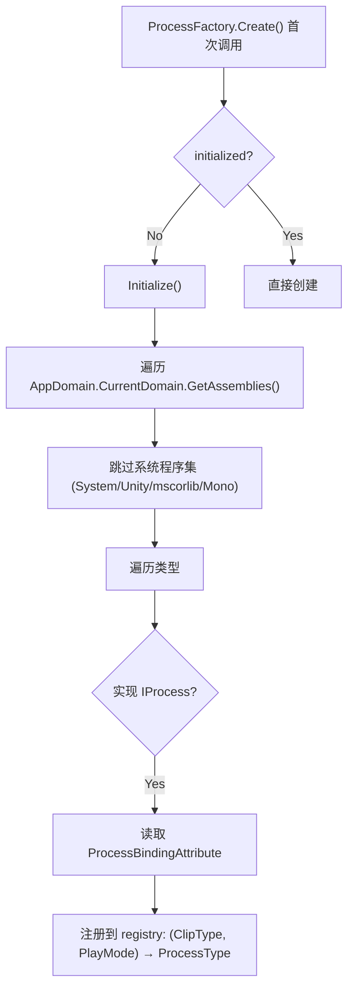

### 5.2 对象池机制

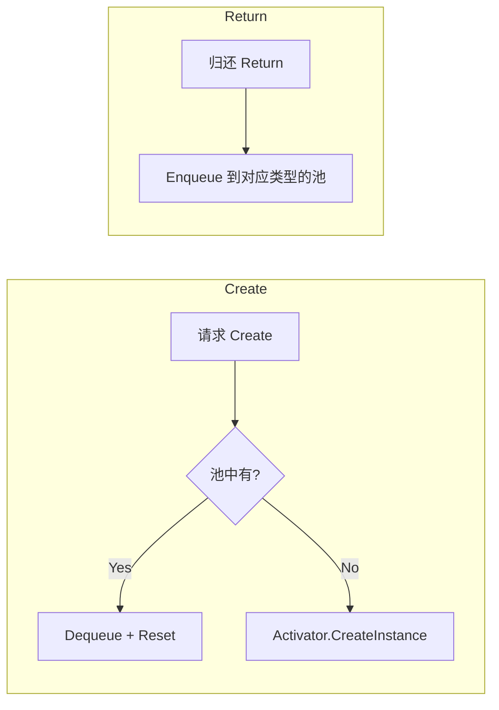

**分析要点**:

1. **惰性初始化**: 首次 `Create` 时自动扫描，后续不再反射
2. **程序集过滤**: 跳过 `System`/`Unity`/`mscorlib`/`Mono` 前缀的程序集，降低扫描开销
3. **对象池无上限**: 池大小不受限，仅在 `ClearPools()` 时清空

> [!NOTE]
> 对象池使用 `Queue<IProcess>` 而非 `Stack`，这意味着 FIFO 复用顺序。一般对象池使用 `Stack`（LIFO）以利用 CPU 缓存局部性。此处差异影响不大，因为 Process 对象本身是轻量级的。

> [!WARNING]
> **ReflectionTypeLoadException 处理**: `Initialize()` 中 catch 了 `ReflectionTypeLoadException` 并使用 `e.Types`（可能含 null），后续遍历中已有 `type == null` 检查，设计完善。但如果某些 Process 类型位于未被过滤的程序集中且加载失败，可能需要更详细的日志记录。

---

## 6. SkillRunner（核心播放器）

**文件**: [SkillRunner.cs](file:///D:/Unity/Server_Game/Assets/SkillEditor/Runtime/Playback/Core/SkillRunner.cs)

### 6.1 状态机

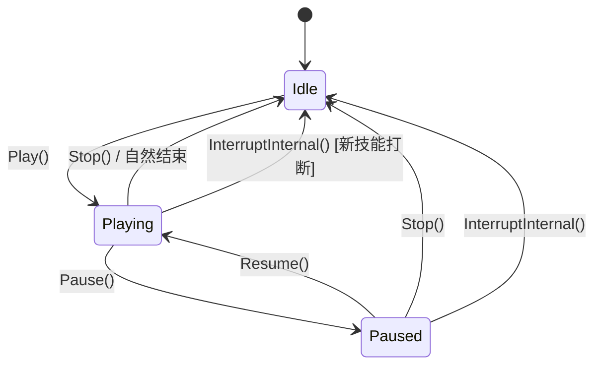

### 6.2 核心方法分析

#### Play(timeline, context)

```
1. 如果当前非 Idle → InterruptInternal() 先打断
2. 设置 Timeline、Context、重置时间
3. BuildProcesses() → 为每个启用的 Clip 创建 Process
4. 所有 Process.OnEnable()
5. 触发 OnStart 事件
```

**BuildProcesses 详细流程** (L298-323):
- 遍历 `Timeline.AllTracks`（跳过 `!isEnabled` 的 Track）
- 遍历每个 Track 的 `clips`（跳过 `!isEnabled` 的 Clip）
- 通过 `ProcessFactory.Create(clip, playMode)` 获取 Process
- 调用 `process.Initialize(clip, context)`
- 封装为 `ProcessInstance` 结构体存入列表

#### Tick(deltaTime)

```
1. 非 Playing 状态直接返回
2. CurrentTime += deltaTime × GlobalPlaySpeed
3. 区间扫描：遍历所有 ProcessInstance
   - shouldBeActive = currentTime ∈ [clip.startTime, clip.EndTime)
   - 进入区间：OnEnter() + isActive=true
   - 区间内：OnUpdate(currentTime, deltaTime)
   - 离开区间：OnExit() + isActive=false
4. 触发 OnTick 事件
5. 播放结束检测：
   - 循环 → ResetActiveProcesses() + CurrentTime=0
   - 非循环 → FullCleanup() + 回到 Idle
```

> [!IMPORTANT]
> **区间判定使用左闭右开 `[startTime, EndTime)`**: `shouldBeActive = currentTime >= startTime && currentTime < EndTime`。这意味着 `EndTime` 那一帧不会执行 `OnUpdate`，而是触发 `OnExit`。

#### Seek(targetTime)

```
1. 遍历所有 ProcessInstance
   - 计算 willBeActive = targetTime ∈ [startTime, EndTime)
   - 当前活跃但即将不活跃 → OnExit()
   - 当前不活跃但即将活跃 → OnEnter()
2. 设置 CurrentTime = targetTime
3. 对所有活跃 Process 调用 OnUpdate(currentTime, deltaTime=0)
```

- **deltaTime=0**: 表示静态采样，Process 可据此区分 Seek 和正常播放
- **用途**: 编辑器时间轴拖拽定位

#### FullCleanup()（三层清理）

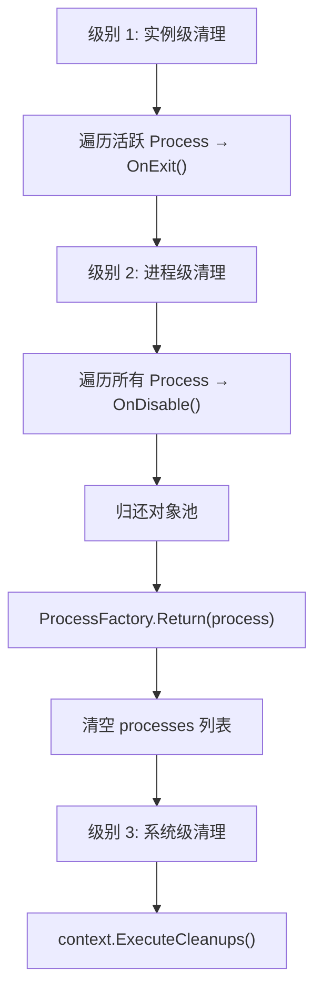

**设计亮点**:

- **三层分级**: 实例级（OnExit）→ 进程级（OnDisable）→ 系统级（Context Cleanups）
- **对象池归还**: 在 OnDisable 之后、系统清理之前归还，确保 Process 不再持有资源
- **Context.ExecuteCleanups**: 去重字典（同 key 仅一个回调），避免重复清理

### 6.3 事件系统

| 事件 | 触发时机 | 典型用途 |
|:-----|:---------|:---------|
| `OnStart` | `Play()` 完成后 | 通知 UI/状态机 |
| `OnEnd` | 自然结束或 `Stop()` | 回收技能对象 |
| `OnInterrupt` | 被新技能打断 | 旧技能清理逻辑 |
| `OnPause` / `OnResume` | 暂停/恢复 | UI 暂停图标 |
| `OnLoopComplete` | 循环播放一轮完成 | 计数/条件判断 |
| `OnTick` | 每帧 | 进度条更新 |

> [!WARNING]
> **ClearEvents 设计**: `Stop()` 和 `InterruptInternal()` 后清除所有事件订阅（`OnStart = null` 等）。这意味着每次 `Play()` 都需要重新订阅事件。如果外部代码在 `OnEnd` 回调中引用了 SkillRunner 并期望复用事件订阅，会遇到问题。

### 6.4 ProcessInstance 结构体

```csharp
public struct ProcessInstance
{
    public IProcess process;
    public ClipBase clip;
    public bool isActive;
}
```

- 使用 `struct` 避免堆分配，但存入 `List<ProcessInstance>` 时需注意值类型语义
- Tick 循环中通过 `processes[i] = inst` 回写修改后的 `isActive`

---

## 7. ProcessContext（播放上下文）

**文件**: [ProcessContext.cs](file:///D:/Unity/Server_Game/Assets/SkillEditor/Runtime/Playback/Core/ProcessContext.cs)

### 7.1 核心职责

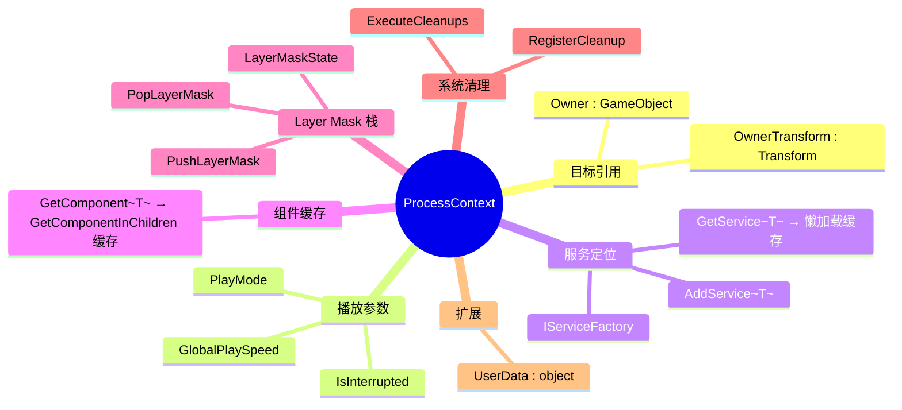

### 7.2 服务定位器模式

```csharp
public T GetService<T>() where T : class
{
    // 1. 缓存命中
    if (_services.TryGetValue(type, out var service)) return service as T;
    // 2. 工厂懒加载
    if (_serviceFactory != null)
    {
        var newService = _serviceFactory.ProvideService(type);
        if (newService != null && newService is T typedService)
        {
            AddService<T>(typedService);
            return typedService;
        }
    }
    return null;
}
```

**流程**: Dictionary 缓存 → IServiceFactory 懒加载 → 缓存结果

- ✅ **惰性解析**: 按需获取服务，未使用的接口不会实例化
- ✅ **缓存去重**: 首次获取后存入字典，后续直接命中
- ⚠️ **弱类型字典**: `Dictionary<Type, object>` 使用装箱，但服务数量少，影响可忽略

### 7.3 LayerMask 栈管理

**专门处理动画遮罩（AvatarMask）的嵌套覆盖问题**：

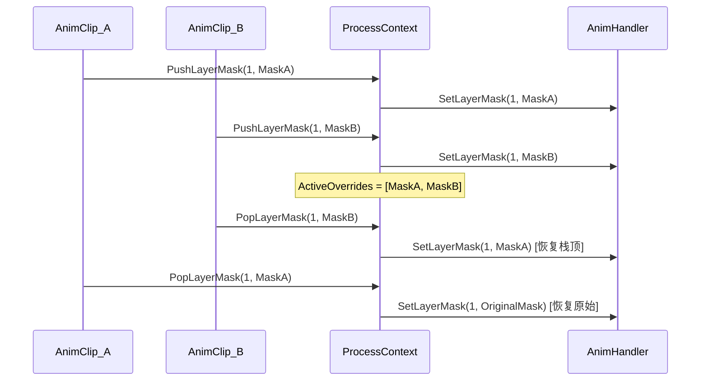

- 使用 `List<AvatarMask>` 作为栈（最后一个元素为栈顶）
- 支持中间退出（`Remove` 而非 `RemoveAt(Count-1)`）
- 栈空时恢复原始 Mask 并清理 State

### 7.4 系统级清理注册

```csharp
public void RegisterCleanup(string key, Action cleanup)
{
    _cleanupActions[key] = cleanup; // 同 key 覆盖
}
```

- **同 key 去重**: 多个动画 Process 注册 `"AnimComponent"` 清理回调，只保留最后一个
- **执行时机**: `SkillRunner.FullCleanup()` → `context.ExecuteCleanups()`

---

## 8. SkillLifecycleManager（生命周期管理器）

**文件**: [SkillLifecycleManager.cs](file:///D:/Unity/Server_Game/Assets/SkillEditor/Runtime/Playback/Lifecycle/SkillLifecycleManager.cs)

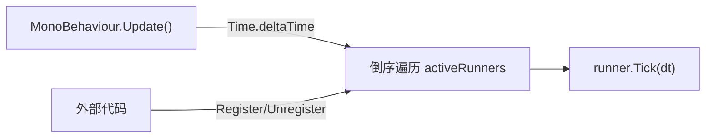

**设计分析**:

| 特性 | 分析 |
|:-----|:-----|
| 懒初始化单例 | `DontDestroyOnLoad`，首次访问 `Instance` 时创建 |
| 倒序遍历 | 允许 Runner 在 Tick 中自行注销，避免列表修改异常 |
| 仅驱动 Tick | 不负责 Runner 的创建/销毁，职责清晰 |
| 帧同步兼容 | 注释说明帧同步模式下不使用此管理器，由外部框架直接调用 `Runner.Tick()` |

> [!TIP]
> 当前使用 `List.Contains()` 做重复检查（O(n)），如果同时活跃的 Runner 数量较多，可考虑改用 `HashSet` 辅助去重。

---

## 9. VFXPoolManager（VFX 对象池）

**文件**: [VFXPoolManager.cs](file:///D:/Unity/Server_Game/Assets/SkillEditor/Runtime/Playback/VFXPoolManager.cs)

### 9.1 架构

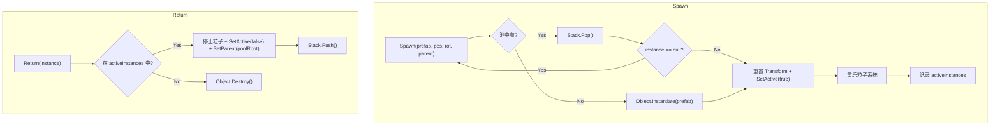

### 9.2 设计分析

| 特性 | 评价 |
|:-----|:-----|
| 静态类 | ✅ 全局单一池，避免重复实例化 |
| Stack 存储 | ✅ LIFO 复用，缓存友好 |
| `DontDestroyOnLoad` 根节点 | ✅ 跨场景持久 |
| 粒子系统重启 | ✅ `Clear + Play` 确保复用时状态干净 |
| null 检测 + 递归 | ⚠️ 被销毁的对象递归重试，极端情况可能 StackOverflow |
| 无池容量上限 | ⚠️ 不主动销毁闲置对象，内存持续增长 |
| 无预热接口 | 🟡 缺少 `Prewarm(prefab, count)` |

---

## 10. 运行时 Process 实现详解

### 10.1 RuntimeAnimationProcess

**文件**: [RuntimeAnimationProcess.cs](file:///D:/Unity/Server_Game/Assets/SkillEditor/Runtime/Playback/Processes/RuntimeAnimationProcess.cs) (61行)

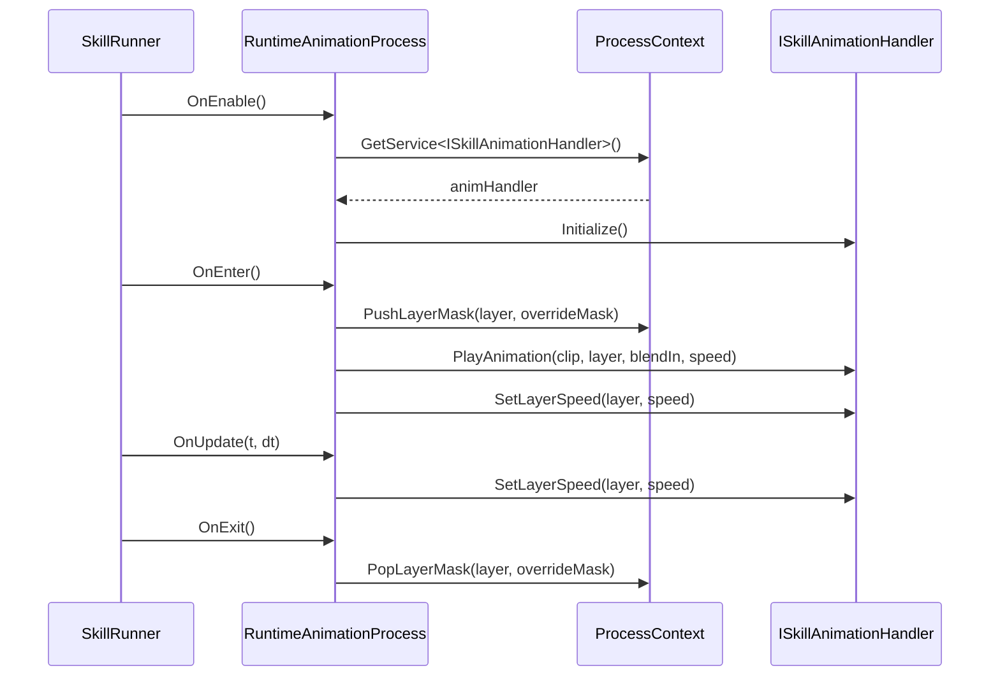

- 通过 `ISkillAnimationHandler` 接口驱动，完全解耦
- 速度 = `clip.playbackSpeed × context.GlobalPlaySpeed`
- 支持 AvatarMask 动态覆盖（Push/Pop 模式）

### 10.2 RuntimeAudioProcess

**文件**: [RuntimeAudioProcess.cs](file:///D:/Unity/Server_Game/Assets/SkillEditor/Runtime/Playback/Processes/RuntimeAudioProcess.cs) (65行)

- 使用 `AudioArgs` 值类型封装播放参数（volume/pitch/loop/spatialBlend/startTime/position）
- `playingSoundId` 追踪当前播放实例，用于 Stop 和 UpdateSound
- `OnUpdate` 持续同步 pitch（因 GlobalPlaySpeed 可能动态变化）

### 10.3 RuntimeVFXProcess

**文件**: [RuntimeVFXProcess.cs](file:///D:/Unity/Server_Game/Assets/SkillEditor/Runtime/Playback/Processes/RuntimeVFXProcess.cs) (182行)

**完整的 VFX 生命周期管理**：

1. **OnEnter**: 获取挂点 → VFXPoolManager.Spawn → 应用偏移/缩放 → 缓存粒子信息 → 同步速度
2. **OnUpdate**: 持续同步粒子模拟速度
3. **OnExit**: 区分硬结束（直接 Return）和软结束（StopEmitting + 延迟 Return）

**软结束机制**:
```csharp
// 停止发射但保留已有粒子
ps.Stop(true, ParticleSystemStopBehavior.StopEmitting);
// 计算最长粒子寿命
float maxLifetime = ps.main.startLifetime.constantMax;
// 延迟回收
runner.StartCoroutine(DelayReturn(instance, maxLifetime));
```

> [!WARNING]
> **协程依赖**: 软结束依赖 `context.GetService<MonoBehaviour>()` 获取协程 Runner。如果服务不可用，退化为硬结束。这是一个隐式依赖。

### 10.4 RuntimeDamageProcess

**文件**: [RuntimeDamageProcess.cs](file:///D:/Unity/Server_Game/Assets/SkillEditor/Runtime/Playback/Processes/RuntimeDamageProcess.cs) (215行)

**最复杂的 Process**，完整实现了 5 种碰撞体的伤害检测：

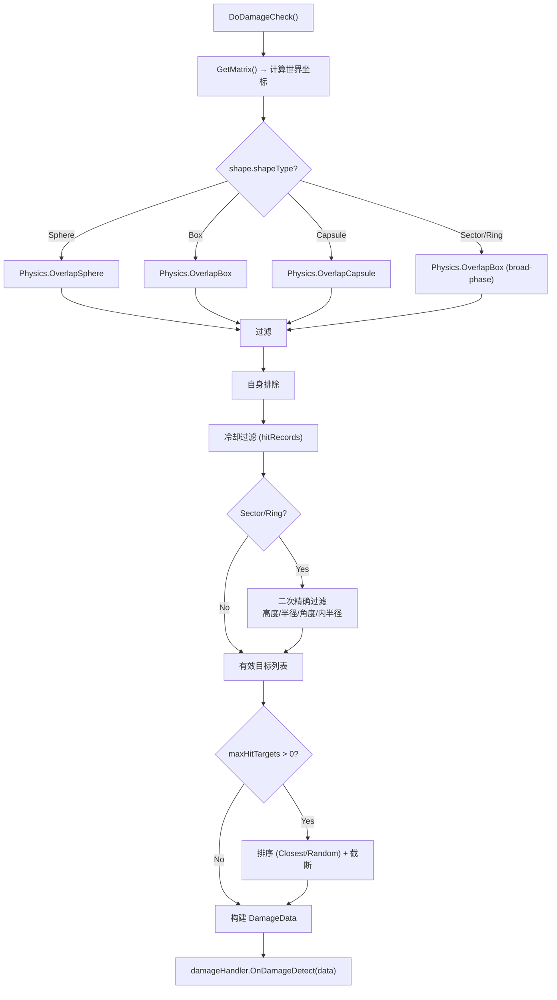

**检测频率策略**:

| HitFrequency | 行为 |
|:-------------|:-----|
| `Once` | 仅在 `OnEnter` 时检测一次 |
| `Always` | 每帧 `OnUpdate` 都检测 |
| `Interval` | 按 `checkInterval` 间隔检测 |

**高级碰撞体处理**:

- **Sector（扇形）**: 先用 Box 做 broad-phase，再在局部坐标系中做角度过滤
- **Ring（环形）**: 先用 Box 做 broad-phase，再过滤内半径
- 两者都做高度剔除（局部 Y 轴）

**DamageData 值类型**:
```csharp
DamageData damageData = new DamageData()
{
    deployer = context.Owner,
    targets = validHits.ToArray(),
    eventTag = clip.eventTag,
    actionTags = clip.targetTags
};
```

### 10.5 RuntimeSpawnProcess

**文件**: [RuntimeSpawnProcess.cs](file:///D:/Unity/Server_Game/Assets/SkillEditor/Runtime/Playback/Processes/RuntimeSpawnProcess.cs) (86行)

- 使用 `SpawnData` 值类型封装生成参数
- `OnEnter` 时通过 `ISkillSpawnHandler.Spawn()` 生成实体
- 生成后调用 `ISkillProjectile.Initialize()` 下发上下文
- `OnUpdate` **不介入**投射物运动（由投射物自身管理）
- `OnExit` 时若被打断 (`context.IsInterrupted`) 且 `destroyOnInterrupt`，调用 `Recycle()`

### 10.6 RuntimeEventProcess

**文件**: [RuntimeEventProcess.cs](file:///D:/Unity/Server_Game/Assets/SkillEditor/Runtime/Playback/Processes/RuntimeEventProcess.cs) (33行)

- 最简单的 Process：`OnEnter` 时触发 `ISkillEventHandler.OnSkillEvent(eventName, parameters)`
- `OnUpdate` 空实现（事件是瞬时的）

### 10.7 CameraProcess / MovementProcess（骨架）

**文件**: [CameraProcess.cs](file:///D:/Unity/Server_Game/Assets/SkillEditor/Runtime/Playback/Processes/CameraProcess.cs) / [MovementProcess.cs](file:///D:/Unity/Server_Game/Assets/SkillEditor/Runtime/Playback/Processes/MovementProcess.cs) (各26行)

- **编辑器/运行时共用** (`[ProcessBinding]` 标注了两种 PlayMode)
- 全部方法为 `TODO` 空实现

---

## 11. CharSkillActor（示例实现）

**文件**: [CharSkillActor.cs](file:///D:/Unity/Server_Game/Assets/SkillEditor/Runtime/Sample/CharSkillActor.cs)

- 实现 `ISkillActor.GetBone(BindPoint, customName)` 接口
- 使用 `Animator.GetBoneTransform(HumanBodyBones.XX)` 获取人形骨骼
- 武器挂点通过 `Transform.Find("WeaponLeftHolder")` 查找
- 自定义骨骼通过 `Transform.Find(customName)` 查找
- 所有找不到的情况都降级返回 `owner.transform`

---

## 12. 数据流总结

### 12.1 完整播放数据流

```mermaid
flowchart TD
    subgraph 初始化阶段
        A["外部代码"] -->|"new SkillRunner(PlayMode.Runtime)"| B["SkillRunner"]
        A -->|"new ProcessContext(owner, mode, factory)"| C["ProcessContext"]
        A -->|"runner.Play(timeline, context)"| D["Play()"]
        D --> E["BuildProcesses()"]
        E --> F["ProcessFactory.Create(clip, mode)"]
        F -->|反射查找| G["(ClipType, PlayMode) → ProcessType"]
        G -->|对象池或 new| H["IProcess 实例"]
        H -->|"Initialize(clip, context)"| I["Process 就绪"]
        I --> J["OnEnable()"]
        J -->|"GetService<IHandler>()"| K["服务懒加载"]
    end

    subgraph 播放循环
        L["SkillLifecycleManager.Update()"] -->|deltaTime| M["runner.Tick(dt)"]
        M --> N["区间扫描"]
        N -->|进入| O["OnEnter()"]
        N -->|区间内| P["OnUpdate(t, dt)"]
        N -->|离开| Q["OnExit()"]
        O & P & Q -->|通过接口| R["Handler 执行具体逻辑"]
    end

    subgraph 清理阶段
        S["Stop() / Interrupt"] --> T["FullCleanup()"]
        T --> U["L1: OnExit() 活跃 Process"]
        U --> V["L2: OnDisable() 所有 Process"]
        V --> W["归还对象池"]
        W --> X["L3: Context.ExecuteCleanups()"]
    end
```

### 12.2 依赖注入数据流

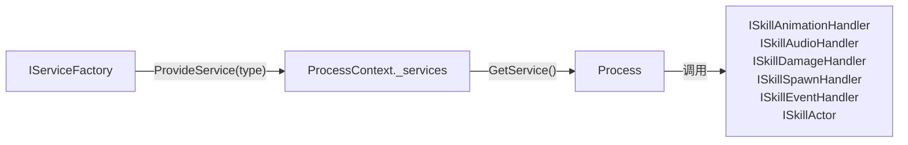

---

## 13. 设计评估

### 13.1 优势

| 方面 | 评价 |
|:-----|:-----|
| Process 生命周期 | ✅ 五阶段设计覆盖完整，职责清晰 |
| ProcessBinding 声明式 | ✅ 新增 Process 无需修改工厂代码（OCP） |
| 对象池复用 | ✅ ProcessFactory 和 VFXPoolManager 双层池化 |
| 依赖倒置 | ✅ 所有 Process 通过接口访问外部服务（DIP） |
| 打断安全 | ✅ 三层清理 + IsInterrupted 标记 |
| 帧同步友好 | ✅ SkillRunner 为纯 C# 类，不依赖 MonoBehaviour |
| LayerMask 栈 | ✅ 支持动画遮罩嵌套覆盖，正确恢复 |

### 13.2 需要关注的问题

| 是否解决 | 问题 | 严重程度 | 说明 |
|:----:|:--------:|:-----|:----:|
| ❌ | ClearEvents 清除订阅 | 🟡 中 | Stop/Interrupt 后所有事件订阅被清空，外部需每次重新订阅 |
| ❌ | VFX 软结束协程依赖 | 🟡 中 | 依赖 `GetService<MonoBehaviour>()` 获取协程 Runner |
| ❌ | VFXPoolManager 无容量上限 | 🟡 中 | 不主动回收闲置对象，可能内存持续增长 |
| ❌ | Debug.Log 残留 | 🟢 低 | RuntimeAnimationProcess/RuntimeVFXProcess 中残留调试日志 |
| ❌ | CameraProcess/MovementProcess 空实现 | 🟢 低 | 骨架代码，功能待实现 |
| ❌ | ProcessFactory 惰性初始化线程安全 | 🟢 低 | 非线程安全，但 Unity 主线程单线程模型下无问题 |

---

## 附录：文件清单

| 文件路径 | 行数 | 大小 | 角色 |
|:---------|:----:|:----:|:-----|
| `Runtime/Playback/Core/SkillRunner.cs` | 391 | 11.6KB | 核心播放状态机 |
| `Runtime/Playback/Core/ProcessContext.cs` | 205 | 7.4KB | 依赖注入上下文 |
| `Runtime/Playback/Core/ProcessFactory.cs` | 129 | 4.2KB | 反射工厂+对象池 |
| `Runtime/Playback/Core/ProcessBase.cs` | 49 | 1.4KB | 泛型 Process 基类 |
| `Runtime/Playback/Core/IProcess.cs` | 48 | 1.5KB | 生命周期接口 |
| `Runtime/Playback/Core/ProcessBindingAttribute.cs` | 38 | 1.3KB | 绑定特性 |
| `Runtime/Playback/Lifecycle/SkillLifecycleManager.cs` | 79 | 2.2KB | Mono 单例驱动器 |
| `Runtime/Playback/VFXPoolManager.cs` | 119 | 3.9KB | VFX 对象池 |
| `Runtime/Playback/Processes/RuntimeAnimationProcess.cs` | 61 | 2.3KB | 动画处理器 |
| `Runtime/Playback/Processes/RuntimeAudioProcess.cs` | 65 | 2.3KB | 音频处理器 |
| `Runtime/Playback/Processes/RuntimeVFXProcess.cs` | 182 | 6.5KB | VFX 处理器 |
| `Runtime/Playback/Processes/RuntimeDamageProcess.cs` | 215 | 8.2KB | 伤害处理器 |
| `Runtime/Playback/Processes/RuntimeSpawnProcess.cs` | 86 | 3.0KB | 生成处理器 |
| `Runtime/Playback/Processes/RuntimeEventProcess.cs` | 33 | 848B | 事件处理器 |
| `Runtime/Playback/Processes/CameraProcess.cs` | 26 | 700B | 相机处理器（骨架） |
| `Runtime/Playback/Processes/MovementProcess.cs` | 26 | 690B | 移动处理器（骨架） |
| `Runtime/Sample/CharSkillActor.cs` | 41 | 1.7KB | 示例 Actor |
