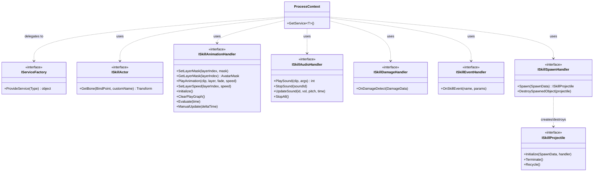
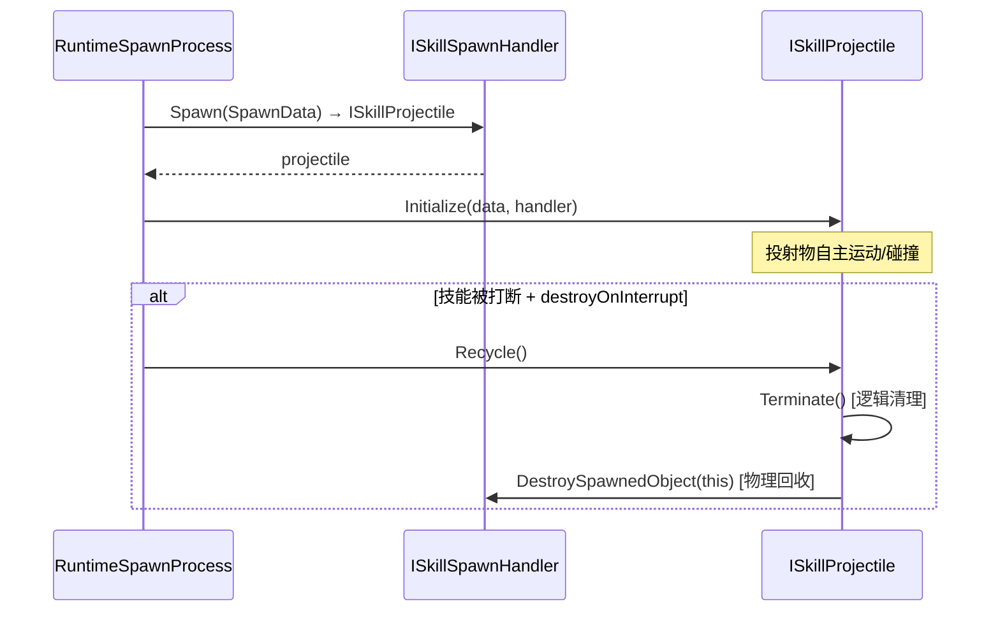
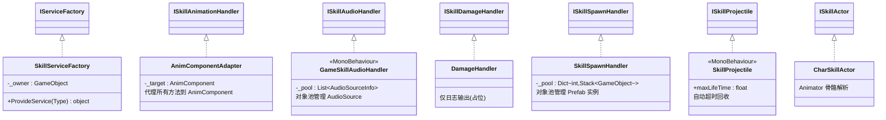
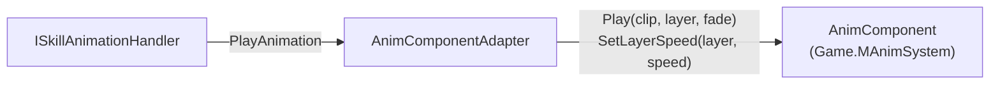
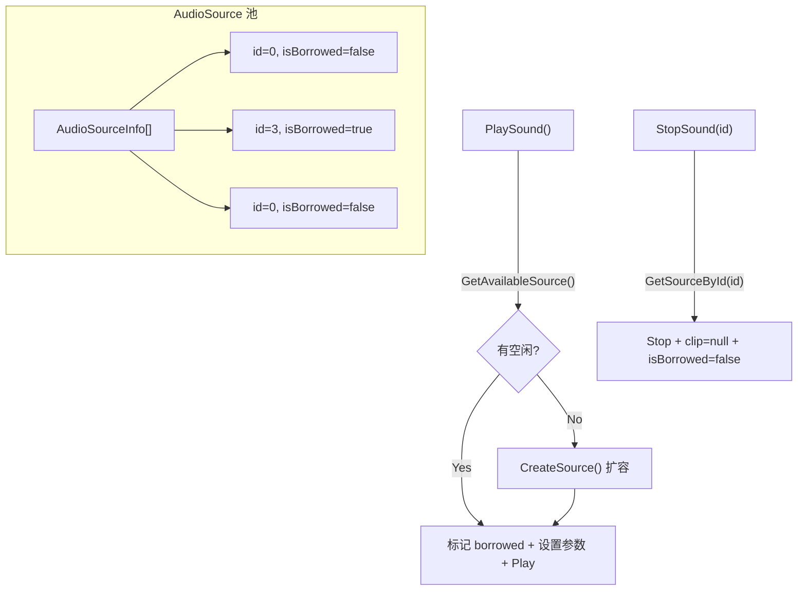
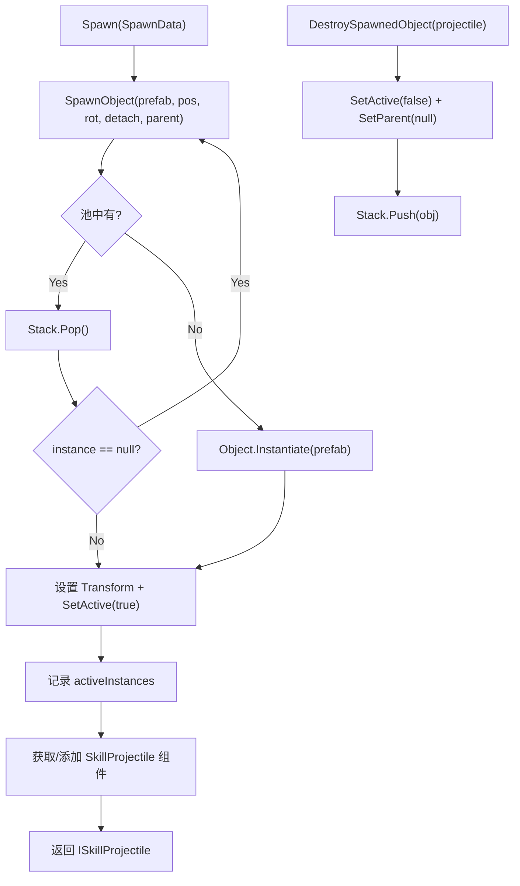
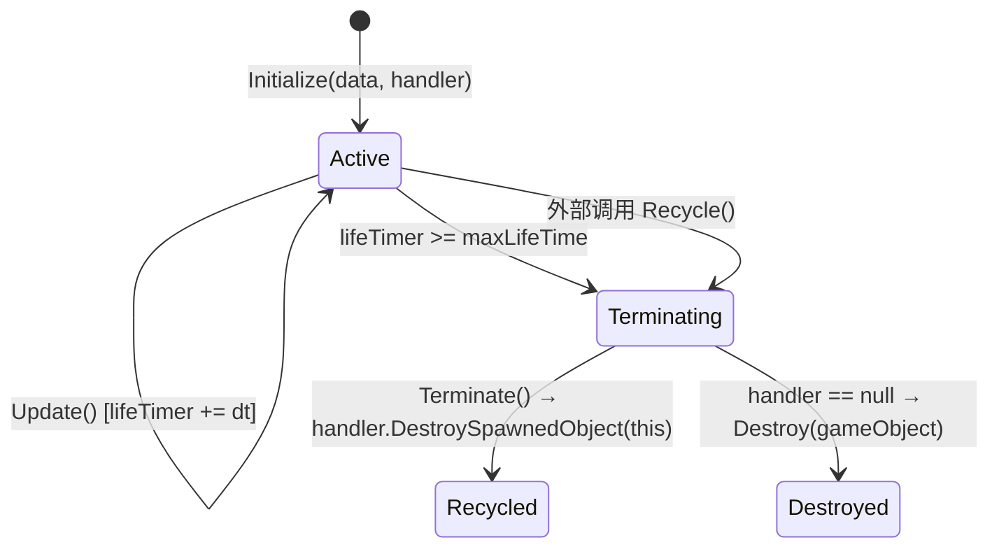
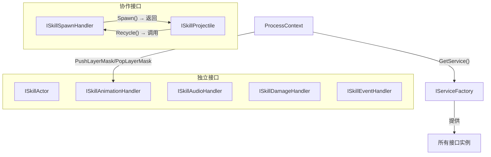
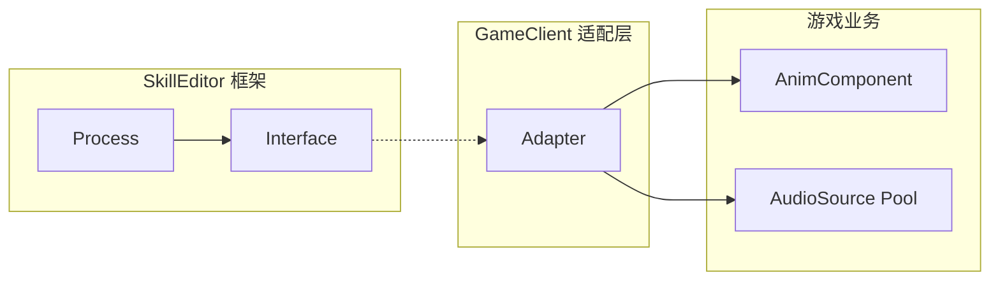

# SkillEditor 运行时接口与适配器分析报告

> **分析范围**: `Runtime/Playback/Interfaces/`（8个接口 + 3个值类型参数包）及 `GameClient/Adapters/`（6个适配器实现）
> **分析日期**: 2026-02-22
> **分析维度**: 运行时 × 接口层

---

## 1. 接口层整体架构



### 接口分类

| 类别 | 接口 | 消费者 (Process) |
|:-----|:-----|:-----------------|
| 基础设施 | `IServiceFactory` | `ProcessContext` |
| 角色查询 | `ISkillActor` | VFX / Damage / Spawn Process |
| 动画控制 | `ISkillAnimationHandler` | `RuntimeAnimationProcess` |
| 音频控制 | `ISkillAudioHandler` | `RuntimeAudioProcess` |
| 伤害回调 | `ISkillDamageHandler` | `RuntimeDamageProcess` |
| 事件回调 | `ISkillEventHandler` | `RuntimeEventProcess` |
| 生成管理 | `ISkillSpawnHandler` + `ISkillProjectile` | `RuntimeSpawnProcess` |

---

## 2. 各接口详细分析

### 2.1 IServiceFactory（服务工厂）

**文件**: [IServiceFactory.cs](file:///D:/Unity/Server_Game/Assets/SkillEditor/Runtime/Playback/Interfaces/IServiceFactory.cs)

```csharp
public interface IServiceFactory
{
    object ProvideService(Type serviceType);
}
```

- **职责**: 根据 `Type` 创建/提供对应的服务实例
- **消费方**: `ProcessContext.GetService<T>()` 在缓存未命中时调用
- **返回值**: `object`（弱类型），由调用方强转

> [!NOTE]
> 使用 `Type` 参数而非泛型方法 `T ProvideService<T>()`，这使得实现方可以用 `if-else` 链路由不同类型，但每个分支需要手动类型匹配。泛型接口需要更复杂的实现但更类型安全。当前的 `object` 返回值设计是简单实用的选择。

---

### 2.2 ISkillActor（技能角色）

**文件**: [ISkillActor.cs](file:///D:/Unity/Server_Game/Assets/SkillEditor/Runtime/Playback/Interfaces/ISkillActor.cs)

```csharp
public interface ISkillActor
{
    Transform GetBone(BindPoint point, string customName = "");
}
```

- **职责**: 解析 `BindPoint` 枚举到实际的 `Transform` 引用
- **消费方**: RuntimeVFXProcess、RuntimeDamageProcess、RuntimeSpawnProcess — 3 个 Process 都需要获取挂点位置
- **设计评价**: ✅ 极简单一接口（ISP），仅做骨骼解析，不涉及任何状态修改

---

### 2.3 ISkillAnimationHandler（动画处理）

**文件**: [ISkillAnimationHandler.cs](file:///D:/Unity/Server_Game/Assets/SkillEditor/Runtime/Playback/Interfaces/ISkillAnimationHandler.cs)

```csharp
public interface ISkillAnimationHandler
{
    // 遮罩管理
    void SetLayerMask(int layerIndex, AvatarMask mask);
    AvatarMask GetLayerMask(int layerIndex);

    // 播放控制
    void PlayAnimation(AnimationClip clip, int layerIndex, float fadeDuration, float speed);
    void SetLayerSpeed(int layerIndex, float speed);

    // 基础属性
    void Initialize();
    void ClearPlayGraph();

    // 采样与手动更新（编辑器预览用）
    void Evaluate(float time);
    void ManualUpdate(float deltaTime);
}
```

| 方法分组 | 方法 | 运行时使用 | 编辑器使用 |
|:---------|:-----|:----------:|:----------:|
| 遮罩管理 | `SetLayerMask` / `GetLayerMask` | ✅ | ✅ |
| 播放控制 | `PlayAnimation` / `SetLayerSpeed` | ✅ | ❌ |
| 基础 | `Initialize` / `ClearPlayGraph` | ✅ | ✅ |
| 采样 | `Evaluate` / `ManualUpdate` | ❌ | ✅ |

> [!WARNING]
> **ISP 违反可能**: `Evaluate` 和 `ManualUpdate` 仅编辑器预览使用，运行时实现方需空实现这两个方法。可考虑拆分为 `ISkillAnimationSampler`（编辑器专用）子接口。但考虑到接口总共只有 8 个方法，拆分收益有限。

---

### 2.4 ISkillAudioHandler（音频处理）

**文件**: [ISkillAudioHandler.cs](file:///D:/Unity/Server_Game/Assets/SkillEditor/Runtime/Playback/Interfaces/ISkillAudioHandler.cs)

```csharp
public interface ISkillAudioHandler
{
    int PlaySound(UnityEngine.AudioClip clip, AudioArgs args);
    void StopSound(int soundId);
    void UpdateSound(int soundId, float volume, float pitch, float time);
    void StopAll();
}
```

**配套值类型**:

```csharp
public struct AudioArgs
{
    public float volume;
    public float pitch;
    public bool loop;
    public float spatialBlend;  // 0=2D, 1=3D
    public float startTime;     // 起始播放时间
    public Vector3 position;    // 3D音效位置
}
```

- **ID 管理**: `PlaySound` 返回 `int` 作为播放实例 ID，后续操作通过此 ID 寻址
- ✅ `AudioArgs` 使用 `struct` 值类型，避免堆分配
- ✅ `StopAll` 提供批量清理能力

---

### 2.5 ISkillDamageHandler（伤害处理）

**文件**: [ISkillDamageHandler.cs](file:///D:/Unity/Server_Game/Assets/SkillEditor/Runtime/Playback/Interfaces/ISkillDamageHandler.cs)

```csharp
public interface ISkillDamageHandler
{
    void OnDamageDetect(DamageData damageData);
}
```

**配套值类型**:

```csharp
public struct DamageData
{
    public GameObject deployer;     // 释放者
    public Collider[] targets;      // 命中目标
    public string eventTag;         // 事件标识
    public string[] actionTags;     // 行为标签
}
```

- **单方法接口**: 极致简洁，仅传递检测结果
- ✅ `DamageData` 封装了所有上下文信息，实现方不需要反查 Clip 数据
- SkillEditor 负责空间检测，战斗系统负责伤害计算 — **职责清晰**

> [!NOTE]
> `DamageData` 虽然是 `struct`，但内部包含引用类型（`GameObject`、`Collider[]`、`string[]`），实际上并不具备完整的值语义。但作为参数包传递是合理的。

---

### 2.6 ISkillEventHandler（事件处理）

**文件**: [ISkillEventHandler.cs](file:///D:/Unity/Server_Game/Assets/SkillEditor/Runtime/Playback/Interfaces/ISkillEventHandler.cs)

```csharp
public interface ISkillEventHandler
{
    void OnSkillEvent(string eventName, List<SkillEventParam> parameters);
}
```

- **通用事件机制**: 通过 `eventName` + `List<SkillEventParam>` 实现运行时无限扩展
- 战斗系统可根据 `eventName` 分发到不同处理逻辑（如 "AddBuff"、"SetCamera"、"PlayVO" 等）
- ⚠️ `List<SkillEventParam>` 是引用类型，实现方需注意不要修改原始数据

---

### 2.7 ISkillSpawnHandler + ISkillProjectile（生成系统）

**文件**: [ISkillSpawnHandler.cs](file:///D:/Unity/Server_Game/Assets/SkillEditor/Runtime/Playback/Interfaces/ISkillSpawnHandler.cs) / [ISkillProjectile.cs](file:///D:/Unity/Server_Game/Assets/SkillEditor/Runtime/Playback/Interfaces/ISkillProjectile.cs)



**ISkillSpawnHandler**:

```csharp
public interface ISkillSpawnHandler
{
    ISkillProjectile Spawn(SpawnData data);
    void DestroySpawnedObject(ISkillProjectile projectile);
}
```

**SpawnData**:

```csharp
public struct SpawnData
{
    public GameObject configPrefab;  // 预制体
    public Vector3 position;         // 世界坐标
    public Quaternion rotation;      // 世界旋转
    public bool detach;              // 脱离父节点
    public Transform parent;         // 父节点
    public string eventTag;          // 事件标识
    public string[] targetTags;      // 目标标签
    public GameObject deployer;      // 释放者
}
```

**ISkillProjectile**:

```csharp
public interface ISkillProjectile
{
    void Initialize(SpawnData data, ISkillSpawnHandler handler);
    void Terminate();   // 逻辑清理（停止粒子/音效等）
    void Recycle();     // 真实回收（入池/销毁，先调 Terminate）
}
```

**设计亮点**:

1. **双接口协作**: Handler 负责生成/销毁，Projectile 负责自身生命周期
2. **SpawnData 值类型**: 完整的参数包，一次性传递
3. **Terminate/Recycle 分离**: 逻辑清理和物理回收解耦，支持渐隐效果
4. **反向引用**: Projectile 持有 Handler 引用，可主动触发回收

---

## 3. 适配器实现分析

### 3.1 适配器总览



---

### 3.2 SkillServiceFactory（服务工厂适配器）

**文件**: [SkillServiceFactory.cs](file:///D:/Unity/Server_Game/Assets/GameClient/Adapters/SkillServiceFactory.cs)

**服务路由表**:

| 请求类型 | 提供的实现 | 创建方式 |
|:---------|:----------|:---------|
| `ISkillAnimationHandler` | `AnimComponentAdapter` | `new`（包装 AnimComponent） |
| `MonoBehaviour` | 任意 MonoBehaviour | `GetComponent<MonoBehaviour>()` |
| `ISkillActor` | `CharSkillActor` | `new`（传入 owner） |
| `ISkillAudioHandler` | `GameSkillAudioHandler` | `AddComponent<>()`（动态挂载） |
| `ISkillDamageHandler` | `DamageHandler` | `new`（占位实现） |

**分析要点**:

1. **if-else 链路由**: 简单直接但违反 OCP，每新增服务需修改此类
2. **创建方式不一致**: 
   - `AnimComponentAdapter` 和 `CharSkillActor` 用 `new` 创建纯 C# 对象
   - `GameSkillAudioHandler` 用 `AddComponent` 动态挂载 MonoBehaviour

> [!WARNING]
> **AddComponent 每次调用**: `ISkillAudioHandler` 通过 `AddComponent<GameSkillAudioHandler>()` 创建，如果 `GetService` 被多次调用（虽然有缓存），首次调用会在 GameObject 上动态添加组件。且 `ProcessContext` 的缓存在 `Clear()` 后失效，下次需要时会再次 `AddComponent`，造成组件堆积。

3. **缺少几个服务**: `ISkillSpawnHandler` 和 `ISkillEventHandler` 未在工厂中注册，可能还未接入。

---

### 3.3 AnimComponentAdapter（动画适配器）

**文件**: [AnimComponentAdapter.cs](file:///D:/Unity/Server_Game/Assets/GameClient/Adapters/AnimComponentAdapter.cs)

- **适配器模式**的教科书实现：将 `AnimComponent`（游戏专有动画组件）包装为 `ISkillAnimationHandler`
- 每个方法直接代理到 `_target`，使用 `?.` 空安全调用
- `PlayAnimation` 将 SkillEditor 的参数映射到 AnimComponent 的 `Play(clip, layer, fade)` + `SetLayerSpeed(layer, speed)`



---

### 3.4 GameSkillAudioHandler（音频适配器）

**文件**: [GameSkillAudioHandler.cs](file:///D:/Unity/Server_Game/Assets/GameClient/Adapters/GameSkillAudioHandler.cs)

**核心设计**: MonoBehaviour + AudioSource 对象池



| 特性 | 分析 |
|:-----|:-----|
| 预创建池 | ✅ `Awake` 时创建 `poolSize`(10) 个 AudioSource |
| 自动扩容 | ✅ 池满时 `CreateSource()` 追加新的 |
| ID 追踪 | ✅ 递增 `_nextId` 保证唯一性 |
| UpdateSound | ✅ 支持动态修改 volume/pitch，且 time 同步有 0.1s 阈值保护 |
| 线性查找 | ⚠️ `GetSourceById` 和 `GetAvailableSource` 均为 O(n) 线性扫描 |
| 无缩容 | ⚠️ 创建的 AudioSource 不会销毁，仅回收到池 |

---

### 3.5 SkillSpawnHandler（生成适配器）

**文件**: [SkillSpawnHandler.cs](file:///D:/Unity/Server_Game/Assets/GameClient/Adapters/SkillSpawnHandler.cs)

**对象池化的 Prefab 实例管理**:



**设计分析**:

1. ✅ **池化模式**: 与 `VFXPoolManager` 相似的 `Dictionary<int, Stack<GameObject>>` 结构
2. ✅ **GetComponent/AddComponent**: 自动获取或添加 `SkillProjectile` 组件
3. ⚠️ **递归空检测**: 与 VFXPoolManager 相同的 null 递归重试问题
4. ⚠️ **未实现 InitializePool**: 方法体为空，不支持预热

---

### 3.6 SkillProjectile（投射物适配器）

**文件**: [SkillProjectile.cs](file:///D:/Unity/Server_Game/Assets/GameClient/Adapters/SkillProjectile.cs)



| 特性 | 分析 |
|:-----|:-----|
| `maxLifeTime` | ✅ Inspector 可配置的自动超时回收 |
| `virtual` 方法 | ✅ `Initialize` / `Update` / `Terminate` 均 `virtual`，支持子类扩展 |
| `Recycle()` 流程 | ✅ 先 `Terminate()` 逻辑清理，再通过 Handler 物理回收 |
| 降级销毁 | ✅ Handler 为 null 时直接 `Destroy`，避免内存泄漏 |
| `Terminate` 空实现 | 🟡 基类 `Terminate()` 为空，需子类覆写实际逻辑 |

---

### 3.7 DamageHandler（伤害占位适配器）

**文件**: [DamageHandler.cs](file:///D:/Unity/Server_Game/Assets/GameClient/Adapters/DamageHandler.cs)

```csharp
public class DamageHandler : ISkillDamageHandler
{
    public void OnDamageDetect(DamageData damageData)
    {
        foreach (var c in damageData.targets)
        {
            Debug.Log($"{c.gameObject.name}:Damage Triggered!");
        }
    }
}
```

- **纯占位实现**: 仅输出日志，不做实际伤害计算
- 待接入真实战斗系统后替换

---

## 4. 接口间依赖关系



**关键观察**:
- 大部分接口是 **独立的**，彼此无依赖
- 唯一的 **协作对** 是 `ISkillSpawnHandler` ↔ `ISkillProjectile`（双向引用）
- `ProcessContext` 是所有接口的 **聚合点**，但接口之间不知道彼此的存在

---

## 5. 值类型参数包设计

### 5.1 参数包对比

| 参数包 | 类型 | 字段数 | 消费方 |
|:-------|:-----|:------:|:-------|
| `AudioArgs` | `struct` | 6 | `ISkillAudioHandler.PlaySound` |
| `DamageData` | `struct` | 4 | `ISkillDamageHandler.OnDamageDetect` |
| `SpawnData` | `struct` | 7 | `ISkillSpawnHandler.Spawn` / `ISkillProjectile.Initialize` |

### 5.2 设计评价

| 方面 | 评价 |
|:-----|:-----|
| 使用 struct | ✅ 避免堆分配，传参时复制值 |
| 参数聚合 | ✅ 避免方法签名过长（替代多参数方法） |
| 数据安全 | ⚠️ 包含引用类型字段（GameObject、Collider[]），修改引用指向的对象仍会影响原始数据 |
| 可扩展性 | ✅ 新增字段只需修改 struct，不影响接口签名 |

---

## 6. 设计原则遵守评估

### 6.1 SOLID 分析

| 原则 | 评价 | 说明 |
|:-----|:----:|:-----|
| **SRP** | ✅ | 每个接口职责单一：Actor 做骨骼查询、DamageHandler 做伤害回调、AudioHandler 做音频管理 |
| **OCP** | ✅/⚠️ | 接口层完美遵守 OCP（新增实现不修改接口）；但 `SkillServiceFactory` 的 if-else 链违反 OCP |
| **LSP** | ✅ | 所有适配器可替换接口使用方不知道具体实现 |
| **ISP** | ✅/⚠️ | 大部分接口精简；`ISkillAnimationHandler` 包含编辑器专用方法，轻微违反 |
| **DIP** | ✅ | Process 层完全依赖抽象接口，不依赖 GameClient 具体类 |

### 6.2 适配器模式评价



- **边界清晰**: SkillEditor 框架不知道 GameClient 的存在（单向依赖）
- **替换成本低**: 更换游戏引擎/音频系统只需重写适配器，不修改 SkillEditor
- **程序集隔离**: 接口在 `SkillEditor.Runtime`，适配器在 `GameClient`

---

## 7. 设计评估

### 7.1 优势

| 方面 | 评价 |
|:-----|:-----|
| DIP 贯彻彻底 | ✅ 所有 Process → Interface → Adapter → 具体实现 |
| 值类型参数包 | ✅ AudioArgs/DamageData/SpawnData 提升数据安全性和传参清晰度 |
| 双接口生成系统 | ✅ SpawnHandler/Projectile 分离生成和生命周期管理 |
| 适配器池化 | ✅ AudioHandler 和 SpawnHandler 都实现了对象池 |
| 接口极简 | ✅ 大部分接口仅 1-4 个方法 |

### 7.2 需要关注的问题

| 是否解决 | 问题 | 严重程度 | 说明 |
|:----:|:--------:|:-----|:----:|
| ❌ | SkillServiceFactory if-else 链 | 🟡 中 | 违反 OCP，新增服务需修改工厂；可考虑字典注册或泛型方法 |
| ❌ | AudioHandler AddComponent | 🟡 中 | 每次首次获取服务时动态挂载 MonoBehaviour，可能重复挂载 |
| ❌ | ISkillAnimationHandler 编辑器方法 | 🟢 低 | `Evaluate`/`ManualUpdate` 仅编辑器使用，运行时空实现 |
| ❌ | DamageHandler 占位实现 | 🟢 低 | 仅日志输出，需接入真实战斗系统 |
| ❌ | 缺少 SpawnHandler/EventHandler 注册 | 🟡 中 | SkillServiceFactory 未注册这两个服务 |
| ❌ | SpawnHandler.InitializePool 未实现 | 🟢 低 | 预热方法体为空 |

---

## 附录：文件清单

| 文件路径 | 行数 | 大小 | 角色 |
|:---------|:----:|:----:|:-----|
| `Runtime/Playback/Interfaces/IServiceFactory.cs` | 18 | 489B | 服务工厂接口 |
| `Runtime/Playback/Interfaces/ISkillActor.cs` | 20 | 612B | 角色查询接口 |
| `Runtime/Playback/Interfaces/ISkillAnimationHandler.cs` | 28 | 813B | 动画处理接口 |
| `Runtime/Playback/Interfaces/ISkillAudioHandler.cs` | 48 | 1.4KB | 音频处理接口+AudioArgs |
| `Runtime/Playback/Interfaces/ISkillDamageHandler.cs` | 28 | 971B | 伤害回调接口+DamageData |
| `Runtime/Playback/Interfaces/ISkillEventHandler.cs` | 19 | 646B | 事件回调接口 |
| `Runtime/Playback/Interfaces/ISkillSpawnHandler.cs` | 40 | 1.5KB | 生成管理接口+SpawnData |
| `Runtime/Playback/Interfaces/ISkillProjectile.cs` | 32 | 1.2KB | 投射物接口 |
| `GameClient/Adapters/SkillServiceFactory.cs` | 61 | 2.0KB | 服务工厂实现 |
| `GameClient/Adapters/AnimComponentAdapter.cs` | 63 | 1.6KB | 动画适配器 |
| `GameClient/Adapters/GameSkillAudioHandler.cs` | 150 | 4.3KB | 音频适配器 |
| `GameClient/Adapters/DamageHandler.cs` | 17 | 380B | 伤害占位适配器 |
| `GameClient/Adapters/SkillSpawnHandler.cs` | 85 | 2.7KB | 生成适配器 |
| `GameClient/Adapters/SkillProjectile.cs` | 54 | 1.2KB | 投射物适配器 |
| `Runtime/Sample/CharSkillActor.cs` | 41 | 1.7KB | 示例角色适配器 |
