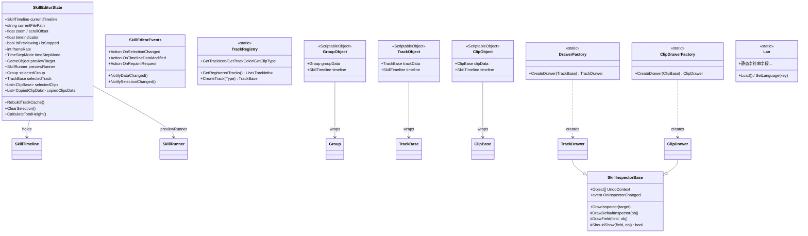
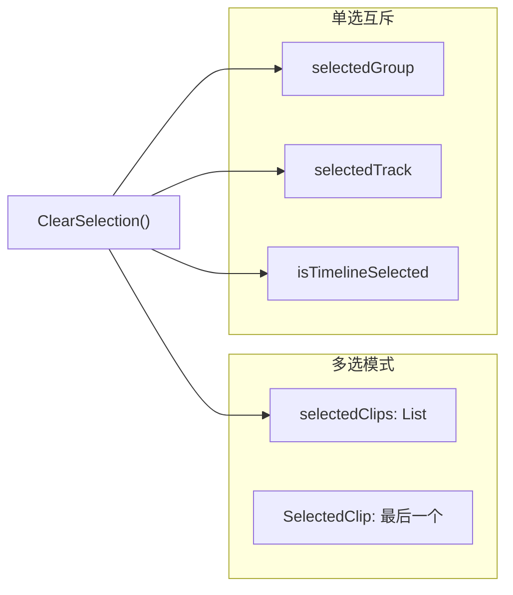
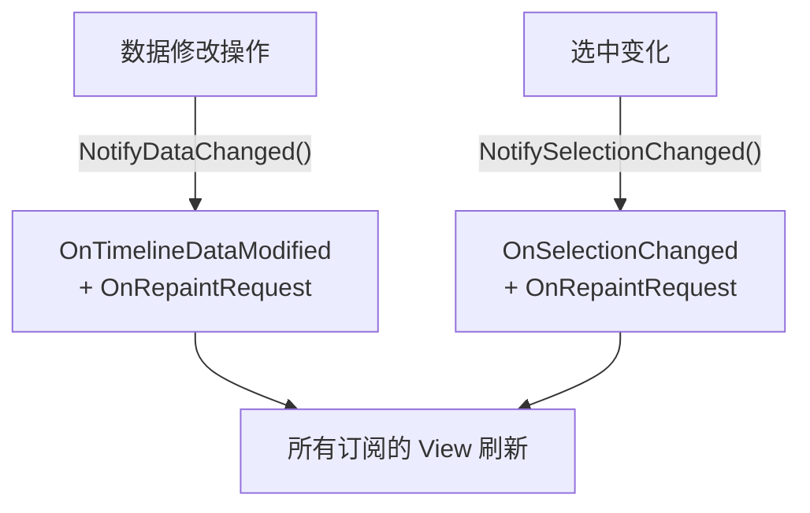
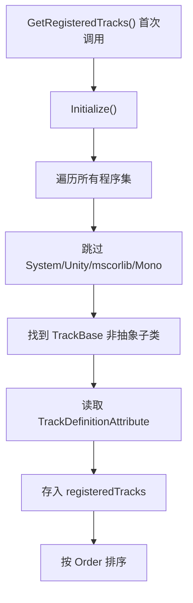
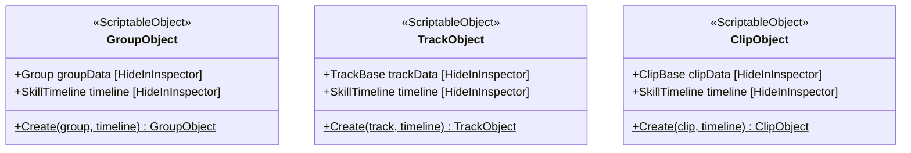
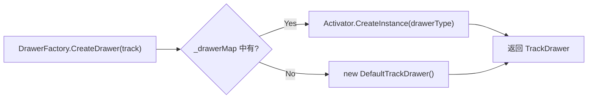
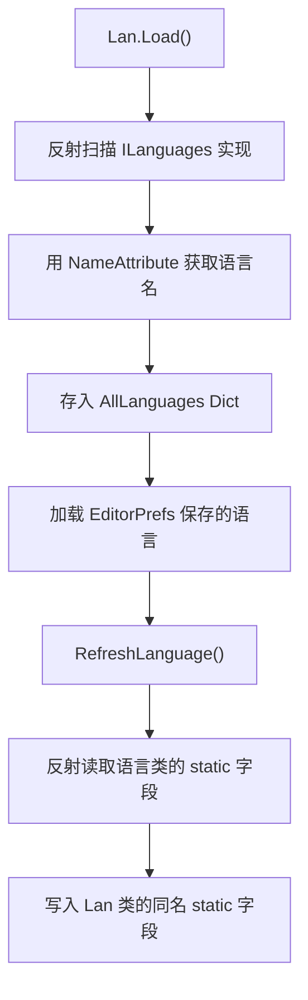
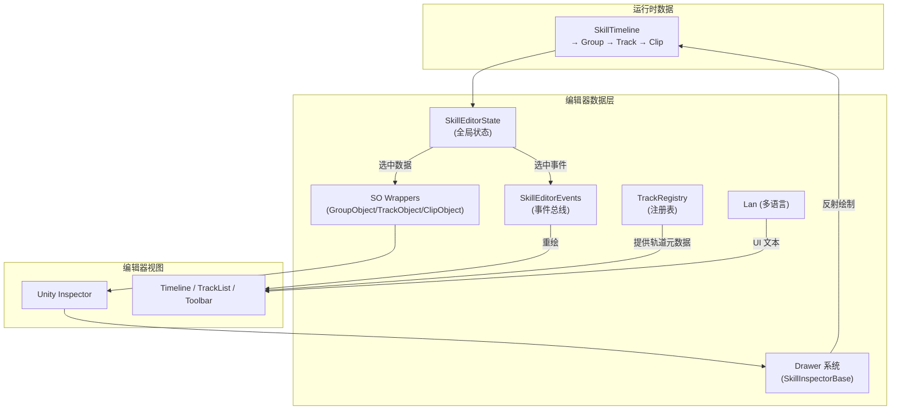
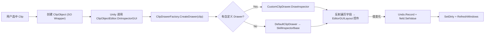

# SkillEditor 编辑器 Data 层分析报告

> **分析范围**: `Editor/Core/`、`Editor/Enums/`、`Editor/Language/`、`Editor/Drawers/Base/`、`Editor/TrackObjectWrapper.cs`
> **分析日期**: 2026-02-22
> **分析维度**: 编辑器 × Data

---

## 1. 编辑器数据层架构



---

## 2. SkillEditorState（全局 UI 状态）

**文件**: [SkillEditorState.cs](file:///D:/Unity/Server_Game/Assets/SkillEditor/Editor/Core/SkillEditorState.cs) (246行)

### 2.1 职责分区

| 分区 | 字段/属性 | 持久化方式 |
|:-----|:---------|:-----------|
| **核心数据引用** | `currentTimeline`、`currentFilePath` | 无（会话内） |
| **视口状态** | `zoom`、`scrollOffset`、`verticalScrollOffset`、`timeIndicator` | 无（会话内） |
| **时间指示器** | `isPreviewing`、`isStopped`、`ShouldShowIndicator` | 无（会话内） |
| **选中项** | `selectedGroup`、`selectedTrack`、`selectedClips`、`isTimelineSelected` | 无（会话内） |
| **复制粘贴** | `copiedClipsData`、`copiedTrack`、`copiedGroup`、`pasteTargetTrack/Time` | 无（会话内） |
| **预览** | `previewTarget`、`previewRunner`、`PreviewContext` | 无（会话内） |
| **设置（持久化）** | `previewSpeedMultiplier`、`snapEnabled`、`frameRate`、`timeStepMode`、`Language`、`DefaultPreviewCharacterPath` | EditorPrefs |

### 2.2 轨道缓存系统

```csharp
private Dictionary<string, TrackBase> trackCache;

public void RebuildTrackCache()     // 全量重建
public void AddTrackToCache(track)  // 增量添加
public void RemoveTrackFromCache(id)// 增量移除
public TrackBase GetTrackById(id)   // O(1) 查找
```

- ✅ **全量+增量双模式**: 支持初始化全量扫描和运行时按需更新
- ✅ **O(1) 查找**: Dictionary 通过 trackId 快速索引

### 2.3 选中状态管理



- 支持 **多 Clip 选中**（`List<ClipBase>`）
- Group / Track / Timeline 选中是 **互斥的**
- `SelectedClip` 属性取列表最后一项（最近选中的）

### 2.4 复制粘贴系统

```csharp
public struct CopiedClipData
{
    public ClipBase clip;
    public string sourceTrackId;
    public int sourceTrackIndex;  // 维持相对轨道层级
}

public List<CopiedClipData> copiedClipsData;
```

- 支持 **多 Clip 复制**，保留源轨道 ID 和索引信息
- 同时维护了旧版单项 `copiedClip` 属性的兼容性
- 支持分组复制：`copiedGroup` + `copiedTracksForGroup`

### 2.5 时间步长与帧控制

| 属性 | 说明 |
|:-----|:-----|
| `timeStepMode` | `Variable`（动态网格）/ `Fixed`（固定帧率） |
| `frameRate` | 逻辑帧率（默认30） |
| `useFrameSnap` | `Fixed` 模式下自动启用 |
| `SnapInterval` | `Fixed` 模式 = `1/frameRate`，`Variable` 模式 = `-1`（动态） |

> [!NOTE]
> 设置通过 `EditorPrefs` 持久化，跨编辑器会话保留用户偏好。Key 使用 `SkillEditor_` 前缀避免冲突。

---

## 3. SkillEditorEvents（事件总线）

**文件**: [SkillEditorEvents.cs](file:///D:/Unity/Server_Game/Assets/SkillEditor/Editor/Core/SkillEditorEvents.cs) (42行)



| 事件 | 触发时机 | 订阅者 |
|:-----|:---------|:-------|
| `OnSelectionChanged` | 选中 Group/Track/Clip 变化 | Inspector、属性面板 |
| `OnTimelineDataModified` | 增删 Track/Clip/Group | 所有 View |
| `OnRepaintRequest` | 上述两者 + 直接请求 | EditorWindow.Repaint |

- ✅ **通知合并**: `NotifyDataChanged` 同时触发数据修改和重绘
- 🟡 **简单 Action 委托**: 无事件参数（无法知道具体修改了什么），所有订阅者做全量刷新

---

## 4. TrackRegistry（轨道注册表）

**文件**: [TrackRegistry.cs](file:///D:/Unity/Server_Game/Assets/SkillEditor/Editor/Core/TrackRegistry.cs) (162行)

### 4.1 初始化流程



### 4.2 查询 API

| 方法 | 输入 | 输出 |
|:-----|:-----|:-----|
| `GetRegisteredTracks()` | - | 全部 TrackInfo 列表 |
| `CreateTrack(Type)` | Track Type | TrackBase 实例 |
| `GetTrackIcon(typeName)` | Track 类型名 | Icon 字符串 |
| `GetTrackColor(typeName)` | Track 类型名 | Color |
| `GetClipType(trackType)` | Track Type | Clip Type |
| `GetTrackTypeByClipType(clipType)` | Clip Type | Track 类型名 |

- ✅ **与 ProcessFactory 模式一致**: 反射扫描 + 惰性初始化 + 程序集过滤
- ✅ **TrackType ↔ ClipType 双向查询**: 支持从 Track 查 Clip 类型，也支持反向查找
- ⚠️ **线性查找**: `GetTrackIcon`/`GetTrackColor`/`GetClipType` 都是 O(n) 遍历。Track 类型数量少（8种），影响可忽略

---

## 5. TrackObjectWrapper（SO 封装层）

**文件**: [TrackObjectWrapper.cs](file:///D:/Unity/Server_Game/Assets/SkillEditor/Editor/TrackObjectWrapper.cs) (219行)

### 5.1 三层 ScriptableObject 封装



**设计目的**: Unity Inspector 只能显示 `UnityEngine.Object` 的 `CustomEditor`。运行时数据（Group/TrackBase/ClipBase）不是 SO，因此需要 Wrapper 将其包装为临时 SO（`HideFlags.DontSave`），再通过 `[CustomEditor]` 接管 Inspector 绘制。

### 5.2 三个 CustomEditor

| Editor | Target | Drawer 系统 | Fallback |
|:-------|:-------|:-----------|:---------|
| `GroupObjectEditor` | `GroupObject` | 直接 EditorGUILayout | - |
| `TrackObjectEditor` | `TrackObject` | `DrawerFactory.CreateDrawer(track)` | 文本框 trackName |
| `ClipObjectEditor` | `ClipObject` | `ClipDrawerFactory.CreateDrawer(clip)` | 文本框 clip 基本字段 |

**通用流程**:

```
1. EditorGUI.BeginChangeCheck()
2. 获取 Drawer（或 Fallback）
3. 设置 UndoContext = [wrapperSO, timeline]
4. 注册 OnInspectorChanged → SceneView.RepaintAll()
5. 调用 drawer.DrawInspector(data)
6. EditorGUI.EndChangeCheck() → SetDirty + RefreshWindows
```

> [!TIP]
> `TrackObjectUtility.RefreshWindows()` 通过 `Resources.FindObjectsOfTypeAll<SkillEditorWindow>()` 查找所有打开的编辑器窗口并刷新，支持多窗口同步。

---

## 6. Drawer 系统（反射式 Inspector）

### 6.1 SkillInspectorBase（核心 Inspector 引擎）

**文件**: [SkillInspectorBase.cs](file:///D:/Unity/Server_Game/Assets/SkillEditor/Editor/Drawers/Base/SkillInspectorBase.cs) (326行)

**通过反射自动绘制任意对象的所有 public 字段**。

```mermaid
flowchart TD
    A["DrawInspector(target)"] --> B["DrawDefaultInspector(obj)"]
    B --> C["构建继承链 Stack (Base→Derived)"]
    C --> D["遍历每层的 DeclaredOnly 字段"]
    D --> E{ShouldShow?}
    E -->|No| D
    E -->|Yes| F["DrawField(field, obj)"]
    F --> G{"字段类型?"}
    G -->|int| H["IntField"]
    G -->|float| I["FloatField / Slider"]
    G -->|bool| J["Toggle"]
    G -->|string| K["TextField"]
    G -->|Vector2/3| L["VectorField"]
    G -->|Color| M["ColorField"]
    G -->|AnimationCurve| N["CurveField"]
    G -->|UnityEngine.Object| O["ObjectField"]
    G -->|Enum| P["EnumPopup"]
    G -->|LayerMask| Q["MaskField"]
    G -->|HitBoxShape| R["嵌套形状编辑器"]
    G -->|List~SkillEventParam~| S["参数列表编辑器"]
    G -->|string[]| T["标签下拉编辑器"]
    G -->|IList| U["未实现提示"]
    G -->|其他| V["不支持提示"]
```

### 6.2 支持的字段类型

| 类型 | 控件 | 特殊处理 |
|:-----|:-----|:---------|
| `int` | IntField | - |
| `float` | FloatField | startTime/duration 限非负；blendIn/Out 用 Slider |
| `bool` | Toggle | - |
| `string` | TextField | - |
| `Vector2` | Vector2Field | - |
| `Vector3` | Vector3Field | - |
| `Color` | ColorField | - |
| `AnimationCurve` | CurveField | - |
| `UnityEngine.Object` | ObjectField | allowSceneObjects=false |
| `Enum` | EnumPopup | - |
| `LayerMask` | MaskField | 使用 InternalEditorUtility 转换 |
| `HitBoxShape` | 嵌套编辑 | 按 shapeType 条件显示参数 |
| `List<SkillEventParam>` | 可增删列表 | key/string/float/int 字段 |
| `string[]` | 标签下拉 | 自动读取 SkillTagConfig 资产 |

### 6.3 字段显示规则（ShouldShow）

```csharp
// 1. [HideInInspector] → 隐藏
// 2. blendIn/blendOut → 仅 SupportsBlending 的 Clip 显示
// 3. customBoneName → 仅 bindPoint == CustomBone 时显示
```

### 6.4 Undo 支持

```csharp
if (EditorGUI.EndChangeCheck())
{
    Undo.RecordObjects(UndoContext, "Inspector Change: " + name);
    field.SetValue(obj, newValue);
    OnInspectorChanged?.Invoke();
}
```

- 在值变化时记录 Undo（`UndoContext` 通常包含 SO Wrapper + Timeline）
- 值通过反射 `SetValue` 写回对象

### 6.5 设计评价

| 方面 | 评价 |
|:-----|:-----|
| 自动化程度 | ✅ 新增字段无需编写 Inspector 代码 |
| 特殊类型处理 | ✅ HitBoxShape/SkillEventParam/string[] 都有专门逻辑 |
| SkillTagConfig 集成 | ✅ 自动搜索配置资产，提供下拉选择 |
| 硬编码条件 | ⚠️ `ShouldShow` 中硬编码了 blendDuration/customBoneName 的显示逻辑 |
| 性能 | ⚠️ 每次绘制都反射获取字段（可缓存 FieldInfo[]） |

---

## 7. DrawerFactory / ClipDrawerFactory（Drawer 工厂）

### 7.1 DrawerFactory（Track Drawer）

**文件**: [TrackDrawer.cs](file:///D:/Unity/Server_Game/Assets/SkillEditor/Editor/Drawers/Base/TrackDrawer.cs) (67行)



- 通过 `[CustomDrawer(typeof(XXTrack))]` 注解关联
- 反射扫描 `TrackDrawer` 子类 + 对应特性
- 未注册的类型使用 `DefaultTrackDrawer`（调用基类反射绘制）

### 7.2 ClipDrawerFactory（Clip Drawer）

**文件**: [ClipDrawer.cs](file:///D:/Unity/Server_Game/Assets/SkillEditor/Editor/Drawers/Base/ClipDrawer.cs) (71行)

- 结构与 DrawerFactory **完全对称**
- `ClipDrawer` 额外提供 `DrawSceneGUI(clip, state)` 虚方法，供子类在 Scene 窗口绘制 Gizmos

### 7.3 CustomDrawerAttribute

**文件**: [CustomDrawerAttribute.cs](file:///D:/Unity/Server_Game/Assets/SkillEditor/Editor/Drawers/CustomDrawerAttribute.cs) (16行)

```csharp
[AttributeUsage(AttributeTargets.Class, Inherited = false, AllowMultiple = false)]
public class CustomDrawerAttribute : Attribute
{
    public Type TargetType { get; }
}
```

- `AllowMultiple = false`: 每个 Drawer 类只能绑定一个数据类型
- `Inherited = false`: 防止子类继承

---

## 8. 多语言系统（Lan）

### 8.1 架构

**文件**: [Lan.cs](file:///D:/Unity/Server_Game/Assets/SkillEditor/Editor/Language/Lan.cs) (123行) / [ILanguages.cs](file:///D:/Unity/Server_Game/Assets/SkillEditor/Editor/Language/ILanguages.cs) (13行)



**扩展方法**: 实现 `ILanguages` 接口 + 添加 `[Name("语言名")]` 特性 + 定义同名静态字段

### 8.2 设计评价

| 方面 | 评价 |
|:-----|:-----|
| 扩展性 | ✅ 新增语言只需添加实现类（OCP） |
| 反射映射 | ✅ 字段名匹配，无需手动注册 |
| 持久化 | ✅ 语言选择通过 EditorPrefs 保存 |
| 降级处理 | ✅ 找不到保存的语言时回退到默认 |
| 类型安全 | ⚠️ 字段名必须完全一致，不匹配时静默跳过 |

---

## 9. 编辑器枚举

**文件**: [EditorEnums.cs](file:///D:/Unity/Server_Game/Assets/SkillEditor/Editor/Enums/EditorEnums.cs) (36行)

| 枚举 | 值 | 用途 |
|:-----|:---|:-----|
| `TrackListDragType` | None, Track, Group | 轨道列表拖拽类型识别 |
| `ClipDragMode` | None, MoveClip, ResizeLeft, ResizeRight, CrossTrackDrag, BlendIn, BlendOut | 时间轴 Clip 交互模式 |
| `TimeStepMode` | Variable(0), Fixed(1) | 时间步长策略 |

---

## 10. 数据流总结

### 10.1 编辑器数据流



### 10.2 Inspector 渲染链



---

## 11. 设计评估

### 11.1 优势

| 方面 | 评价 |
|:-----|:-----|
| 反射式 Inspector | ✅ 新增字段自动出现在面板中，零 Inspector 代码 |
| SO Wrapper 模式 | ✅ 将非 SO 数据无缝接入 Unity Inspector |
| Drawer 工厂 | ✅ 声明式注册（OCP），支持自定义和默认 Fallback |
| TrackRegistry | ✅ 与 ProcessFactory 模式一致，反射发现无需手动注册 |
| EventBus | ✅ 解耦 View 与 State 的变更通知 |
| 多语言系统 | ✅ 反射映射实现 OCP 扩展 |
| EditorPrefs 持久化 | ✅ 用户设置跨会话保留 |

### 11.2 需要关注的问题

| 是否解决 | 问题 | 严重程度 | 说明 |
|:----:|:--------:|:-----|:----:|
| ❌ | SkillInspectorBase 硬编码逻辑 | 🟡 中 | `ShouldShow` 中硬编码了 blendDuration/customBoneName，新增类似逻辑需修改基类 |
| ❌ | 反射性能 | 🟢 低 | 每次绘制反射获取 FieldInfo[]，可考虑缓存 |
| ❌ | EventBus 无细粒度参数 | 🟡 中 | 事件仅 `Action`（无参），订阅者无法区分具体修改内容 |
| ❌ | DrawerFactory 每次 new | 🟢 低 | `CreateDrawer` 每次创建新实例而非复用，Inspector 每帧调用 |
| ❌ | Lan 字段名静默匹配 | 🟢 低 | 拼写错误不会报错，需维护时注意一致性 |
| ❌ | SO Wrapper 内存 | 🟢 低 | `HideFlags.DontSave` 的 SO 不会持久化但占用编辑器内存 |

---

## 附录：文件清单

| 文件路径 | 行数 | 大小 | 角色 |
|:---------|:----:|:----:|:-----|
| `Editor/Core/SkillEditorState.cs` | 246 | 8.9KB | 全局 UI 状态 |
| `Editor/Core/SkillEditorEvents.cs` | 42 | 1.1KB | 事件总线 |
| `Editor/Core/TrackRegistry.cs` | 162 | 5.0KB | 轨道注册表 |
| `Editor/TrackObjectWrapper.cs` | 219 | 7.6KB | SO 封装 + CustomEditor |
| `Editor/Enums/EditorEnums.cs` | 36 | 743B | 编辑器枚举 |
| `Editor/Drawers/CustomDrawerAttribute.cs` | 16 | 378B | Drawer 绑定特性 |
| `Editor/Drawers/Base/SkillInspectorBase.cs` | 326 | 13.7KB | 反射 Inspector 引擎 |
| `Editor/Drawers/Base/TrackDrawer.cs` | 67 | 2.3KB | Track Drawer 基类+工厂 |
| `Editor/Drawers/Base/ClipDrawer.cs` | 71 | 2.4KB | Clip Drawer 基类+工厂 |
| `Editor/Language/ILanguages.cs` | 13 | 283B | 语言接口+NameAttribute |
| `Editor/Language/Lan.cs` | 123 | 5.1KB | 多语言管理器 |
