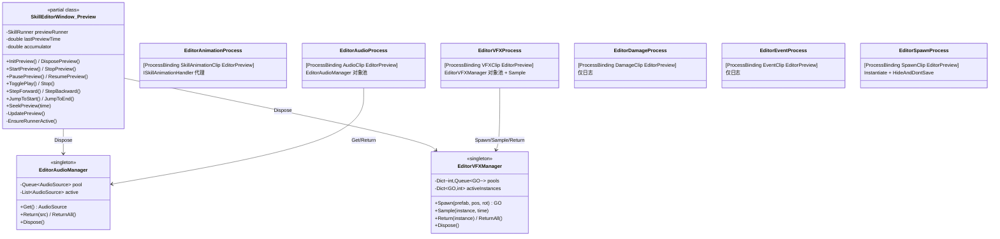
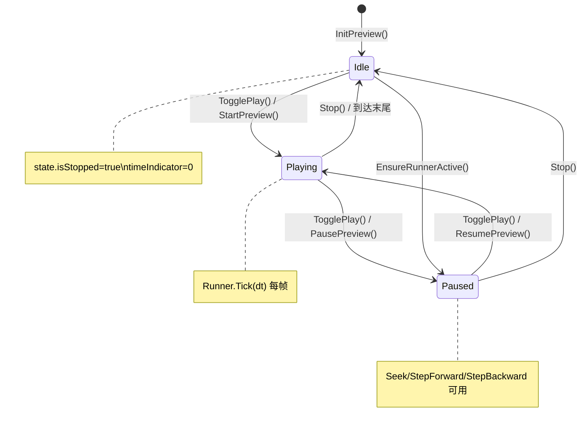
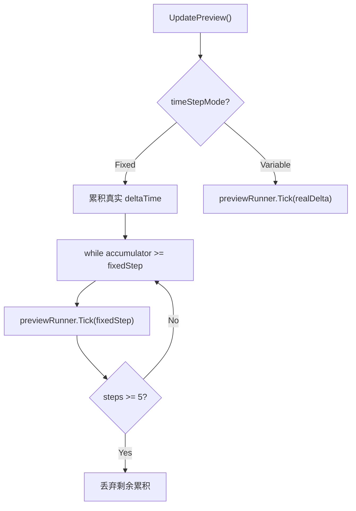
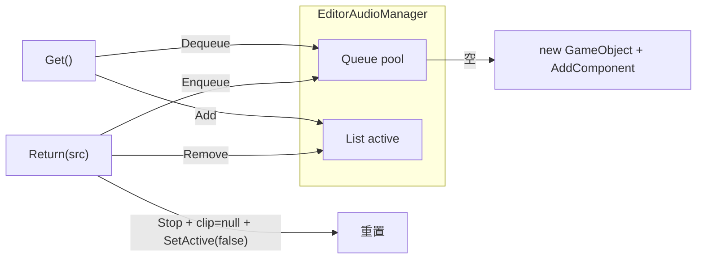
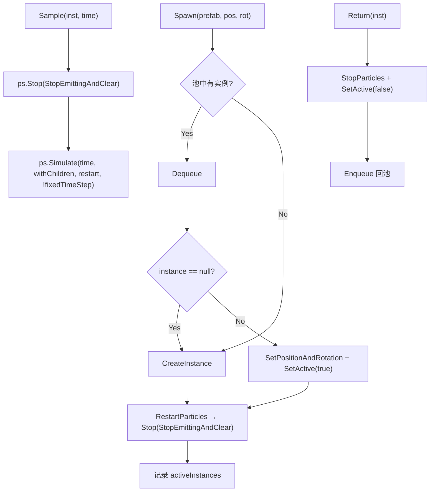
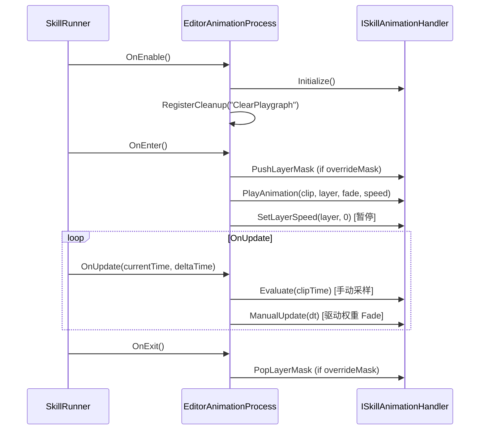
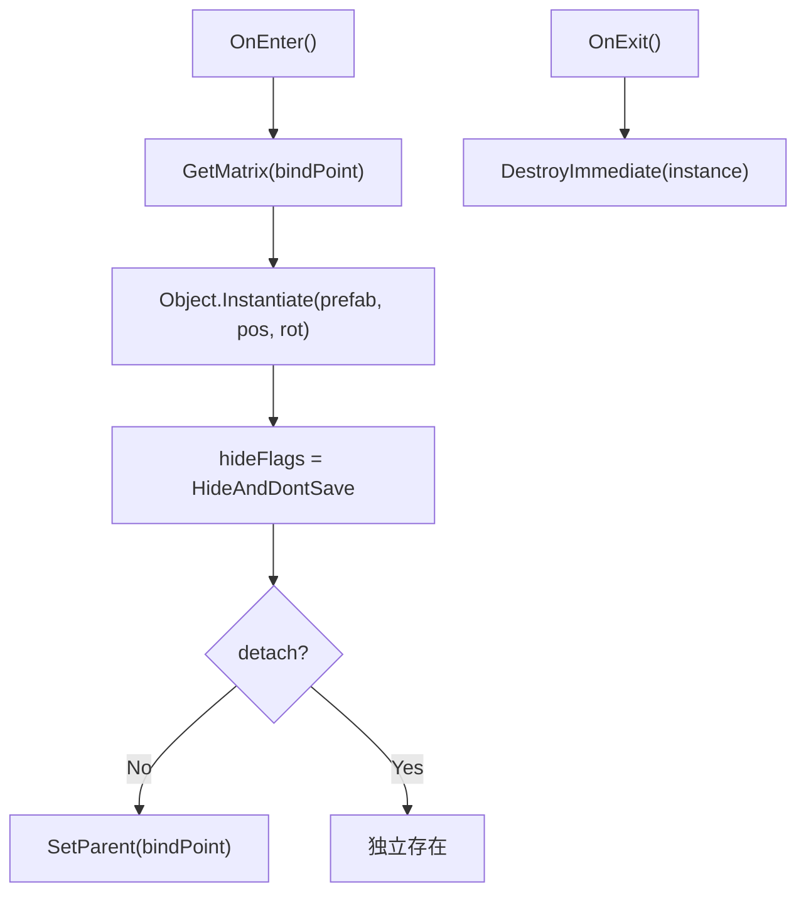
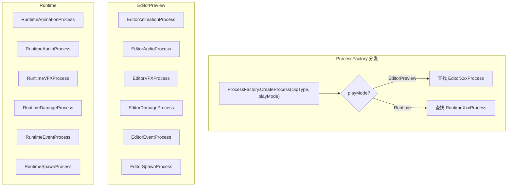

# SkillEditor 编辑器 Logic 层分析报告

> **分析范围**: `Editor/Playback/`（Preview partial + 2个 Manager + 6个 Process）+ `Editor/SkillEditorSettingsWindow.cs`
> **分析日期**: 2026-02-22
> **分析维度**: 编辑器 × Logic

---

## 1. 编辑器 Logic 层架构



---

## 2. 预览播放系统（SkillEditorWindow.Preview）

**文件**: [SkillEditorWindow.Preview.cs](file:///D:/Unity/Server_Game/Assets/SkillEditor/Editor/Playback/SkillEditorWindow.Preview.cs) (310行)

### 2.1 状态机



### 2.2 时间步长模式



| 模式 | 行为 | 适用场景 |
|:-----|:-----|:---------|
| **Variable** | 直接使用真实 deltaTime | 流畅预览 |
| **Fixed** | 按 `1/frameRate` 固定步长消耗累积时间 | 精确帧对齐，支持服务器同步验证 |

**防追赶机制**: Fixed 模式限制每帧最多 5 步，超出部分丢弃，防止卡顿后无限追赶。

### 2.3 核心方法

| 方法 | 行为 |
|:-----|:-----|
| `InitPreview` | 创建 `SkillRunner(EditorPreview)` + `ProcessContext`，注入 `SkillServiceFactory` |
| `StartPreview` | `runner.Play(timeline, context)` |
| `TogglePlay` | 智能切换：Idle→Play（末尾自动回头）、Playing→Pause、Paused→Resume |
| `SeekPreview` | 暂停→`EnsureRunnerActive`→`runner.Seek(time)` |
| `StepForward/Backward` | 暂停→`runner.Seek(±1/frameRate)` |
| `EnsureRunnerActive` | Idle 时自动 Start+Pause 以启用 Process |

### 2.4 预览速度

```csharp
accumulator += realDelta * state.previewSpeedMultiplier;
```

- `previewSpeedMultiplier` 影响累积速度，实现变速预览（0.1x ~ 3.0x）

---

## 3. EditorAudioManager（编辑器音频管理）

**文件**: [EditorAudioManager.cs](file:///D:/Unity/Server_Game/Assets/SkillEditor/Editor/Playback/EditorAudioManager.cs) (120行)



| 特性 | 分析 |
|:-----|:-----|
| 惰性单例 | ✅ `instance ??= new EditorAudioManager()` |
| HideAndDontSave | ✅ GameObject 隐藏且不保存到场景 |
| 完整重置 | ✅ `ResetSource` 重置 volume/pitch/loop/spatialBlend/time |
| `Dispose` | ✅ ReturnAll + DestroyImmediate(audioRoot) + instance=null |
| 重复检查 | ✅ `Return` 检查 `pool.Contains(src)` 防止重复入池 |

---

## 4. EditorVFXManager（编辑器 VFX 管理）

**文件**: [EditorVFXManager.cs](file:///D:/Unity/Server_Game/Assets/SkillEditor/Editor/Playback/EditorVFXManager.cs) (171行)



### 关键方法：Sample

```csharp
public void Sample(GameObject instance, float time)
{
    var particles = instance.GetComponentsInChildren<ParticleSystem>();
    foreach (var ps in particles)
    {
        ps.Stop(true, ParticleSystemStopBehavior.StopEmittingAndClear);
        ps.Simulate(time, true, true, false);
    }
}
```

- **Stop + Simulate 模式**: 每次采样先清除所有粒子，然后从时间 0 模拟到目标时间
- 支持 Seek/Scrub 时精确预览粒子状态
- ⚠️ 时间越长，`Simulate` 性能开销越大（线性增长）

| 对比 | EditorVFXManager | VFXPoolManager (Runtime) |
|:-----|:-----------------|:-------------------------|
| 池结构 | `Dict<int, Queue<GO>>` | `Dict<int, Stack<GO>>` |
| 粒子控制 | ✅ Sample/Simulate | ❌ 无采样 |
| HideFlags | ✅ DontSave | ❌ 无 |
| 暴露 API | ✅ VfxRoot / Sample | 仅 Spawn/Return |

---

## 5. Editor Process 实现

### 5.1 运行时 vs 编辑器 Process 对比

| Clip 类型 | Runtime Process | Editor Process | 关键差异 |
|:----------|:---------------|:---------------|:---------|
| SkillAnimationClip | `RuntimeAnimationProcess` | `EditorAnimationProcess` | 编辑器用 `Evaluate`+`ManualUpdate` 采样 |
| AudioClip | `RuntimeAudioProcess` | `EditorAudioProcess` | 编辑器用 `EditorAudioManager` 池 |
| VFXClip | `RuntimeVFXProcess` | `EditorVFXProcess` | 编辑器用 `EditorVFXManager` + `Sample` |
| DamageClip | `RuntimeDamageProcess` | `EditorDamageProcess` | 编辑器仅日志 |
| EventClip | `RuntimeEventProcess` | `EditorEventProcess` | 编辑器仅日志 |
| SpawnClip | `RuntimeSpawnProcess` | `EditorSpawnProcess` | 编辑器用 `Instantiate` + `HideAndDontSave` |

### 5.2 EditorAnimationProcess

**文件**: [EditorAnimationProcess.cs](file:///D:/Unity/Server_Game/Assets/SkillEditor/Editor/Playback/Processes/EditorAnimationProcess.cs) (65行)



**关键设计**: 编辑器不依赖 Unity 自动播放动画，而是通过 `Evaluate` 精确采样到指定时间点，支持 Seek/Scrub。

### 5.3 EditorAudioProcess

**文件**: [EditorAudioProcess.cs](file:///D:/Unity/Server_Game/Assets/SkillEditor/Editor/Playback/Processes/EditorAudioProcess.cs) (120行)

| 功能 | 实现 |
|:-----|:-----|
| 获取 AudioSource | `EditorAudioManager.Instance.Get()` |
| Pitch 同步 | `clip.pitch * context.GlobalPlaySpeed`（支持变速） |
| 循环处理 | `Mathf.Repeat(clipLocalTime, clipLength)` |
| Scrub 同步 | `audioSource.time` 偏差 > 0.1s 时强制同步 |
| 暂停检测 | `GlobalPlaySpeed == 0` → `audioSource.Pause()` |
| 归还 | `OnExit` → `EditorAudioManager.Instance.Return(src)` |

### 5.4 EditorVFXProcess

**文件**: [EditorVFXProcess.cs](file:///D:/Unity/Server_Game/Assets/SkillEditor/Editor/Playback/Processes/EditorVFXProcess.cs) (194行)

最复杂的编辑器 Process，額外功能：

| 功能 | 说明 |
|:-----|:-----|
| 骨骼解析降级链 | `ISkillActor` → `Animator.GetBoneTransform` → `OwnerTransform` |
| followTarget | 每帧更新 Transform |
| Sample 驱动 | `EditorVFXManager.Instance.Sample(inst, clipTime)` |
| GetCurrentRelativeOffset | 从世界坐标逆向计算 posOffset/rotOffset（供 Drawer 同步 Handles 修改） |
| GetHumanBone | 编辑器独有的 HumanBodyBones 映射 |

### 5.5 EditorDamageProcess & EditorEventProcess

**文件**: [EditorDamageProcess.cs](file:///D:/Unity/Server_Game/Assets/SkillEditor/Editor/Playback/Processes/EditorDamageProcess.cs) (41行) / [EditorEventProcess.cs](file:///D:/Unity/Server_Game/Assets/SkillEditor/Editor/Playback/Processes/EditorEventProcess.cs) (23行)

- **两者都是日志占位**: 编辑器环境无真实战斗实体
- DamageProcess 区分 `HitFrequency.Once`（OnEnter 触发）和 `Interval`（周期触发）输出日志
- EventProcess 仅 `OnEnter` 打印事件名

### 5.6 EditorSpawnProcess

**文件**: [EditorSpawnProcess.cs](file:///D:/Unity/Server_Game/Assets/SkillEditor/Editor/Playback/Processes/EditorSpawnProcess.cs) (104行)



- 与运行时的 `ISkillSpawnHandler` 不同，编辑器直接 `Instantiate` + `DestroyImmediate`
- `HideAndDontSave` 防止误保存到场景
- 不走对象池（预览场景实例数少）

---

## 6. SkillEditorSettingsWindow（设置窗口）

**文件**: [SkillEditorSettingsWindow.cs](file:///D:/Unity/Server_Game/Assets/SkillEditor/Editor/SkillEditorSettingsWindow.cs) (100行)

### 设置项

| 设置 | 控件 | 持久化 |
|:-----|:-----|:------:|
| **帧率** | IntPopup (15/30/60) | EditorPrefs |
| **时间步长** | EnumPopup (Variable/Fixed) | EditorPrefs |
| **帧吸附** | Toggle (只读，自动) | 派生值 |
| **磁性吸附** | Toggle | EditorPrefs |
| **预览速度** | Slider (0.1-3.0) | EditorPrefs |
| **默认预览角色** | ObjectField (Prefab) | EditorPrefs |
| **语言** | Popup | EditorPrefs |

---

## 7. 编辑器 vs 运行时 Process 绑定



**`[ProcessBinding]` 特性**决定绑定关系：
- `[ProcessBinding(typeof(VFXClip), PlayMode.EditorPreview)]` → EditorVFXProcess
- `[ProcessBinding(typeof(VFXClip), PlayMode.Runtime)]` → RuntimeVFXProcess

---

## 8. 设计评估

### 8.1 优势

| 方面 | 评价 |
|:-----|:-----|
| 编辑器/运行时完全隔离 | ✅ 通过 `PlayMode` 区分，同一个 SkillRunner 驱动不同 Process |
| 手动采样 | ✅ 动画 Evaluate + 粒子 Simulate 支持精确 Seek/Scrub |
| HideAndDontSave | ✅ 预览对象不污染场景 |
| 对象池管理器 | ✅ Audio/VFX 都有独立的编辑器专用对象池 |
| Fixed/Variable 双模式 | ✅ 支持精确帧对齐和流畅预览两种需求 |
| 防追赶机制 | ✅ Fixed 模式最多 5 步/帧，防止卡顿后雪崩 |
| 预览速度倍率 | ✅ 0.1x~3.0x 变速预览 |

### 8.2 需要关注的问题

| 是否解决 | 问题 | 严重程度 | 说明 |
|:----:|:--------:|:-----|:----:|
| ❌ | VFX Sample 性能 | 🟡 中 | `Simulate(time)` 每次从 0 开始模拟，时间越长开销越大 |
| ❌ | Debug.Log 残留 | 🟢 低 | `SeekPreview` 中有调试日志未清理 |
| ❌ | EditorSpawnProcess 无池化 | 🟢 低 | 每次 Instantiate/DestroyImmediate，无对象复用 |
| ❌ | GetHumanBone 重复定义 | 🟢 低 | `EditorVFXProcess` 中的骨骼映射与 `CharSkillActor` 重复 |
| ❌ | 预览 Target 变更未自动重建 | 🟢 低 | 切换预览角色后需手动 InitPreview |

---

## 附录：文件清单

| 文件路径 | 行数 | 大小 | 角色 |
|:---------|:----:|:----:|:-----|
| `Editor/Playback/SkillEditorWindow.Preview.cs` | 310 | 10.8KB | 预览播放 partial |
| `Editor/Playback/EditorAudioManager.cs` | 120 | 3.5KB | 编辑器音频池 |
| `Editor/Playback/EditorVFXManager.cs` | 171 | 5.7KB | 编辑器 VFX 池 |
| `Editor/Playback/Processes/EditorAnimationProcess.cs` | 65 | 2.4KB | 动画预览 Process |
| `Editor/Playback/Processes/EditorAudioProcess.cs` | 120 | 4.8KB | 音频预览 Process |
| `Editor/Playback/Processes/EditorVFXProcess.cs` | 194 | 7.2KB | VFX 预览 Process |
| `Editor/Playback/Processes/EditorDamageProcess.cs` | 41 | 1.6KB | 伤害日志 Process |
| `Editor/Playback/Processes/EditorEventProcess.cs` | 23 | 714B | 事件日志 Process |
| `Editor/Playback/Processes/EditorSpawnProcess.cs` | 104 | 4.3KB | 生成预览 Process |
| `Editor/SkillEditorSettingsWindow.cs` | 100 | 4.1KB | 设置窗口 |
| **合计** | **1248** | **45KB** | - |
