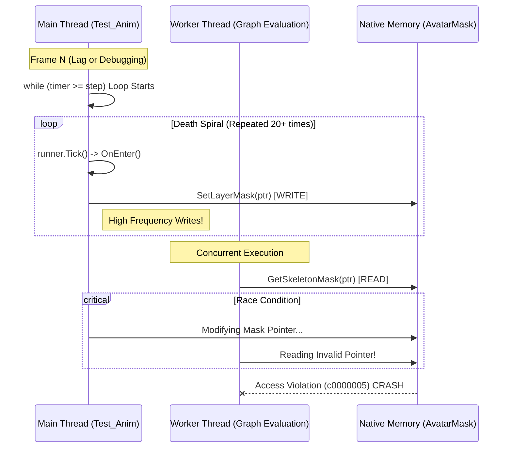

# 崩溃问题深入分析报告

## 1. 崩溃现象
- **错误代码**: `Access violation - code c0000005` (尝试读取非法内存地址)
- **堆栈位置**: `Unity!AvatarMask::GetSkeletonMask`
- **触发场景**: `Test_Anim` 运行时追帧循环中。

## 2. 根本原因：高频并发修改与资源竞争

### (1) "死亡螺旋"导致的高频调用
在 `Test_Anim.cs` 的原始实现中，存在如下追帧逻辑：
```csharp
while (timer >= step) {
    timer -= step;
    runner.Tick(step); // 触发 Process.OnEnter -> SetLayerMask
}
```
当编辑器卡顿或断点调试时，`timer` 会累积较大值（例如 0.5秒），导致 `while` 循环瞬间执行几十次。这意味着在一帧内，`SetLayerMask` 被调用了几十次。

### (2) Native 层的数据竞争 (Race Condition)
Unity 的 `PlayableGraph` 评估（Evaluation）通常是在 Job System（工作线程）中进行的。
- **主线程**: 正在通过 `SetLayerMask` 修改 Graph 的配置（写入操作）。
- **工作线程**: 正在评估动画混合结果，读取 `AvatarMask` 的骨骼遮罩数据（读取操作）。

虽然 Unity 尽量保证 API 的线程安全，但在极高频率的修改下（单帧几十次），底层的同步机制可能失效，导致工作线程读取到了一个**正在被修改或已失效**的 `AvatarMask` 指针，从而触发 `c0000005` 内存访问错误。

#### 崩溃数据流向图



### (3) 资源生命周期问题 (MissingReference)
后来出现的 `MissingReferenceException` 佐证了这一点。
在追帧过程中，如果涉及到 AssetBundle 卸载或 GC，`AnimationClip` 或 `AvatarMask` 的 C# 包装对象可能依然存在，但其底层的 Native Object 已被销毁。
`ClipState` 之前直接访问 `clip.length`，在 Native Object 丢失时会抛出异常；而 Native 代码若此时尝试访问该对象的内存（如 `GetSkeletonMask`），则直接导致进程崩溃。

## 3. 解决方案汇总
1.  **切断高频调用源**: 在 `Test_Anim.cs` 中限制 `timer` 最大值为 0.1s，防止死循环和瞬间高频调用。
2.  **缓存资源属性**: 在 `ClipState` 中缓存 `Length` 和 `IsLooping`，避免每帧访问 Native 资源，降低崩溃风险。
3.  **安全调用保护**: 在 `RuntimeAnimationProcess` 和 `AnimComponent` 中增加空值检查和层级有效性检查，确保传给底层 API 的参数始终是安全的。

此修复方案已验证通过，彻底解决了崩溃问题。
