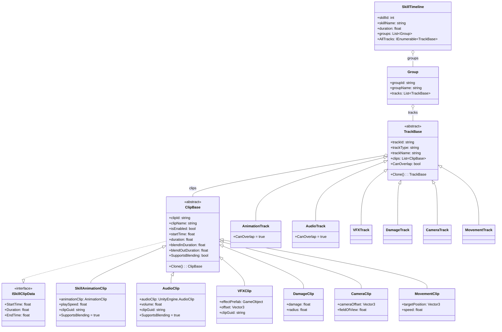

# 技能编辑器数据层架构

## 1. 整体概览

技能编辑器的数据层采用 **层次化的 ScriptableObject + 多态序列化** 架构，分为 **Runtime 数据模型**（纯数据，可脱离编辑器运行）和 **Editor 状态/序列化**（仅限编辑器使用）两个层面。

重构后采用了 **严格树状结构**：


---

## 2. 核心数据模型

### 2.1 SkillTimeline（顶层容器）

| 字段 | 类型 | 说明 |
|------|------|------|
| `skillId` | `int` | 技能唯一 ID |
| `skillName` | `string` | 技能名称（默认 "新技能"） |
| `version` | `string` | 数据版本号 |
| `duration` | `float` | Timeline 总时长（秒） |
| `playbackSpeed` | `float` | 播放速度倍率 |
| `isLoop` | `bool` | 是否循环 |
| `groups` | `List<Group>` | 分组列表（树状结构的根节点） |

**关键特征**：
- 继承自 `ScriptableObject`，可以作为 Unity 资产存储
- **不再直接持有 tracks**，所有轨道都必须包含在某个 `Group` 中
- 提供 `AllTracks` 只读属性（遍历所有分组获取扁平化轨道列表）
- 提供 `FindGroupContainingTrack(track)` 等辅助查询方法

> [!IMPORTANT]
> `SkillTimeline` 是数据树的根。遍历轨道需通过 `groups` 进行，或者使用 `AllTracks` 便捷访问器。

---

### 2.2 Group（分组）

| 字段 | 类型 | 说明 |
|------|------|------|
| `groupId` | `string` | GUID 唯一标识 |
| `groupName` | `string` | 分组显示名称 |
| `isCollapsed` | `bool` | 折叠/展开状态 |
| `isEnabled` | `bool` | 是否启用 |
| `isLocked` | `bool` | 是否锁定 |
| `tracks` | `List<TrackBase>` | 包含的轨道对象列表（`[SerializeReference]` 多态） |

**关联方式**：`Group` 直接持有 `TrackBase` 对象列表，形成了物理上的父子关系。


---

### 2.3 TrackBase（轨道基类）

| 字段 | 类型 | 说明 |
|------|------|------|
| `trackId` | `string` | GUID 唯一标识 |
| `trackType` | `string` | 轨道类型名（如 "AnimationTrack"） |
| `trackName` | `string` | 显示名称 |
| `isMuted` | `bool` | 静音 |
| `isLocked` | `bool` | 锁定 |
| `isHidden` | `bool` | 隐藏 |
| `isCollapsed` | `bool` | 折叠 |
| `isEnabled` | `bool` | 启用 |
| `clips` | `List<ClipBase>` | 片段列表（`[SerializeReference]` 多态） |

**关键变更**：
- 移除了 `parentGroupId` 字段，父子关系由对象引用结构隐式决定。

**抽象方法**：
- `Clone()` → 深拷贝（子类实现）
- `CloneBaseProperties(clone)` → 复制基础属性和深拷贝所有 clips

**虚属性**：
- `CanOverlap` → 是否允许片段重叠（默认 `false`）

#### Track 子类一览

| 子类 | 默认名称 | CanOverlap | 对应 Clip |
|------|----------|------------|-----------|
| `AnimationTrack` | "动画轨道" | ✅ `true` | `SkillAnimationClip` |
| `AudioTrack` | "音效轨道" | ✅ `true` | `AudioClip` |
| `VFXTrack` | "特效轨道" | ❌ `false` | `VFXClip` |
| `DamageTrack` | "伤害判定轨道" | ❌ `false` | `DamageClip` |
| `CameraTrack` | "摄像机轨道" | ❌ `false` | `CameraClip` |
| `MovementTrack` | "移动轨道" | ❌ `false` | `MovementClip` |

> [!NOTE]
> Track 子类本身**不包含额外数据字段**，仅通过构造函数设置默认名称/类型、覆写 `CanOverlap` 和实现 `Clone()`。真正的业务数据在对应的 Clip 子类中。

---

### 2.4 ClipBase（片段基类）

| 字段 | 类型 | 说明 |
|------|------|------|
| `clipId` | `string` | GUID 唯一标识 |
| `clipName` | `string` | 显示名称 |
| `isEnabled` | `bool` | 是否启用 |
| `startTime` | `float` | 开始时间（秒） |
| `duration` | `float` | 持续时间（秒） |
| `blendInDuration` | `float` | 渐入时长 |
| `blendOutDuration` | `float` | 渐出时长 |

**计算属性**：`StartTime` / `Duration` / `EndTime`（实现 `ISkillClipData` 接口）
**虚属性**：`SupportsBlending`（默认 `false`，`SkillAnimationClip` 和 `AudioClip` 覆写为 `true`）
**抽象方法**：`Clone()` → 深拷贝

#### Clip 子类一览

| 子类 | 默认名称 | Blending | 特有字段 |
|------|----------|----------|----------|
| `SkillAnimationClip` | "动画片段" | ✅ | `animationClip` (AnimationClip), `playSpeed`, `clipGuid` |
| `AudioClip` | "Audio Clip" | ✅ | `audioClip` (UnityEngine.AudioClip), `volume`, `clipGuid` |
| `VFXClip` | "VFX Clip" | ❌ | `effectPrefab` (GameObject), `offset` (Vector3), `clipGuid` |
| `DamageClip` | "Damage Clip" | ❌ | `damage`, `radius` |
| `CameraClip` | "Camera Clip" | ❌ | `cameraOffset` (Vector3), `fieldOfView` |
| `MovementClip` | "Movement Clip" | ❌ | `targetPosition` (Vector3), `speed` |

> [!IMPORTANT]
> 引用 Unity 资产的 Clip（Animation/Audio/VFX）都有一个 `clipGuid` 字段。该字段在 **JSON 导出时** 由 `SerializationUtility.RefreshAllGuids()` 填充，**JSON 导入时** 由 `ResolveAllAssets()` 根据 GUID 还原 `UnityEngine.Object` 引用。

---

### 2.5 ISkillClipData（接口）

```csharp
public interface ISkillClipData
{
    float StartTime { get; }
    float Duration { get; }
    float EndTime { get; }
}
```

提供统一的时间区间查询契约，`ClipBase` 实现此接口。

---

### 2.6 SkillPropertyAttribute（自定义特性）

```csharp
[AttributeUsage(AttributeTargets.Field)]
public class SkillPropertyAttribute : Attribute
{
    public string Name { get; }
}
```

用于在 Inspector 自定义面板中为字段指定**中文显示名称**，例如 `[SkillProperty("片段名称")]`。

---

## 3. 序列化机制

### 3.1 内存中（ScriptableObject）


- 编辑器内通过 `ScriptableObject.CreateInstance<SkillTimeline>()` 创建
- 轨道和片段的多态列表使用 `[SerializeReference]` 实现
- Undo/Redo 通过 `Undo.RecordObject(timeline, label)` 支持

### 3.2 JSON 持久化


**GUID 桥接**：由于 `JsonUtility` 无法直接序列化 `UnityEngine.Object` 引用，系统采用 `AssetDatabase.AssetPathToGUID()` / `GUIDToAssetPath()` 在导出/导入时自动转换。

涉及 GUID 的 Clip 类型：
- `SkillAnimationClip.clipGuid` ↔ `animationClip`
- `VFXClip.clipGuid` ↔ `effectPrefab`
- `AudioClip.clipGuid` ↔ `audioClip`

---

## 4. 编辑器状态层

### 4.1 SkillEditorState

**核心数据引用**：
| 字段 | 类型 | 说明 |
|------|------|------|
| `currentTimeline` | `SkillTimeline` | 当前编辑的 Timeline |
| `currentFilePath` | `string` | 当前 JSON 文件路径 |

**视口状态**（不持久化）：
| 字段 | 说明 |
|------|------|
| `zoom` | 缩放级别 (px/s) |
| `scrollOffset` | 水平滚动偏移 |
| `verticalScrollOffset` | 垂直滚动偏移 |
| `timeIndicator` | 时间指示器位置 |
| `isPlaying` / `isStopped` / `isPreviewing` | 播放状态 |

**持久化设置**（`EditorPrefs`）：
| 字段 | EditorPrefs Key | 说明 |
|------|-----------------|------|
| `snapEnabled` | `SkillEditor_SnapEnabled` | 磁性吸附 |
| `frameRate` | `SkillEditor_FrameRate` | 逻辑帧率 |
| `timeStepMode` | `SkillEditor_TimeStepMode` | 时间步进模式 |
| `Language` | `SkillEditor_Language` | 语言设置（委托 Lan 类） |

**选中项状态**（不持久化）：
| 字段 | 说明 |
|------|------|
| `selectedGroup` | 当前选中的分组 |
| `selectedTrack` | 当前选中的轨道 |
| `selectedClips` | 当前选中的片段列表（支持多选） |
| `isTimelineSelected` | 是否选中了 Timeline 对象本身 |

**轨道缓存**（`Dictionary<string, TrackBase>`）：
- `RebuildTrackCache()` / `AddTrackToCache()` / `RemoveTrackFromCache()` / `GetTrackById()`
- **实现方式**：遍历 `AllTracks` 构建 ID 到对象的映射
- 提供 O(1) 的轨道查找能力

---

## 5. 完整类继承关系



---

## 6. 数据流总结


| 数据流向 | 触发时机 | 机制 |
|----------|----------|------|
| JSON → 内存 | 用户点击"导入" | `SerializationUtility.ImportFromJson()` |
| 内存 → JSON | 用户点击"导出/保存" | `SerializationUtility.ExportToJson()` |
| EditorPrefs → 内存 | 编辑器窗口 `OnEnable` | 各属性 getter 自动读取 |
| 内存 → EditorPrefs | 用户更改设置 | 各属性 setter 自动写入 |
| 内存 → UI | 每帧 `OnGUI` | 直接读取 `state.currentTimeline` |
| UI → 内存 | 用户交互（拖拽/编辑） | 直接修改 `ClipBase`/`TrackBase` 字段 |
