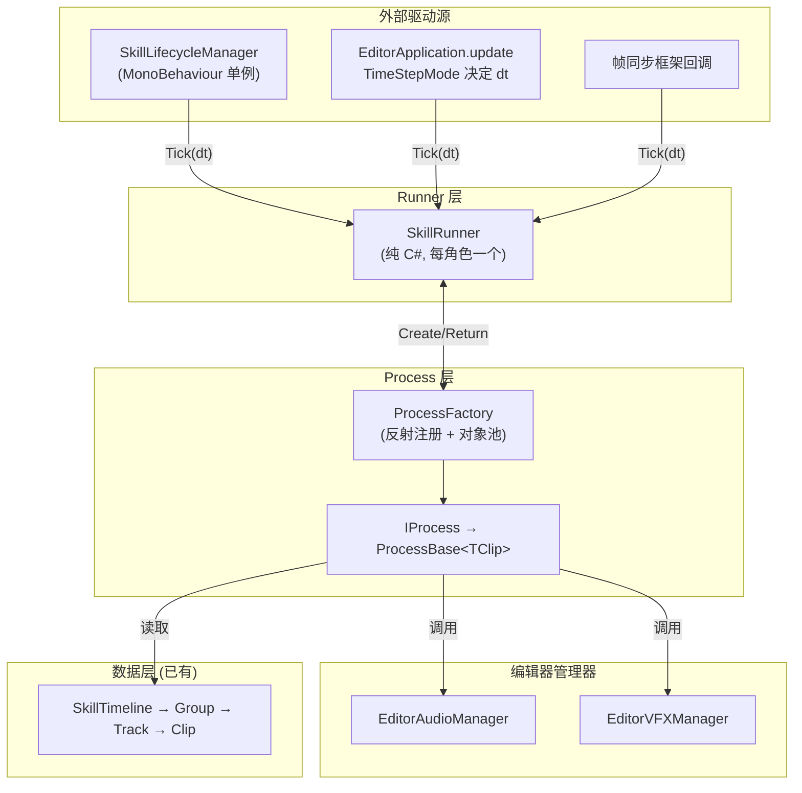
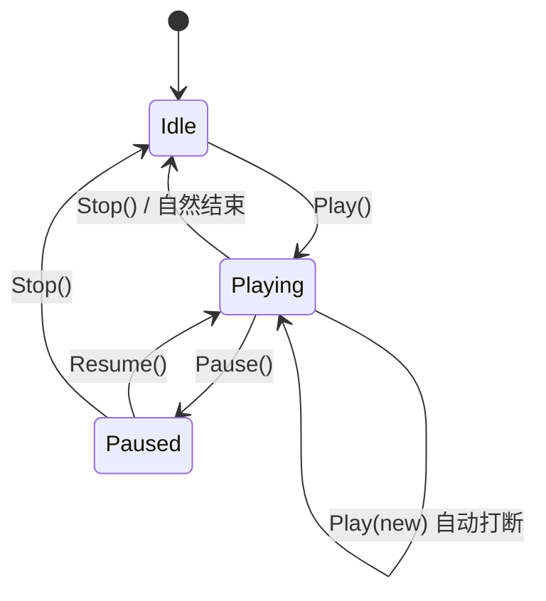

# 技能编辑器播放器系统 — 架构方案（最终版）

## 概述

数据（Clip/Track）与执行逻辑（Process）分离，通过 Runner 驱动 Process 生命周期。支持编辑器预览与运行时执行。

---

## 1. 整体架构



---

## 2. 核心设计决策汇总

| 决策 | 方案 | 原则 |
|------|------|------|
| 清理职责 | 三层：OnExit(实例) / OnDisable(进程) / RegisterCleanup(系统) | SRP, 信息专家 |
| 时间驱动 | Tick(dt) 由调用方决定（无 ITimeProvider） | DIP |
| 编辑器/运行时多态 | 独立子类 + [ProcessBinding] 工厂 | OCP, LSP |
| Process 内存 | ProcessFactory 内部池化 + Reset() | — |
| 生命周期 | 五阶段：Enable/Enter/Update/Exit/Disable | ISP |
| 事件模型 | Runner 事件订阅链，Interrupt 时 ClearEvents | OCP |

---

## 3. 模块详细设计

### 3.1 IProcess + ProcessBase

```csharp
public interface IProcess
{
    void Initialize(ClipBase clipData, ProcessContext context);
    void Reset();       // 对象池复用前调用
    void OnEnable();
    void OnEnter();
    void OnUpdate(float currentTime, float deltaTime);
    void OnExit();
    void OnDisable();
}

public abstract class ProcessBase<TClip> : IProcess where TClip : ClipBase
{
    protected TClip clip;
    protected ProcessContext context;
    
    public void Initialize(ClipBase clipData, ProcessContext context)
    {
        this.clip = (TClip)clipData;
        this.context = context;
    }
    
    public virtual void Reset() { clip = default; context = null; }
    public virtual void OnEnable() { }
    public virtual void OnEnter() { }
    public abstract void OnUpdate(float currentTime, float deltaTime);
    public virtual void OnExit() { }
    public virtual void OnDisable() { }
}
```

---

### 3.2 ProcessContext

```csharp
public class ProcessContext
{
    public GameObject Owner { get; }
    public Transform OwnerTransform { get; }
    public PlayMode PlayMode { get; }
    public object UserData { get; set; }
    
    // 组件缓存
    private Dictionary<Type, Component> componentCache = new Dictionary<Type, Component>();
    public T GetComponent<T>() where T : Component { /* 惰性查找+缓存 */ }
    
    // 系统级清理注册（同 key 去重）
    private Dictionary<string, Action> cleanupActions = new Dictionary<string, Action>();
    public void RegisterCleanup(string key, Action cleanup) => cleanupActions[key] = cleanup;
    internal void ExecuteCleanups()
    {
        foreach (var a in cleanupActions.Values) a.Invoke();
        cleanupActions.Clear();
    }
}

public enum PlayMode { EditorPreview, Runtime }
```

---

### 3.3 ProcessFactory（反射注册 + 对象池）

```csharp
[AttributeUsage(AttributeTargets.Class, AllowMultiple = true)]
public class ProcessBindingAttribute : Attribute
{
    public Type ClipType { get; }
    public PlayMode Mode { get; }
    public ProcessBindingAttribute(Type clipType, PlayMode mode) { ... }
}

public static class ProcessFactory
{
    private static Dictionary<(Type, PlayMode), Type> registry;
    private static Dictionary<Type, Queue<IProcess>> pools = new();
    
    static ProcessFactory()
    {
        registry = new Dictionary<(Type, PlayMode), Type>();
        foreach (var asm in AppDomain.CurrentDomain.GetAssemblies())
            foreach (var type in asm.GetTypes())
                foreach (var attr in type.GetCustomAttributes<ProcessBindingAttribute>())
                    registry[(attr.ClipType, attr.Mode)] = type;
    }
    
    public static IProcess Create(ClipBase clip, PlayMode mode)
    {
        if (!registry.TryGetValue((clip.GetType(), mode), out var pType)) return null;
        if (pools.TryGetValue(pType, out var pool) && pool.Count > 0)
        {
            var reused = pool.Dequeue();
            reused.Reset();
            return reused;
        }
        return (IProcess)Activator.CreateInstance(pType);
    }
    
    public static void Return(IProcess process)
    {
        if (process == null) return;
        var t = process.GetType();
        if (!pools.ContainsKey(t)) pools[t] = new Queue<IProcess>();
        pools[t].Enqueue(process);
    }
    
    public static void ClearPools() => pools.Clear();
}
```

---

### 3.4 SkillRunner

#### 状态机



#### 事件

```csharp
public event Action OnStart;
public event Action OnEnd;          // 自然结束或 Stop
public event Action OnInterrupt;    // 被新技能打断
public event Action OnPause;
public event Action OnResume;
public event Action OnLoopComplete; // 循环一轮
public event Action<float> OnTick;  // 每帧 (currentTime)
```

#### 核心方法

```csharp
public class SkillRunner
{
    public enum State { Idle, Playing, Paused }
    
    public State CurrentState { get; private set; } = State.Idle;
    public float CurrentTime { get; private set; }
    public SkillTimeline Timeline { get; private set; }
    
    private PlayMode playMode;
    private ProcessContext context;
    private List<ProcessInstance> processes = new List<ProcessInstance>();
    
    private struct ProcessInstance
    {
        public IProcess process;
        public ClipBase clip;
        public bool isActive;
    }
    
    public SkillRunner(PlayMode mode) { playMode = mode; }
    
    // ─── 播放控制 ───
    
    public void Play(SkillTimeline timeline, ProcessContext context) { /* ... */ }
    public void Pause()  { /* Playing→Paused */ }
    public void Resume() { /* Paused→Playing */ }
    public void Stop()   { /* FullCleanup → OnEnd → ClearEvents */ }
    public void Seek(float targetTime) { /* 跳转：Exit 脱离区间、Enter 进入区间 */ }
    
    // ─── 每帧驱动 ───
    
    public void Tick(float deltaTime)
    {
        if (CurrentState != State.Playing) return;
        CurrentTime += deltaTime * (Timeline?.playbackSpeed ?? 1f);
        
        // 区间扫描（Enter/Update/Exit）
        for (int i = 0; i < processes.Count; i++) { /* ... */ }
        
        OnTick?.Invoke(CurrentTime);
        
        if (CurrentTime >= Timeline.duration)
        {
            if (Timeline.isLoop)
                { ResetActiveProcesses(); CurrentTime = 0f; OnLoopComplete?.Invoke(); }
            else
                { FullCleanup(); CurrentState = State.Idle; OnEnd?.Invoke(); ClearEvents(); }
        }
    }
    
    // ─── 清理（三层 + 池归还）───
    
    private void FullCleanup()
    {
        foreach (var inst in processes)
            if (inst.isActive) inst.process.OnExit();        // 级别1: 实例
        foreach (var inst in processes)
            inst.process.OnDisable();                         // 级别2: 进程
        foreach (var inst in processes)
            ProcessFactory.Return(inst.process);              // 归还池
        processes.Clear();
        context?.ExecuteCleanups();                            // 级别3: 系统
    }
}
```

---

### 3.5 SkillLifecycleManager

```csharp
public class SkillLifecycleManager : MonoBehaviour
{
    public static SkillLifecycleManager Instance { get; private set; }
    private List<SkillRunner> activeRunners = new List<SkillRunner>();
    
    private void Awake() { /* 单例, DontDestroyOnLoad */ }
    private void Update()
    {
        float dt = Time.deltaTime;
        for (int i = activeRunners.Count - 1; i >= 0; i--)
            activeRunners[i].Tick(dt);
    }
    public void Register(SkillRunner runner) => activeRunners.Add(runner);
    public void Unregister(SkillRunner runner) => activeRunners.Remove(runner);
}
```

---

### 3.6 EditorVFXManager

```csharp
/// <summary>
/// 编辑器预览 VFX 管理器：实例池 + ParticleSystem 采样
/// </summary>
public class EditorVFXManager
{
    private static EditorVFXManager instance;
    public static EditorVFXManager Instance => instance ??= new EditorVFXManager();
    
    private GameObject vfxRoot;
    // 按预制体 InstanceID 分池
    private Dictionary<int, Queue<GameObject>> pools = new();
    // 活跃实例 → 预制体 ID（归还时定位池）
    private Dictionary<GameObject, int> activeInstances = new();
    
    /// 从池取或新建 VFX 实例
    public GameObject Spawn(GameObject prefab, Vector3 position, Quaternion rotation)
    {
        EnsureRoot();
        int prefabId = prefab.GetInstanceID();
        GameObject inst;
        
        if (pools.TryGetValue(prefabId, out var pool) && pool.Count > 0)
        {
            inst = pool.Dequeue();
            inst.transform.SetPositionAndRotation(position, rotation);
            inst.SetActive(true);
        }
        else
        {
            inst = Object.Instantiate(prefab, position, rotation, vfxRoot.transform);
            inst.hideFlags = HideFlags.HideAndDontSave;
        }
        activeInstances[inst] = prefabId;
        RestartParticles(inst);
        return inst;
    }
    
    /// ParticleSystem 采样到指定时间（Seek 时使用）
    public void Sample(GameObject instance, float time)
    {
        if (instance == null) return;
        foreach (var ps in instance.GetComponentsInChildren<ParticleSystem>())
        {
            ps.Stop(true, ParticleSystemStopBehavior.StopEmittingAndClear);
            ps.Simulate(time, true, true, false);
        }
    }
    
    /// 回收实例到池
    public void Return(GameObject instance)
    {
        if (instance == null || !activeInstances.TryGetValue(instance, out int prefabId)) return;
        StopParticles(instance);
        instance.SetActive(false);
        activeInstances.Remove(instance);
        if (!pools.ContainsKey(prefabId)) pools[prefabId] = new Queue<GameObject>();
        pools[prefabId].Enqueue(instance);
    }
    
    public void ReturnAll() { foreach (var inst in new List<GameObject>(activeInstances.Keys)) Return(inst); }
    public void Dispose() { if (vfxRoot) Object.DestroyImmediate(vfxRoot); pools.Clear(); activeInstances.Clear(); instance = null; }
    
    private void EnsureRoot() { if (!vfxRoot) { vfxRoot = new GameObject("[EditorVFXPreview]"); vfxRoot.hideFlags = HideFlags.HideAndDontSave; } }
    private void RestartParticles(GameObject inst) { foreach (var ps in inst.GetComponentsInChildren<ParticleSystem>()) { ps.Clear(true); ps.Play(true); } }
    private void StopParticles(GameObject inst) { foreach (var ps in inst.GetComponentsInChildren<ParticleSystem>()) ps.Stop(true, ParticleSystemStopBehavior.StopEmittingAndClear); }
}
```

---

### 3.7 EditorAudioManager

```csharp
public class EditorAudioManager
{
    private static EditorAudioManager instance;
    public static EditorAudioManager Instance => instance ??= new EditorAudioManager();
    
    private GameObject audioRoot;
    private Queue<AudioSource> pool = new();
    private List<AudioSource> active = new();
    
    public AudioSource Get() { /* 从池取或新建 AudioSource */ }
    public void Return(AudioSource src) { /* 停止 → 归池 */ }
    public void Dispose() { /* DestroyImmediate root */ }
}
```

---

## 4. 编辑器预览集成

### 4.1 TimeStepMode 驱动

编辑器预览的 deltaTime 根据 `SkillEditorState.timeStepMode` 决定：

| TimeStepMode | deltaTime | 说明 |
|-------------|-----------|------|
| `Variable` | `EditorApplication.timeSinceStartup` 差值（实时） | 不做帧约束 |
| `Fixed` | `1f / state.frameRate`（固定步长，如 1/30） | 模拟帧同步 |

### 4.2 SkillEditorWindow.Preview.cs

```csharp
public partial class SkillEditorWindow
{
    private SkillRunner previewRunner;
    private double lastPreviewTime;
    
    private void InitPreview()
    {
        previewRunner = new SkillRunner(PlayMode.EditorPreview);
    }
    
    public void StartPreview()
    {
        if (state.currentTimeline == null || state.previewTarget == null) return;
        var ctx = new ProcessContext(state.previewTarget, PlayMode.EditorPreview);
        lastPreviewTime = EditorApplication.timeSinceStartup;
        previewRunner.Play(state.currentTimeline, ctx);
    }
    
    public void StopPreview() => previewRunner?.Stop();
    
    /// <summary>
    /// EditorApplication.update 回调中调用
    /// </summary>
    private void OnPreviewUpdate()
    {
        if (previewRunner?.CurrentState != SkillRunner.State.Playing) return;
        
        float dt;
        if (state.timeStepMode == TimeStepMode.Fixed)
        {
            // Fixed 模式：固定步长，模拟帧同步
            dt = 1f / state.frameRate;
        }
        else
        {
            // Variable 模式：实时 delta
            double now = EditorApplication.timeSinceStartup;
            dt = Mathf.Min((float)(now - lastPreviewTime), 0.1f);
            lastPreviewTime = now;
        }
        
        previewRunner.Tick(dt);
        // 同步时间指针到 state（供 UI 显示）
        state.timeIndicator = previewRunner.CurrentTime;
        Repaint();
    }
}
```

### 4.3 预览角色选择器

`SkillEditorState` 新增字段：

```csharp
// SkillEditorState 中
public GameObject previewTarget;  // 预览角色
```

`ToolbarView` 中恢复选择器 UI：

```csharp
// ToolbarView 中
state.previewTarget = (GameObject)EditorGUILayout.ObjectField(
    Lan.PreviewTarget, state.previewTarget, typeof(GameObject), true);

if (state.previewTarget == null)
{
    if (GUILayout.Button(Lan.CreateDefaultCharacter))
    {
        var prefab = AssetDatabase.LoadAssetAtPath<GameObject>(
            "Assets/SkillEditor/Editor/Resources/DefaultPreviewCharacter.prefab");
        if (prefab != null)
            state.previewTarget = Object.Instantiate(prefab);
    }
}
```

---

## 5. 运行时使用示例

```csharp
// 非帧同步
public class CharacterSkillController : MonoBehaviour
{
    private SkillRunner runner;
    private ProcessContext context;
    
    private void Start()
    {
        runner = new SkillRunner(PlayMode.Runtime);
        context = new ProcessContext(gameObject, PlayMode.Runtime);
        SkillLifecycleManager.Instance.Register(runner);
    }
    
    public void CastSkill(SkillTimeline skill)
    {
        runner.OnEnd += () => animComponent.PlayIdle();
        runner.OnInterrupt += () => animComponent.PlayIdle();
        runner.Play(skill, context);
    }
}

// 帧同步
public class FrameSyncSkillController
{
    private SkillRunner runner;
    public void OnLogicFrame(float fixedDelta) => runner.Tick(fixedDelta);
}
```

---

## 6. 目录结构

```
Assets/SkillEditor/
├── Runtime/Playback/
│   ├── Core/
│   │   ├── IProcess.cs
│   │   ├── ProcessBase.cs
│   │   ├── ProcessContext.cs
│   │   ├── ProcessBindingAttribute.cs
│   │   ├── ProcessFactory.cs
│   │   └── SkillRunner.cs
│   ├── Lifecycle/
│   │   └── SkillLifecycleManager.cs
│   └── Processes/
│       └── Runtime[Type]Process.cs × 6
├── Editor/
│   ├── Resources/
│   │   └── DefaultPreviewCharacter.prefab
│   └── Playback/
│       ├── Editor[Type]Process.cs × 3+
│       ├── EditorAudioManager.cs
│       ├── EditorVFXManager.cs
│       └── SkillEditorWindow.Preview.cs
```

---

## 7. 需求对照

| # | 需求 | 方案 |
|---|------|------|
| 1 | Mono 单例 | SkillLifecycleManager |
| 2 | Process 五阶段 | IProcess + ProcessBase + Reset |
| 3 | 跨轨道并行 | 扁平列表 + 区间扫描 |
| 4 | 多播放模式 | Tick(dt)，编辑器按 TimeStepMode 驱动 |
| 5 | 多态实现 | 独立子类 + 工厂 |
| 6 | 依赖注入 | ProcessContext |
| 7 | 可扩展工厂 | [ProcessBinding] + 反射 |
| 8 | Runner 非 Mono | 纯 C# |
| 9 | 多 Runner 并行 | 管理器列表 |
| 10 | 层间隔离 | 目录 + partial |
| 🆕 | 三层清理 | OnExit / OnDisable / RegisterCleanup |
| 🆕 | Process 对象池 | ProcessFactory 内部托管 |
| 🆕 | EditorVFXManager | 实例池 + Simulate 采样 |
| 🆕 | EditorAudioManager | AudioSource 池 |
| 🆕 | 角色选择器 | ToolbarView + previewTarget |
| 🆕 | TimeStepMode | Variable(实时) / Fixed(1/fps) |
| 🆕 | 播放控制 | 状态机 + Pause/Resume/Interrupt |
| 🆕 | 事件订阅 | OnEnd/OnInterrupt/OnLoopComplete... |
| 🆕 | Seek | 直接跳转 + Exit/Enter |

---

## 8. 实施顺序

| 阶段 | 产出 |
|------|------|
| **Phase 1** | `IProcess`, `ProcessBase`, `ProcessContext`, `ProcessBindingAttribute`, `ProcessFactory` |
| **Phase 2** | `SkillRunner` |
| **Phase 3** | `EditorAudioManager`, `EditorVFXManager` |
| **Phase 4** | EditorProcess 骨架 + `SkillEditorWindow.Preview.cs` + 角色选择器 |
| **Phase 5** | RuntimeProcess 骨架 + `SkillLifecycleManager` |
